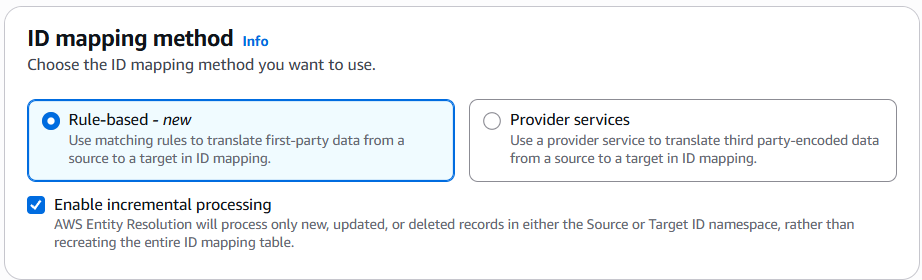

# Creating an ID mapping workflow

(rule-based)

This topic describes the process of creating an ID mapping workflow for one
AWS account that uses matching rules to translate first-party data from a source to a
target.

###### To create a rule-based ID mapping workflow for one AWS account

1.  Sign in to the AWS Management Console and open the AWS Entity Resolution console at [https://console.aws.amazon.com/entityresolution/](https://console.aws.amazon.com/entityresolution/ "https://console.aws.amazon.com/entityresolution/").
2.  In the left navigation pane, under **Workflows**, choose
    **ID mapping**.
3.  On the **ID mapping workflows** page, in the upper right corner,
    choose **Create ID mapping workflow**.
4.  For **Step 1: Specify ID mapping workflow details**, do the
    following.
    1. Enter an **ID mapping workflow name** and an optional
       **Description**.

     2. For the **ID mapping method**, choose
    **Rule-based**. 3. (Optional) To process only new, updated, or deleted records in the workflow,
    select **Enable incremental processing**.

    

    AWS Entity Resolution processes only new, updated, or deleted records in either the Source or
    Target ID namespace, rather than recreating the entire ID mapping table.

    When you choose incremental processing and your data table has a DELETE column,
    AWS Entity Resolution handles records differently based on the DELETE column value.

        * Records marked as `true` in the DELETE column are removed from
         the ID mapping table.
        * Records marked as `false` in the DELETE column are ingested into
         Amazon S3.

    If you leave this option unselected, AWS Entity Resolution runs the default batch processing ID
    mapping workflow on the ID mapping table. 4. (Optional) To enable **Tags** for the resource, choose
    **Add new tag**, and then enter the **Key** and
    **Value** pair. 5. Choose **Next**.

5.  For **Step 2: Specify source and target**, do the following.
    1. For **Source**, choose the scenario that applies to you and
       then take the recommended action.

    | Scenario                                                                                                        | Recommended action                                                                                                                                                                                     |
    | --------------------------------------------------------------------------------------------------------------- | ------------------------------------------------------------------------------------------------------------------------------------------------------------------------------------------------------ |
    | Use your own AWS Glue database, AWS Glue table, and schema mapping in the ID mapping workflow.               | 1. Choose **Schema mapping**. 2. Select an **AWS Region**, **AWS Glue database**, the **AWS Glue table**, and then the corresponding **Schema mapping**. You can add up to 19 data inputs. |
    | Use an existing matching workflow that points to the record data you want to use in the ID mapping workflow. | 1. Choose **Matching workflow**. 2. Select an existing \*_Matching workflow_ • from the dropdown list.                                                                                        |
    2. For **Target**, select an existing **Matching
       workflow** from the dropdown list.
    3. For **Rule parameters**, do the following.
       1. Specify the **Rule controls** by choosing one of the
          following options based on your source type.

       | Source type           | Recommended action                                                                                                                                                                                                                                                                                                                                                                                                              |
       | --------------------- | ------------------------------------------------------------------------------------------------------------------------------------------------------------------------------------------------------------------------------------------------------------------------------------------------------------------------------------------------------------------------------------------------------------------------------- |
       | **Matching workflow** | Specify the **Rule controls\* • by choosing whether a **Source**, **Target**, or both can provide rules in an ID mapping workflow. **Rule controls\* • must be compatible between the source and the target to be used in an ID mapping workflow. For example, if a source ID namespace limits rules to the target but the target ID namespace limits rules to the source, this results in an error. |
       | **Schema mapping**    | Skip this step.                                                                                                                                                                                                                                                                                                                                                                                                                 |
       2. For **Comparison and matching parameters**, the
          **Comparison type** is automatically set to
          **Multiple input fields**.

       This is because both participants had selected this option previously.

    4. Specify the **Record matching type** by choosing one of the
       following options based on your goal.

    | Your goal                                                                                                                                                           | Recommended option             |
    | ------------------------------------------------------------------------------------------------------------------------------------------------------------------- | ------------------------------ |
    | Limit the record matching type to store only one matching record in the source for each matched record in the target when you create the ID mapping workflow. | **One source to one target**   |
    | Limit the record matching type to store all matching records in the source for each matched record in the target when you create the ID mapping workflow.     | **Many sources to one target** |

    ###### Note

    You must specify compatible limitations for the source and target ID
    namespaces. 5. To specify the **Service access** permissions, choose an option
    and take the recommended action.

    

    | Option                                | Recommended action                                                                                                                                                                                                                                                                                                                                                                                                                                                                                                                                                                                                          |
    | ------------------------------------- | --------------------------------------------------------------------------------------------------------------------------------------------------------------------------------------------------------------------------------------------------------------------------------------------------------------------------------------------------------------------------------------------------------------------------------------------------------------------------------------------------------------------------------------------------------------------------------------------------------------------------- |
    | **Create and use a new service role** | • AWS Entity Resolution creates a service role with the required policy for this table. • The default **Service role name** is `entityresolution-id-mapping-workflow-<timestamp>`. • You must have permissions to create roles and attach policies. • If your input data is encrypted, choose the **This data is encrypted by a KMS key\* • option. Then, enter an **AWS KMS key\* • that is used to decrypt your data input.                                                                                                                                                              |
    | **Use an existing service role**      | 1. Choose an **Existing service role name\* • from the dropdown list. The list of roles are displayed if you have permissions to list roles. If you don't have permissions to list roles, you can enter the Amazon Resource Name (ARN) of the role that you want to use. If there are no existing service roles, the option to **Use an existing service role* • is unavailable. 2. View the service role by choosing the \*\*View in IAM* • external link. By default, AWS Entity Resolution doesn't attempt to update the existing role policy to add necessary permissions. |

6.  Choose **Next**.
7.  For **Step 3: Specify data output location – _optional_**, do the following.
    1. For **Data output destination**, do the following:
       1. Choose the **Amazon S3 location** for the data output.
       2. For **Encryption**, if you choose to **Customize
          encryption settings**, then enter the **AWS KMS key**
          ARN or choose **Create an AWS KMS key**.

    2. Choose **Next**.

8.  For **Step 4: Review and create**, do the following.

        1. Review the selections that you made for the previous steps and edit them if
         necessary.
        2. Choose **Create**.

        A message appears, indicating that the ID mapping workflow has been
         created.

    After you create the ID mapping workflow, you're ready to [run an ID
    mapping workflow](run-id-mapping-workflow.md "run-id-mapping-workflow.md").
