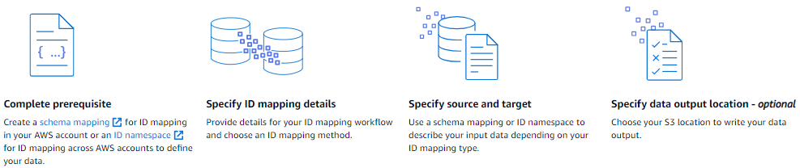

# Map input data using an ID mapping workflow

An _ID mapping workflow_ is a data processing job that maps
data from an input data source to an input data target based on the specified ID mapping method.
It produces an ID mapping table.

An ID mapping workflow requires an input data source and an input data target. Your data
input source and target depends on the type of ID mapping that you want to perform. There are
two ways to perform ID mapping: rule-based or provider services:

- Rule-based ID mapping – You use matching rules to translate first-party data from
  a source to a target.
- Provider services ID mapping – You use the LiveRamp provider service to translate
  third-party data from a source to a target.

###### Note

The provider services ID mapping workflow in AWS Entity Resolution is currently integrated with
LiveRamp. If you have a subscription to the LiveRamp service, then you can create an ID
mapping workflow with LiveRamp to perform transcoding. With LiveRamp transcoding, you can
translate a set of source RampIDs into any target destination RampID. By using the RampID
as a token to represent your customers, you can avoid sharing customer data directly with
advertising platforms.

For more information, see [Perform
Translation Through ADX](https://docs.liveramp.com/identity/en/perform-transcoding-through-adx.html "https://docs.liveramp.com/identity/en/perform-transcoding-through-adx.html") on the LiveRamp documentation website.
You can perform ID mapping between two datasets in either of the following scenarios:

- Within your own AWS account
- Across two different AWS accounts
  The following diagram summarizes how to set up an ID mapping workflow.

###### Topics

- [ID mapping workflow for one
  AWS account](creating-id-mapping-workflow-same-account.md "creating-id-mapping-workflow-same-account.md")
- [ID mapping workflow across two
  AWS accounts](creating-id-mapping-workflow-two-accounts.md "creating-id-mapping-workflow-two-accounts.md")
- [Running an ID mapping workflow](run-id-mapping-workflow.md "run-id-mapping-workflow.md")
- [Running a custom ID mapping
  workflow](run-workflow-new-output-destination.md "run-workflow-new-output-destination.md")
- [Editing an ID mapping workflow](edit-id-mapping-workflow.md "edit-id-mapping-workflow.md")
- [Deleting an ID mapping workflow](delete-id-mapping-workflow.md "delete-id-mapping-workflow.md")
- [Adding or updating a resource policy
  for an ID mapping workflow](add-update-resource-policy-id-mapping.md "add-update-resource-policy-id-mapping.md")
