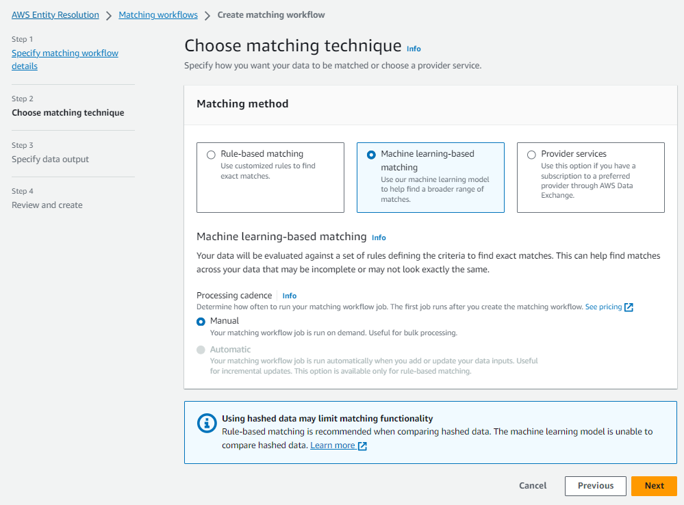

# Creating a machine learning-based matching

workflow

_[Machine learning-based
matching](glossary.md#ml-matching-defn "glossary.md#ml-matching-defn")_ is a preset process that attempts to match records across all
of the data that you input. The machine learning-based matching workflow enables you to
compare cleartext data to find a broad range of matches using a machine learning model.

###### Note

The machine learning model doesn't support the comparison of hashed data.

When AWS Entity Resolution finds a match between two or more records in your data, it assigns:

- A [Match ID](glossary.md#match-id-defin "glossary.md#match-id-defin") to the
  records in the matched set of data
- The match [confidence level](glossary.md#confidence-level-defn "glossary.md#confidence-level-defn") percentage.
  You can use the output of an ML-based matching workflow as an input for data service
  provider matching, or vice-versa to meet your specific goals. For example, you can run an
  ML-based matching to find matches across your data sources on your own records first. If a
  subset wasn't matched, you can then run [provider service- based matching](create-matching-workflow-provider.md "create-matching-workflow-provider.md") to
  find additional matches.

###### To create a ML-based matching workflow:

1.  Sign in to the AWS Management Console and open the AWS Entity Resolution console at [https://console.aws.amazon.com/entityresolution/](https://console.aws.amazon.com/entityresolution/ "https://console.aws.amazon.com/entityresolution/").
2.  In the left navigation pane, under **Workflows**, choose
    **Matching**.
3.  On the **Matching workflows** page, in the upper right corner, choose
    **Create matching workflow**.
4.  For **Step 1: Specify matching workflow details**, do the following:
    1. Enter a **Matching workflow name** and an optional
       **Description**.
    2. For **Data input**, choose an **AWS Region**,
       **AWS Glue database**, the **AWS Glue table**, and then
       the corresponding **Schema mapping**.

    You can add up to 20 data inputs. 3. The **Normalize data** option is selected by default, so that
    data inputs are normalized before matching. If you don't want to normalize data,
    deselect the **Normalize data** option.

    Machine learning based-matching only normalizes [Name](glossary.md#normalization-ML-defn-name "glossary.md#normalization-ML-defn-name"),
    [Phone](glossary.md#normalization-ML-defn-phone "glossary.md#normalization-ML-defn-phone"), and [Email](glossary.md#normalization-ML-defn-email "glossary.md#normalization-ML-defn-email"). 4. To specify the **Service access** permissions, choose an option
    and take the recommended action.

    | Option                                | Recommended action                                                                                                                                                                                                                                                                                                                                                                                                                                                                                                                                                                                                       |
    | ------------------------------------- | ------------------------------------------------------------------------------------------------------------------------------------------------------------------------------------------------------------------------------------------------------------------------------------------------------------------------------------------------------------------------------------------------------------------------------------------------------------------------------------------------------------------------------------------------------------------------------------------------------------------------ |
    | **Create and use a new service role** | • AWS Entity Resolution creates a service role with the required policy for this table. • The default **Service role name** is `entityresolution-matching-workflow-<timestamp>`. • You must have permissions to create roles and attach policies. • If your input data is encrypted, choose the **This data is encrypted by a KMS key\* • option. Then, enter an **AWS KMS key\* • that is used to decrypt your data input.                                                                                                                                                             |
    | **Use an existing service role**      | 1. Choose an **Existing service role name\* • from the dropdown list. The list of roles are displayed if you have permissions to list roles. If you don't have permissions to list roles, you can enter the Amazon Resource Name (ARN) of the role that you want to use. If there are no existing service roles, the option to **Use an existing service role* • is unavailable. 2. View the service role by choosing the \*\*View in IAM* • external link. By default, AWS Entity Resolution doesn't attempt to update the existing role policy to add necessary permissions. |
    5. (Optional) To enable **Tags** for the resource, choose
       **Add new tag**, and then enter the **Key** and
       **Value** pair.
    6. Choose **Next**.

5.  For **Step 2: Choose matching technique**:
    1. For **Matching method**, choose **Machine learning-based
       matching**.

     2. For **Processing cadence**, the **Manual**
    option is selected.

    This option enables you to run a workflow on demand for a bulk update.

    ###### Note

    Automatic (incremental) processing is not supported for machine learning-based
    matching workflows. 3. Choose **Next**.

6.  For **Step 3: Specify data output and format**:
    1. For **Data output destination and format**, choose the
       **Amazon S3 location** for the data output and whether the
       **Data format** will be **Normalized data** or
       **Original data**.
    2. For **Encryption**, if you choose to **Customize
       encryption settings**, enter the **AWS KMS key** ARN.
    3. View the **System generated output**.
    4. For **Data output**, decide which fields you want to include,
       hide, or mask, and then take the recommended actions based on your goals.

    | Your goal                         | Recommended option                                               |
    | --------------------------------- | ---------------------------------------------------------------- |
    | Include fields                    | Keep the output state as **Included**.                           |
    | Hide fields (exclude from output) | Choose the **Output field**, and then choose **Hide**.        |
    | Mask fields                       | Choose the **Output field**, and then choose **Hash output**. |
    | Reset the previous settings       | Choose **Reset**.                                                |
    5. Choose **Next**.

7.  For **Step 4: Review and create**:
    1. Review the selections that you made for the previous steps and edit if
       necessary.
    2. Choose **Create and run**.

    A message appears, indicating that the matching workflow has been created and that
    the job has started.

8.  On the matching workflow details page, on the **Metrics** tab, view
    the following under **Last job metrics**:

        * The **Job ID**.
        * The **Status** of the matching workflow job:
         **Queued**, **In progress**,
         **Completed**, **Failed**
        * The **Time completed** for the workflow job.
        * The number of **Records processed**.
        * The number of **Records not processed**.
        * The **Unique match IDs generated**.
        * The number of **Input records**.

    You can also view the job metrics for matching workflow jobs that have been previously
    run under the **Job history**.

9.  After the matching workflow job completes (**Status** is **Completed**), you can go to the **Data output**
    tab and then select your **Amazon S3 location** to view the results.
10. (**Manual** processing type only) If you have created a
    **Machine learning-based matching** workflow with the
    **Manual** processing type, you can run the matching workflow anytime
    by choosing **Run workflow** on the matching workflow details
    page.
