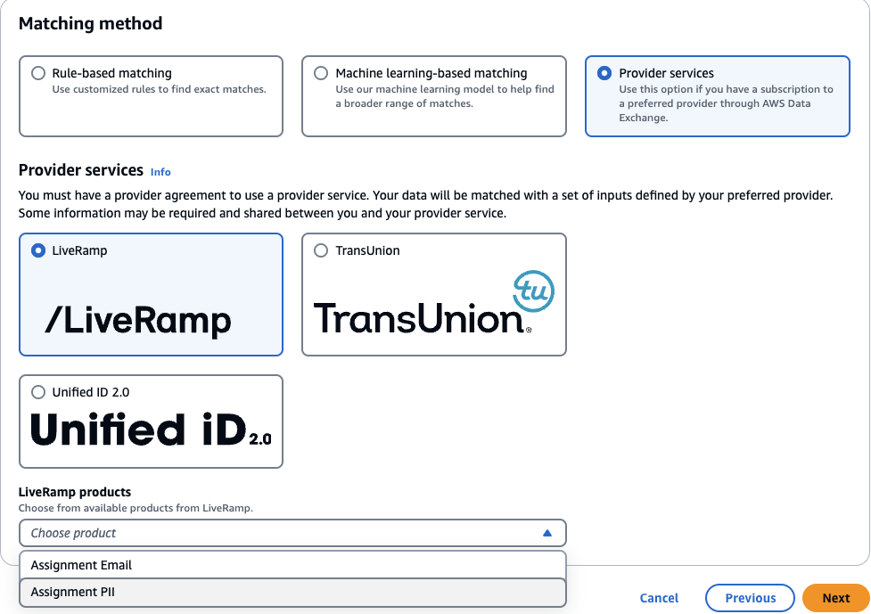
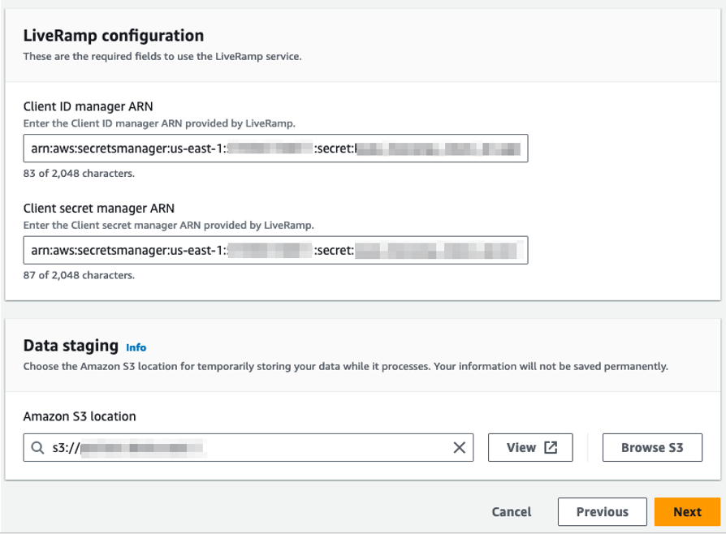
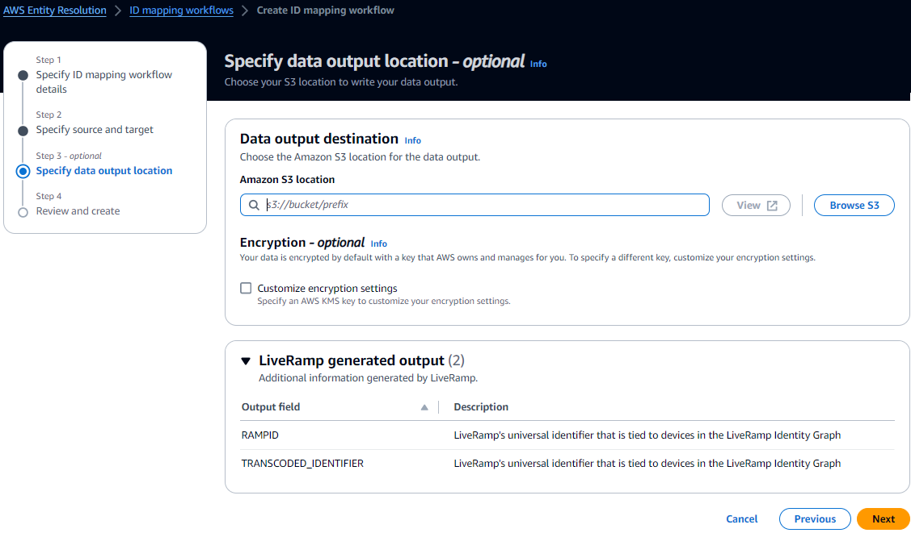
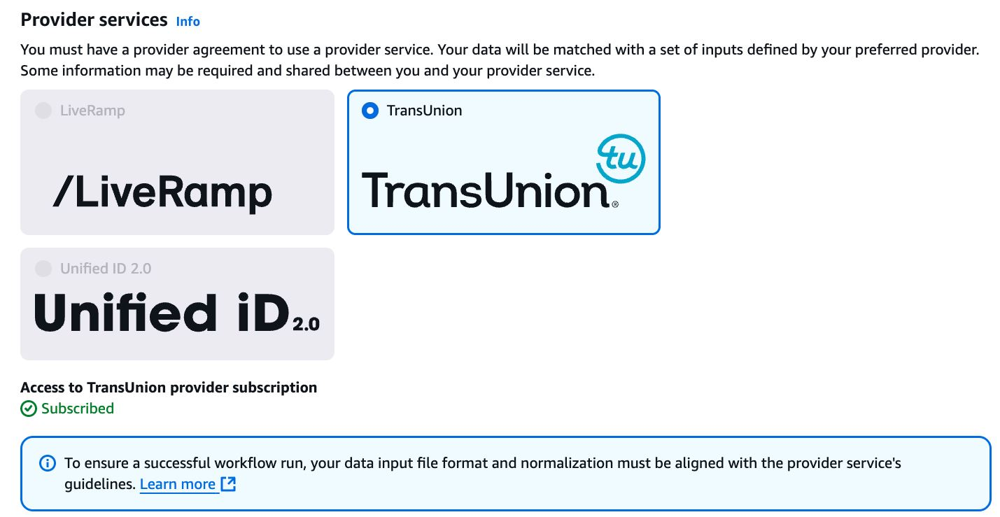
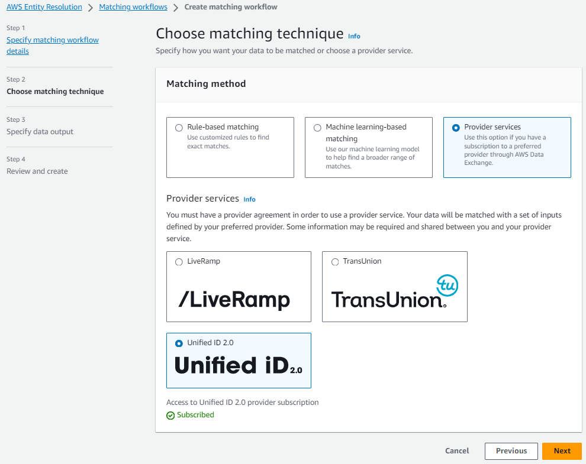

# Creating a provider service-based matching

workflow

_[Provider service-based
matching](glossary.md#provider-service-matching "glossary.md#provider-service-matching")_ enables you to match your known identifiers with your preferred
data service provider.

AWS Entity Resolution currently supports the following data provider services:

- LiveRamp
- TransUnion
- Unified ID 2.0
  For more information about the supported provider services, see [Preparing third-party input data](prepare-third-party-input-data.md "prepare-third-party-input-data.md").

You can use a public subscription for these providers on AWS Data Exchange or negotiate a private
offer directly with the data provider. For more information about creating a new subscription
or reusing an existing subscription to a provider service, see [Step 1: Subscribe to a provider service on
AWS Data Exchange](prepare-third-party-input-data.md#subscribe-provider-service "prepare-third-party-input-data.md#subscribe-provider-service").

The following sections describe how to create a provider-based matching workflow.

###### Topics

- [Creating a matching workflow with LiveRamp](#create-mw-liveramp "#create-mw-liveramp")
- [Creating a matching workflow with TransUnion](#create-mw-transunion "#create-mw-transunion")
- [Creating a matching workflow with UID 2.0](#create-mw-uid "#create-mw-uid")

## Creating a matching workflow with LiveRamp

The LiveRamp service provides an identifier called the RampID. The RampID is one of the
most commonly used IDs in demand-side platforms to create an audience for an advertising
campaign. Using a matching workflow with LiveRamp, you can resolve hashed email addresses to
RAMPIDs.

###### Note

AWS Entity Resolution supports PII-based RampID assignment.

**Prerequisites**

Before you create a matching workflow with LiveRamp, you must:

1. Create a schema mapping. For more information, see [Creating a schema mapping](create-schema-mapping.md "create-schema-mapping.md").
2. Have a subscription to the LiveRamp service
3. Have appropriate permissions configured to the Amazon S3 data staging bucket where you
   want the matching workflow output to be temporarily written

Before
you create a ID mapping workflow with LiveRamp, add the following permissions to the
S3
data staging bucket.

JSON

```
`{
 "Version":"2012-10-17",
 "Statement": [
 {
 "Effect": "Allow",
 "Principal": {
 "AWS": "arn:aws:iam::715724997226:root"

 },
 "Action": [
 "s3:PutObject",
 "s3:GetObject",
 "s3:GetObjectVersion",
 "s3:DeleteObject"
 ],
 "Resource": [
 "arn:aws:s3:::`<staging-bucket>`",
 "arn:aws:s3:::`<staging-bucket>`/*"
 ]
 },
 {
 "Effect": "Allow",
 "Principal": {
 "AWS": "arn:aws:iam::715724997226:root"
 },
 "Action": [
 "s3:ListBucket",
 "s3:GetBucketLocation",
 "s3:GetBucketPolicy",
 "s3:ListBucketVersions",
 "s3:GetBucketAcl"
 ],
 "Resource": [
 "arn:aws:s3:::`<staging-bucket>`",
 "arn:aws:s3:::`<staging-bucket>`/*"
 ]
 }
 ]
}`

```

Replace each `<user input placeholder>` with your own
information.

|                  |                                                                                                        |
| ---------------- | ------------------------------------------------------------------------------------------------------ |
| `staging-bucket` | Amazon S3 bucket that temporarily stores your data while running a provider service-based<br>workflow. |

###### To create a matching workflow with LiveRamp:

1.  Sign in to the AWS Management Console and open the AWS Entity Resolution console at [https://console.aws.amazon.com/entityresolution/](https://console.aws.amazon.com/entityresolution/ "https://console.aws.amazon.com/entityresolution/").
2.  In the left navigation pane, under **Workflows**, choose
    **Matching**.
3.  On the **Matching workflows** page, in the upper right corner,
    choose **Create matching workflow**.
4.  For **Step 1: Specify matching workflow details**, do the
    following:
    1. Enter a **Matching workflow name** and an optional
       **Description**.
    2. For **Data input**, choose an
       **AWS Region**, **AWS Glue database**, the
       **AWS Glue table**, and then the corresponding **Schema
       mapping**.

    You can add up to 20 data inputs. 3. The **Normalize data** option is selected by default, so that
    data inputs are normalized before matching.

    ###### Note

    Normalization is only supported for the following scenarios in
    **Create schema mapping**:

        * If the following **Name** sub-types are grouped:
         **First name**, **Middle name**,
         **Last name**.
        * If the following **Address** sub-types are grouped:
         **Street address 1**, **Street address
         2**: **Street address 3 name**, **City
         name**, **State**, **Country**,
         **Postal code**.
        * If the following **Phone** sub-types are grouped:
         **Phone number**, **Phone country
         code**.

    If you are using the email-only resolution process, deselect the
    **Normalize data** option, because only hashed emails are used
    for input data. 4. To specify the **Service access** permissions, choose an option
    and take the recommended action.

    | Option                                | Recommended action                                                                                                                                                                                                                                                                                                                                                                                                                                                                                                                                                                                                          |
    | ------------------------------------- | --------------------------------------------------------------------------------------------------------------------------------------------------------------------------------------------------------------------------------------------------------------------------------------------------------------------------------------------------------------------------------------------------------------------------------------------------------------------------------------------------------------------------------------------------------------------------------------------------------------------------- |
    | **Create and use a new service role** | • AWS Entity Resolution creates a service role with the required policy for this<br>table.<br>• The default **Service role name** is<br>`entityresolution-matching-workflow-<timestamp>`.<br>• You must have permissions to create roles and attach<br>policies.<br>• If your input data is encrypted, choose the **This data is<br>encrypted by a KMS key\*<br>• option. Then, enter an<br>**AWS KMS key\*<br>• that is used to decrypt your data<br>input.                                                                                                                                                                |
    | **Use an existing service role**      | 1. Choose an **Existing service role name\*<br>• from the<br>dropdown list.<br>The list of roles are displayed if you have permissions to list<br>roles.<br>If you don't have permissions to list roles, you can enter the<br>Amazon Resource Name (ARN) of the role that you want to use.<br>If there are no existing service roles, the option to<br>**Use an existing service role*<br>• is<br>unavailable.<br>2. View the service role by choosing the \*\*View in<br>IAM*<br>• external link.<br>By default, AWS Entity Resolution doesn't attempt to update the existing role<br>policy to add necessary permissions. |
    5. (Optional) To enable **Tags** for the resource, choose
       **Add new tag**, and then enter the **Key** and
       **Value** pair.
    6. Choose **Next**.

5.  For **Step 2: Choose matching technique**:
    1. For **Matching method**, choose **Provider
       services**.
    2. For **Provider services**, choose
       **LiveRamp**.

    ###### Note

    Ensure that your data input file format and normalization is aligned with the
    provider service's guidelines.

    For more information about input file formatting guidelines for the matching
    workflow, see [Perform Identity Resolution Through ADX](https://docs.liveramp.com/identity/en/perform-identity-resolution-through-adx.html "https://docs.liveramp.com/identity/en/perform-identity-resolution-through-adx.html") in the LiveRamp documentation. 3. For **LiveRamp products**, choose a product from the dropdown
    list.

    

    ###### Note

    If you choose **Assignment PII,** then you must provide at
    least one non-identifier column when performing entity resolution. For example,
    GENDER. 4. For **LiveRamp configuration**, enter a **Client ID
    manager ARN** and a **Client secret manager
    ARN**.

     5. For **Data staging**, choose the **Amazon S3
    location** for the temporary storage of your data while it processes.

    You must have permission to the data staging **Amazon S3 location**.
    For more information, see [Creating a workflow job role for
    AWS Entity Resolution](create-workflow-job-role.md "create-workflow-job-role.md"). 6. Choose **Next**.

6.  For **Step 3: Specify data output**:
    1. For **Data output destination and format**, choose the
       **Amazon S3 location** for the data output and whether the
       **Data format** will be **Normalized data** or
       **Original data**.
    2. For **Encryption**, if you choose to **Customize
       encryption settings**, enter the **AWS KMS key**
       ARN.
    3. View the **LiveRamp generated output**.

    This is the additional information generated by LiveRamp. 4. For **Data output**, decide which fields you want to include,
    hide, or mask, and then take the recommended actions based on your goals.

    ###### Note

    If you have chosen **LiveRamp**, due to LiveRamp privacy
    filters that remove Personally Identifiable Information (PII), some fields will
    display an **Output** state of
    **Unavailable**.

    | Your goal                         | Recommended option                                               |
    | --------------------------------- | ---------------------------------------------------------------- |
    | Include fields                    | Keep the output state as **Included**.                           |
    | Hide fields (exclude from output) | Choose the **Output field**, and then choose<br>**Hide**.        |
    | Mask fields                       | Choose the **Output field**, and then choose<br>**Hash output**. |
    | Reset the previous settings       | Choose **Reset**.                                                |

     5. Choose **Next**.

7.  For **Step 4: Review and create**:
    1. Review the selections that you made for the previous steps and edit if
       necessary.
    2. Choose **Create and run**.

    A message appears, indicating that the matching workflow has been created and
    that the job has started.

8.  On the matching workflow details page, on the **Metrics** tab, view
    the following under **Last job metrics**:

        * The **Job ID**.
        * The **Status** of the matching workflow job:
         **Queued**, **In progress**,
         **Completed**, **Failed**
        * The **Time completed** for the workflow job.
        * The number of **Records processed**.
        * The number of **Records not processed**.
        * The **Unique match IDs generated**.
        * The number of **Input records**.

    You can also view the job metrics for matching workflow jobs that have been
    previously run under the **Job history**.

9.  After the matching workflow job completes (**Status** is **Completed**), you can go to the **Data output**
    tab and then select your **Amazon S3 location** to view the results.

## Creating a matching workflow with TransUnion

If you have a subscription to the TransUnion service, you can improve customer
understanding by linking, matching, and enhancing customer-related records stored across
disparate channels with TransUnion Person and Household E Keys and over 200 data
attributes.

The TransUnion service provides identifiers known as the TransUnion Individual and
Household IDs. TransUnion provides ID assignment (also known as encoding) of known
identifiers such as name, address, phone number, and email address.

**Prerequisites**

Before you create a matching workflow with LiveRamp, you must:

1. Create a schema mapping. For more information, see [Creating a schema mapping](create-schema-mapping.md "create-schema-mapping.md").
2. Have a subscription to the TransUnion service
3. Have appropriate permissions configured to the Amazon S3 data staging bucket where you
   want the matching workflow output to be temporarily written

Before
you create a matching workflow with TransUnion, add the following permissions to the
S3
data staging bucket.

JSON

```
`{
 "Version":"2012-10-17",
 "Statement": [
 {
 "Effect": "Allow",
 "Principal": {
 "AWS": "arn:aws:iam::381491956555:root"

 },
 "Action": [
 "s3:PutObject",
 "s3:GetObject",
 "s3:GetObjectVersion",
 "s3:DeleteObject"
 ],
 "Resource": [
 "arn:aws:s3:::`<staging-bucket>`",
 "arn:aws:s3:::`<staging-bucket>`/*"
 ]
 },
 {
 "Effect": "Allow",
 "Principal": {
 "AWS": "arn:aws:iam::381491956555:root"
 },
 "Action": [
 "s3:ListBucket",
 "s3:GetBucketLocation",
 "s3:GetBucketPolicy",
 "s3:ListBucketVersions",
 "s3:GetBucketAcl"
 ],
 "Resource": [
 "arn:aws:s3:::`<staging-bucket>`",
 "arn:aws:s3:::`<staging-bucket>`/*"
 ]
 }
 ]
}`

```

Replace each `<user input placeholder>` with your own
information.

|                  |                                                                                                        |
| ---------------- | ------------------------------------------------------------------------------------------------------ |
| `staging-bucket` | Amazon S3 bucket that temporarily stores your data while running a provider service-based<br>workflow. |

###### To create a matching workflow with TransUnion:

1.  Sign in to the AWS Management Console and open the AWS Entity Resolution console at [https://console.aws.amazon.com/entityresolution/](https://console.aws.amazon.com/entityresolution/ "https://console.aws.amazon.com/entityresolution/").
2.  In the left navigation pane, under **Workflows**, choose
    **Matching**.
3.  On the **Matching workflows** page, in the upper right corner,
    choose **Create matching workflow**.
4.  For **Step 1: Specify matching workflow details**, do the
    following:
    1. Enter a **Matching workflow name** and an optional
       **Description**.
    2. For **Data input**, choose an
       **AWS Region**, **AWS Glue database**, the
       **AWS Glue table**, and then the corresponding **Schema
       mapping**.

    You can add up to 20 data inputs. 3. The **Normalize data** option is selected by default, so that
    data inputs are normalized before matching. If you don't want to normalize data,
    deselect the **Normalize data** option.

    ###### Note

    Normalization is only supported for the following scenarios in
    **Create schema mapping**:

        * If the following **Name** sub-types are grouped:
         **First name**, **Middle name**,
         **Last name**.
        * If the following **Address** sub-types are grouped:
         **Street address 1**, **Street address
         2**: **Street address 3 name**, **City
         name**, **State**, **Country**,
         **Postal code**.
        * If the following **Phone** sub-types are grouped:
         **Phone number**, **Phone country
         code**.

    4. To specify the **Service access** permissions, choose an option
       and take the recommended action.

    | Option                                | Recommended action                                                                                                                                                                                                                                                                                                                                                                                                                                                                                                                                                                                                          |
    | ------------------------------------- | --------------------------------------------------------------------------------------------------------------------------------------------------------------------------------------------------------------------------------------------------------------------------------------------------------------------------------------------------------------------------------------------------------------------------------------------------------------------------------------------------------------------------------------------------------------------------------------------------------------------------- |
    | **Create and use a new service role** | • AWS Entity Resolution creates a service role with the required policy for this<br>table.<br>• The default **Service role name** is<br>`entityresolution-matching-workflow-<timestamp>`.<br>• You must have permissions to create roles and attach<br>policies.<br>• If your input data is encrypted, choose the **This data is<br>encrypted by a KMS key\*<br>• option. Then, enter an<br>**AWS KMS key\*<br>• that is used to decrypt your data<br>input.                                                                                                                                                                |
    | **Use an existing service role**      | 1. Choose an **Existing service role name\*<br>• from the<br>dropdown list.<br>The list of roles are displayed if you have permissions to list<br>roles.<br>If you don't have permissions to list roles, you can enter the<br>Amazon Resource Name (ARN) of the role that you want to use.<br>If there are no existing service roles, the option to<br>**Use an existing service role*<br>• is<br>unavailable.<br>2. View the service role by choosing the \*\*View in<br>IAM*<br>• external link.<br>By default, AWS Entity Resolution doesn't attempt to update the existing role<br>policy to add necessary permissions. |
    5. (Optional) To enable **Tags** for the resource, choose
       **Add new tag**, and then enter the **Key** and
       **Value** pair.
    6. Choose **Next**.

5.  For **Step 2: Choose matching technique**:
    1. For **Matching method**, choose **Provider
       services**.
    2. For **Provider services**, choose
       **TransUnion**.

    ###### Note

    Ensure that your data input file format and normalization is aligned with the
    provider service's guidelines.

     3. For **Data staging**, choose the **Amazon S3
    location** for the temporary storage of your data while it processes.

    You must have permission to the data staging **Amazon S3 location**.
    For more information, see [Creating a workflow job role for
    AWS Entity Resolution](create-workflow-job-role.md "create-workflow-job-role.md").

6.  Choose **Next**.
7.  For **Step 3: Specify data output**:
    1. For **Data output destination and format**, choose the
       **Amazon S3 location** for the data output and whether the
       **Data format** will be **Normalized data** or
       **Original data**.
    2. For **Encryption**, if you choose to **Customize
       encryption settings**, enter the **AWS KMS key**
       ARN.
    3. View the **TransUnion generated output**.

    This is the additional information generated by TransUnion. 4. For **Data output**, decide which fields you want to include,
    hide, or mask, and then take the recommended actions based on your goals.

    | Your goal                         | Recommended option                                               |
    | --------------------------------- | ---------------------------------------------------------------- |
    | Include fields                    | Keep the output state as **Included**.                           |
    | Hide fields (exclude from output) | Choose the **Output field**, and then choose<br>**Hide**.        |
    | Mask fields                       | Choose the **Output field**, and then choose<br>**Hash output**. |
    | Reset the previous settings       | Choose **Reset**.                                                |
    5. For **System generated output**, view all of the fields that
       are included.
    6. Choose **Next**.

8.  For **Step 4: Review and create**:
    1. Review the selections that you made for the previous steps and edit if
       necessary.
    2. Choose **Create and run**.

    A message appears, indicating that the matching workflow has been created and
    that the job has started.

9.  On the matching workflow details page, on the **Metrics** tab, view
    the following under **Last job metrics**:

        * The **Job ID**.
        * The **Status** of the matching workflow job:
         **Queued**, **In progress**,
         **Completed**, **Failed**
        * The **Time completed** for the workflow job.
        * The number of **Records processed**.
        * The number of **Records not processed**.
        * The **Unique match IDs generated**.
        * The number of **Input records**.

    You can also view the job metrics for matching workflow jobs that have been
    previously run under the **Job history**.

10. After the matching workflow job completes (**Status** is **Completed**), you can go to the **Data output**
    tab and then select your **Amazon S3 location** to view the results.

## Creating a matching workflow with UID 2.0

If you have a subscription to the Unified ID 2.0 service, you can activate advertising
campaigns with deterministic identity and lean on interoperability with many UID2-enabled
participants across the advertising ecosystem. For more information, see [Unified ID 2.0 Overview](https://unifiedid.com/docs/intro " https://unifiedid.com/docs/intro").

The Unified ID 2.0 service provides raw UID 2, which is used for building advertising
campaigns in The Trade Desk platform. UID 2.0 is generated using an open source
framework.

In one workflow you can use either `Email Address` or
`Phone number` for raw UID2 generation but not both. If both are
present in the schema mapping, then the workflow will pick the `Email
 Address` and the `Phone number` will be a pass-through
field. To support both, create a new schema mapping where `Phone
 number` is mapped but `Email Address` isn't mapped. Then,
create a second workflow using this new schema mapping.

###### Note

Raw UID2s are created by adding salts from salt buckets which are rotated
approximately once a year, causing the raw UID2 to also be rotated with it. Therefore,
it's recommended that you refresh the raw UID2s daily. For more information, see [https://unifiedid.com/docs/getting-started/gs-faqs#how-often-should-uid2s-be-refreshed-for-incremental-updates](https://unifiedid.com/docs/getting-started/gs-faqs#how-often-should-uid2s-be-refreshed-for-incremental-updates "https://unifiedid.com/docs/getting-started/gs-faqs#how-often-should-uid2s-be-refreshed-for-incremental-updates").

**Prerequisites**

Before you create a matching workflow with UID 2.0, you must:

1. Create a schema mapping. For more information, see [Creating a schema mapping](create-schema-mapping.md "create-schema-mapping.md").
2. Have a subscription to the UID 2.0 service

###### To create a matching workflow with UID 2.0:

1.  Sign in to the AWS Management Console and open the AWS Entity Resolution console at [https://console.aws.amazon.com/entityresolution/](https://console.aws.amazon.com/entityresolution/ "https://console.aws.amazon.com/entityresolution/").
2.  In the left navigation pane, under **Workflows**, choose
    **Matching**.
3.  On the **Matching workflows** page, in the upper right corner,
    choose **Create matching workflow**.
4.  For **Step 1: Specify matching workflow details**, do the
    following:
    1. Enter a **Matching workflow name** and an optional
       **Description**.
    2. For **Data input**, choose an
       **AWS Region**, **AWS Glue database**, the
       **AWS Glue table**, and then the corresponding **Schema
       mapping**.

    You can add up to 20 data inputs. 3. Leave the **Normalize data** option is selected, so that data
    inputs (`Email Address` or `Phone number`)
    are normalized before matching.

    For more information about `Email Address` normalization,
    see [Email Address Normalization](https://unifiedid.com/docs/getting-started/gs-normalization-encoding#email-address-normalization "https://unifiedid.com/docs/getting-started/gs-normalization-encoding#email-address-normalization") in the UID 2.0 documentation.

    For more information about `Phone number` normalization,
    see [Phone Number Normalization](https://unifiedid.com/docs/getting-started/gs-normalization-encoding#phone-number-normalization "https://unifiedid.com/docs/getting-started/gs-normalization-encoding#phone-number-normalization") in the UID 2.0 documentation. 4. To specify the **Service access** permissions, choose an option
    and take the recommended action.

    | Option                                | Recommended action                                                                                                                                                                                                                                                                                                                                                                                                                                                                                                                                                                                                          |
    | ------------------------------------- | --------------------------------------------------------------------------------------------------------------------------------------------------------------------------------------------------------------------------------------------------------------------------------------------------------------------------------------------------------------------------------------------------------------------------------------------------------------------------------------------------------------------------------------------------------------------------------------------------------------------------- |
    | **Create and use a new service role** | • AWS Entity Resolution creates a service role with the required policy for this<br>table.<br>• The default **Service role name** is<br>`entityresolution-matching-workflow-<timestamp>`.<br>• You must have permissions to create roles and attach<br>policies.<br>• If your input data is encrypted, choose the **This data is<br>encrypted by a KMS key\*<br>• option. Then, enter an<br>**AWS KMS key\*<br>• that is used to decrypt your data<br>input.                                                                                                                                                                |
    | **Use an existing service role**      | 1. Choose an **Existing service role name\*<br>• from the<br>dropdown list.<br>The list of roles are displayed if you have permissions to list<br>roles.<br>If you don't have permissions to list roles, you can enter the<br>Amazon Resource Name (ARN) of the role that you want to use.<br>If there are no existing service roles, the option to<br>**Use an existing service role*<br>• is<br>unavailable.<br>2. View the service role by choosing the \*\*View in<br>IAM*<br>• external link.<br>By default, AWS Entity Resolution doesn't attempt to update the existing role<br>policy to add necessary permissions. |
    5. (Optional) To enable **Tags** for the resource, choose
       **Add new tag**, and then enter the **Key** and
       **Value** pair.
    6. Choose **Next**.

5.  For **Step 2: Choose matching technique**:
    1. For **Matching method**, choose **Provider
       services**.
    2. For **Provider services**, choose **Unified ID
       2.0**.

     3. Choose **Next**.

6.  For **Step 3: Specify data output**:
    1. For **Data output destination and format**, choose the
       **Amazon S3 location** for the data output and whether the
       **Data format** will be **Normalized data** or
       **Original data**.
    2. For **Encryption**, if you choose to **Customize
       encryption settings**, enter the **AWS KMS key**
       ARN.
    3. View the **Unified ID 2.0 generated output**.

    This is a list of all of the additional information generated by UID 2.0 4. For **Data output**, decide which fields you want to include,
    hide, or mask, and then take the recommended actions based on your goals.

    | Your goal                         | Recommended option                                               |
    | --------------------------------- | ---------------------------------------------------------------- |
    | Include fields                    | Keep the output state as **Included**.                           |
    | Hide fields (exclude from output) | Choose the **Output field**, and then choose<br>**Hide**.        |
    | Mask fields                       | Choose the **Output field**, and then choose<br>**Hash output**. |
    | Reset the previous settings       | Choose **Reset**.                                                |
    5. For **System generated output**, view all of the fields that
       are included.
    6. Choose **Next**.

7.  For **Step 4: Review and create**:
    1. Review the selections that you made for the previous steps and edit if
       necessary.
    2. Choose **Create and run**.

    A message appears, indicating that the matching workflow has been created and
    that the job has started.

8.  On the matching workflow details page, on the **Metrics** tab, view
    the following under **Last job metrics**:

        * The **Job ID**.
        * The **Status** of the matching workflow job:
         **Queued**, **In progress**,
         **Completed**, **Failed**
        * The **Time completed** for the workflow job.
        * The number of **Records processed**.
        * The number of **Records not processed**.
        * The **Unique match IDs generated**.
        * The number of **Input records**.

    You can also view the job metrics for matching workflow jobs that have been
    previously run under the **Job history**.

9.  After the matching workflow job completes (**Status** is **Completed**), you can go to the **Data output**
    tab and then select your **Amazon S3 location** to view the results.
