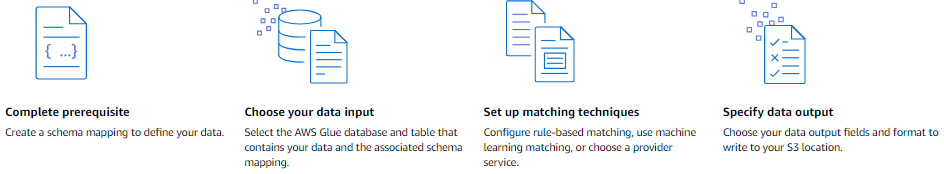

# Match input data using a matching workflow

A _matching workflow_ is a data processing job that
combines and compares data from different input sources and determines which records match based
on different matching techniques. AWS Entity Resolution reads your data from your specified locations, finds
matches between records, and assigns a [Match ID](glossary.md#match-id-defin "glossary.md#match-id-defin") to each matched set of data.

The following diagram summarizes how to create a matching workflow.

###### Topics

- [Matching workflow types](#matching-workflow-types "#matching-workflow-types")
- [Data output options](#data-output-options "#data-output-options")
- [Matching workflow results](#matching-workflow-results "#matching-workflow-results")
- [Creating a rule-based matching
  workflow](creating-matching-workflow-rule-based.md "creating-matching-workflow-rule-based.md")
- [Creating a machine learning-based matching
  workflow](create-matching-workflow-ml.md "create-matching-workflow-ml.md")
- [Creating a provider service-based matching
  workflow](create-matching-workflow-provider.md "create-matching-workflow-provider.md")
- [Editing a matching workflow](edit-matching-workflow.md "edit-matching-workflow.md")
- [Deleting a matching workflow](delete-matching-workflow.md "delete-matching-workflow.md")
- [Modifying or generating a Match ID for a rule-based
  matching workflow](generate-match-id.md "generate-match-id.md")
- [Looking up a Match ID for a rule-based matching
  workflow](find-match-id.md "find-match-id.md")
- [Deleting records from a rule-based or ML-based matching
  workflow](delete-records.md "delete-records.md")
- [Troubleshooting matching workflows](troubleshooting.md "troubleshooting.md")

## Matching workflow types

AWS Entity Resolution supports three types of matching workflows:

Rule-based matching

Uses configurable rules to identify matching records based on exact or fuzzy
matching of specified fields. You define the matching criteria, such as matching names
that are spelled similarly or addresses that are formatted differently.

Machine learning-based matching

Uses machine learning models to identify similar records, even when the data has
variations, errors, or missing fields. This approach can detect more complex matches
than rule-based matching.

Provider service-based matching

Uses third-party data providers to enrich and validate your data before matching.
This type of matching is not compatible with Amazon Connect Customer Profiles
output.

## Data output options

AWS Entity Resolution can write data output files to:

- An Amazon S3 location that you specify
- Amazon Connect Customer Profiles (for customer data deduplication)

###### Important

Exporting to Amazon Connect Customer Profiles is not compatible with provider-based matching. To
export to Amazon Connect Customer Profiles, you must use rule-based matching or machine
learning-based matching.

You can use AWS Entity Resolution to hash output data if desired – helping you maintain control
over your data.

The following table shows the three types of matching workflows and their supported output
destinations.

| Matching type                                                                                            | S3 output | Customer Profiles Output |
| -------------------------------------------------------------------------------------------------------- | --------- | ------------------------ |
| [rule-based](creating-matching-workflow-rule-based.md "creating-matching-workflow-rule-based.md")        | Yes       | Yes                      |
| [machine learning-based](create-matching-workflow-ml.md "create-matching-workflow-ml.md")                | Yes       | Yes                      |
| [provider service-based](create-matching-workflow-provider.md "create-matching-workflow-provider.md") | Yes       | No                       |

## Matching workflow results

After you create and run a matching workflow, you can view the results in your specified
S3 location or in Amazon Connect Customer Profiles. Matching workflows generate IDs after the data is
indexed.

A matching workflow can have multiple runs and the results (successes or errors) are
written to a folder with the `jobId` as the name.

For each run for S3 output destinations:

- The data output contains both a file for successful matches and a file for
  errors
- Successful results are written to a `success` folder containing multiple
  files
- Errors are written to an `error` folder with multiple fields

For each run for Amazon Connect Customer Profiles output destinations:

- Deduplicated customer records are sent directly to your Amazon Connect instance
- You can view your recent job history in the AWS Entity Resolution console
- Existing profiles in Amazon Connect are not included in the deduplication
  process

After you create and run a matching workflow, you can use the output of [rule-based matching](creating-matching-workflow-rule-based.md "creating-matching-workflow-rule-based.md") or [machine
learning (ML) matching](create-matching-workflow-ml.md "create-matching-workflow-ml.md") as an input to [provider service-based matching](create-matching-workflow-provider.md "create-matching-workflow-provider.md") or
the other way around to meet your business needs.

For example, to save provider subscription costs, you can first run [rule-based matching](creating-matching-workflow-rule-based.md "creating-matching-workflow-rule-based.md") to find
matches on your data. Then, you can send a subset of unmatched records to [provider service-based matching](create-matching-workflow-provider.md "create-matching-workflow-provider.md").
Note that if you plan to export to Customer Profiles, you should use rule-based or machine
learning-based matching only.

For more information about troubleshooting errors, see [Troubleshooting matching workflows](troubleshooting.md "troubleshooting.md").
