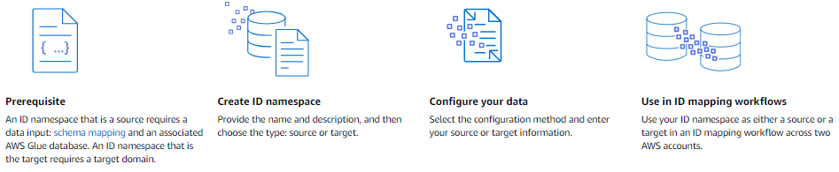

# Define input data using an ID namespace

An _ID namespace_ is a wrapper around your input data
table. You use an ID namespace to provide metadata explaining your input data and matching
techniques and how to use them in an [ID mapping workflow](create-id-mapping-workflow.md "create-id-mapping-workflow.md").

There are two types of ID namespaces: **Source** and
**Target**.

- The **Source** contains configurations for the source data that
  AWS Entity Resolution processes in an ID mapping workflow.
- The **Target** contains a configuration of the target data that all
  sources resolve to.
  You can define the input data that you want to resolve across two AWS accounts in an ID
  mapping workflow. One participant creates an ID namespace source and another participant creates
  an ID namespace target. After the participants create the source and target, you can run an ID
  mapping workflow to translate the data from the source to the target.

The following diagram summarizes how to create an ID namespace to use in an ID mapping
workflow.

The following sections describe how to create an ID namespace source and an ID namespace
target.

###### Topics

- [ID namespace source](create-id-namespace-source.md "create-id-namespace-source.md")
- [ID namespace target](create-id-namespace-target.md "create-id-namespace-target.md")
- [Editing an ID namespace](edit-id-namespaces.md "edit-id-namespaces.md")
- [Deleting an ID namespace](delete-id-namespace.md "delete-id-namespace.md")
- [Adding or updating a resource policy
  for an ID namespace](add-update-resource-policy-id-namespace.md "add-update-resource-policy-id-namespace.md")
