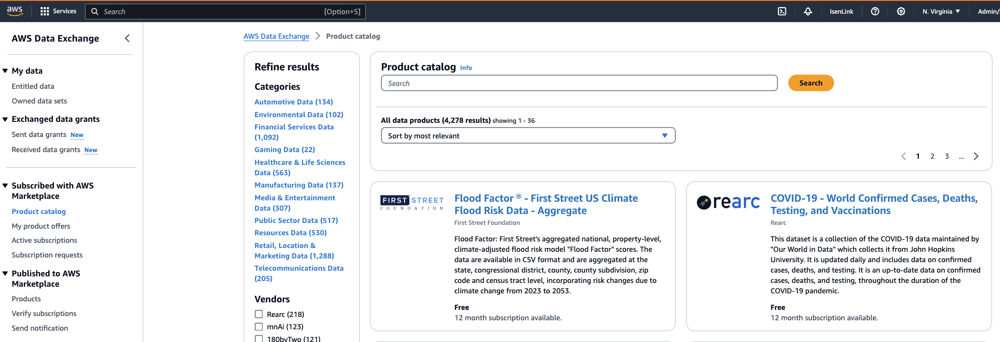

# Requirements

Before integrating as a provider service with AWS Entity Resolution, complete the following requirements.

###### Topics

- [List a provider service on AWS Data Exchange](#list-provider-service "#list-provider-service")
- [Identify your attributes](#provider-create-schema-mapping "#provider-create-schema-mapping")
- [Request the AWS Entity Resolution OpenAPI specification](#request-openapi-spec "#request-openapi-spec")

## List a provider service on AWS Data Exchange

As a third-party provider, you must list your product on the [AWS Data Exchange (ADX)](https://aws.amazon.com/data-exchange/ "https://aws.amazon.com/data-exchange/") Product
Catalog. After your product is listed on the AWS Data Exchange Product Catalog, subscribers can
subscribe to your product through either a public or private offer.

###### To list a provider service on AWS Data Exchange

1. If you are a new data product provider on AWS Data Exchange, complete the steps in the section
   titled [Getting started as a provider](../../../data-exchange/latest/userguide/provider-getting-started.md "../../../data-exchange/latest/userguide/provider-getting-started.md") in the _AWS Data Exchange User Guide_.
2. Create a REST API data set and publish a new product that contains APIs on AWS Data Exchange by
   following the steps in the section titled [How to publish a product containing APIs](../../../data-exchange/latest/userguide/publishing-products.md#publish-API-product "../../../data-exchange/latest/userguide/publishing-products.md#publish-API-product") in the _AWS Data Exchange User Guide_. You can complete the process by using
   either the AWS Data Exchange console or the AWS Command Line Interface.

If you've set the product visibility **Public**, the public offer
is available to all subscribers.

If you've set the product visibility **Private**, complete the
steps in the section titled [Create custom offers](../../../data-exchange/latest/userguide/create-custom-offers.md "../../../data-exchange/latest/userguide/create-custom-offers.md") in the _AWS Data Exchange User
Guide_, depending on your use case.

The following image shows an example of an available product in the AWS Data Exchange Product
Catalog.

 3. After the product is available on the AWS Data Exchange Product Catalog, the subscriber can
subscribe to the product in the following ways.

    * Subscribe the public product.
    * Use a [private offer](../../../data-exchange/latest/userguide/subscribe-to-private-offer.md "../../../data-exchange/latest/userguide/subscribe-to-private-offer.md") (custom offer) that has been issued by
     the provider service.
    * Use a [Bring Your Own Subscription (BYOS)](../../../data-exchange/latest/userguide/subscribe-to-byos-offer.md "../../../data-exchange/latest/userguide/subscribe-to-byos-offer.md") offer.

For more information, see [Subscribe to and access a product containing APIs](../../../data-exchange/latest/userguide/subscribing-to-product.md#subscribing-to-API-product "../../../data-exchange/latest/userguide/subscribing-to-product.md#subscribing-to-API-product") in the
_AWS Data Exchange User Guide_.

## Identify your attributes

_Attributes_ of the input data are the type definitions
of the entities to be resolved in a workflow. Some examples of attributes are
`FirstName`, `LastName`, `Email`, or `Custom
 String`.

When you identify your attributes, you should note any requirements or guidelines.

###### Example

The following is an example of validations for identifying provider attributes.

- Either the `FirstName` or `LastName` attribute is
  mandatory.
- If the `Email` attribute is present, it must be hashed.

As a provider, you must identify the attributes in your provider service product and
then communicate these attributes to the AWS Entity Resolution Business Development team at
`<aws-entity-resolution-bd@amazon.com>` for additional validation before
proceeding.

## Request the AWS Entity Resolution OpenAPI specification

AWS Entity Resolution has an OpenAPI specification that you as a provider can use as a handshake that
contains the APIs involved in the integration. For more information, see [Using the AWS Entity Resolution OpenAPI specification](entity-resolution-open-api.md "entity-resolution-open-api.md").

To request the OpenAPI definition, contact the AWS Entity Resolution Business Development team at
`<aws-entity-resolution-bd@amazon.com>`.
