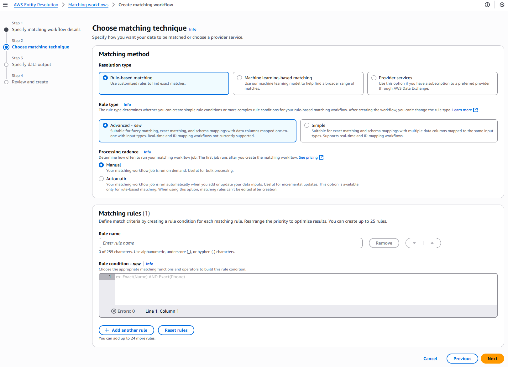
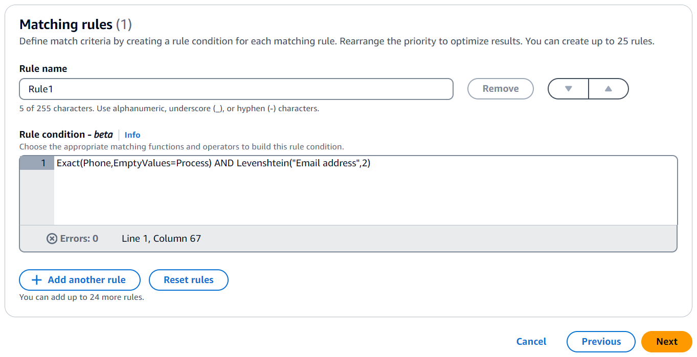

# Creating a rule-based matching workflow with the

Advanced rule type

The following procedure demonstrates how to create a rule-based matching workflow with
the **Advanced** rule type using either the AWS Entity Resolution console or the
`CreateMatchingWorkflow` API.

Console

###### To create a rule-based matching workflow with the **Advanced**

rule type using the console

1.  Sign in to the AWS Management Console and open the AWS Entity Resolution console at [https://console.aws.amazon.com/entityresolution/](https://console.aws.amazon.com/entityresolution/ "https://console.aws.amazon.com/entityresolution/").
2.  In the left navigation pane, under **Workflows**, choose
    **Matching**.
3.  On the **Matching workflows** page, in the upper right
    corner, choose **Create matching workflow**.
4.  For **Step 1: Specify matching workflow details**, do the
    following:
    1. Enter a **Matching workflow name** and an optional
       **Description**.
    2. For **Data input**, choose an
       **AWS Region**, **AWS Glue database**, the
       **AWS Glue table**, and then the corresponding
       **Schema mapping**.

    You can add up to 19 data inputs.

    ###### Note

    To use **Advanced** rules, your schema mappings must
    meet the following requirements:

        1. Each input field must be mapped to a unique match key, unless the
         fields are grouped together.
        2. If input fields are grouped together, they can share the same match
         key.


        For example, the following schema mapping would be valid for
         **Advanced** rules:


        `firstName: { matchKey: 'name', groupName: 'name'
         }`


        `lastName: { matchKey: 'name', groupName: 'name'
         }`


        In this case, the `firstName` and `lastName`
         fields are grouped together and share the same name match key, which is
         allowed.


        Review your schema mappings and update them to follow this
         one-to-one matching rule, unless the fields are properly grouped, in
         order to use **Advanced** rules.
        3. If your data table has a DELETE column, the schema mapping's type
         must be `String` and you can't have a `matchKey`
         and `groupName`.

    3. The **Normalize data** option is selected by default, so
       that data inputs are normalized before matching. If you don't want to
       normalize data, deselect the **Normalize data**
       option.

    ###### Note

    Normalization is only supported for the following scenarios in
    **Create schema mapping**:

        * If the following **Name** sub-types are grouped:
         **First name**, **Middle name**,
         **Last name**.
        * If the following **Address** sub-types are grouped:
         **Street address 1**, **Street address
         2**, **Street address 3**,
         **City**, **State**,
         **Country**, **Postal code**.
        * If the following **Phone** sub-types are grouped:
         **Phone number**, **Phone country
         code**.

    4. To specify the **Service access** permissions, choose an
       option and take the recommended action.

| Option                                                                                                                                                             | Recommended action                                                                                                                                                                                                                                                                                                                                                                                                                                                                                                                                                       |
| ------------------------------------------------------------------------------------------------------------------------------------------------------------------ | ------------------------------------------------------------------------------------------------------------------------------------------------------------------------------------------------------------------------------------------------------------------------------------------------------------------------------------------------------------------------------------------------------------------------------------------------------------------------------------------------------------------------------------------------------------------------ | ------------------------------------------------------------------------------------------------------------------------------------------------------------------------------------------------------------------------------------------------------------------------------------------------------------------------------------------------------------------------------------------------------------------------------------------------------------------------------------------------------------------------------------------------------------------------------------------------------------------------------------------------------------------------------------------------------------------------------------------------------------------------------------------------------------------------------------------------------------------------------------------------------------------------------------------------------------------------------------------------------------------------------------------------------------------------------------------------------------------------------------------------------------------------------------------------------------------------------------------------------------------------------------------------------------------------------------------------------------------------------------------------------------------------------------------------------------------------------------------------------------------------------------------------------------------------------------------------------------------------------------------------------------------- | --------------------------------------------------------------------------------------------------------------------------------------------------------------------------------------- | ----------------------------------------------------------------------------------------------------------------------------------------------------------------------------------------------------------------------------------------------------------------------------------------------------------------------------------------------------------------------------------------------------------------------------------------------------------------------------------------------------------------------------------------------------------------------------------------------------------------------------------------------------------------------------------------------------------------------------------------------------------------------------------------------------------------------------------------------------------------------------------------------------------------------------------------------------------------------------------------------------------------------------------------------------------------------------------------------------------------------------------------------------------------------------------------------------------------------------------------------------------------------------------------------------------------------------------------------------------------------------------------------------------------------------------------------------------------------------------------------------------------------------------------------------------------------------------------------------------------------------------------------------------------------------------------------------------------------------------------------------------------------------------------------------------------------------------------------------------------------------------------------------------------------------------------------------------------------------------------------------------------------------------------------------------------------------------------------------------------------------------------------------------------------------------------------------------------------------------------------------------------------------------------------------------------------------------------------------------------------------------------------------------------------------------------------------------------------------------------------------------------------------------------------------------------------------------------------------------------------------------------------------------------------------------------------------------------------------------------------------------------------------------------------------------------------------------------------------------------------------------------------------------------------------------------------------------------------------------------------------------------------------------------------------------------------------------------------------------------------------------------------------------------------------------------------------------------------------------------------------------------------------------------------------------------------------------------------------------------------------------------------------------------------------------------------------------------------------------------------------------------------------------------------------------------------------------------------------------------------------------------------------------------- | ----------------------------------------------------------------------------------------------------------------------------------------------------------------------------------------------------------------------------------------------------------------------------------------------------------------------------------------------------------------------------------------------------------------------------------------------------------------------------------------------------------------------------------------------------------------------------------------------------------------------------------------------------------------------------------------------------------------------------------------------------------------------------------------------------------------------------------------------------------------------------------------------------------------------------------------------------------------------------------------------------------------------------------------------------------------------------------------------------------------------------------------------------------------------------------------------------------------------------------------------------------------------------------------------------------------------------------------------------------------------------------------------------------------------------------------------------------------------------------------------------------------------------------------------------------------------------------------------------------------------------------------------------------------------------------------------------------------------------------------------------------------------------------------------------------------------------------------------------------------------------------------------------------------------------------------------------------------------------------------------------------------------------------------------------------------------------------------------------------------------------------------------------------------------------------------------------------------------------------------------------------------------------------------------------------------------------------------------------------------------------------------------------------------------------------------------------------------------------------------------------------------------------------------------------------------------------------------------------------------------------------------------------------------------------------------------------------------------------------------------------------------------------------------------------------------------------------------------------------------------------------------------------------------------------------------------------------------------------------------------------------------------------------------------------------------------------------------------------------------------------------------------------------------------------------------------------------------------------------------------------------------------------------------------------------------------------------------------------------------------------------------------------------------------------------------------------------------------------------------------------------------------------------------------------------------------------------------------------------------------------------------------------------------------------------------------------------------------------------------------------------------------------------------------------------------------------------------------------------------------------------------------------------------------------------------------------------------------------------------------------------------------------------------------------------------------------------------------------------------------------------------------------------------------------------------------------------------------------------------------------------------------------------------------------------------------------------------------------------------------------------------------------------------------------------------------------------------------------------------------------------------------------------------------------------------------------------------------------------------------------------------------------------------------------------------------------------------------------------------------------------------------------------------------------------------------------------------------------------------------------------------------------------------------------------------------------------------------------------------------------------------------------------------------------------------------------------------------------------------------------------------------------------------- | ---------------------- |
| **Create and use a new service role**                                                                                                                              | <br>• AWS Entity Resolution creates a service role with the required policy for this table. <br>• The default **Service role name** is `entityresolution-matching-workflow-<timestamp>`. <br>• You must have permissions to create roles and attach policies. <br>• If your input data is encrypted, you can choose the **This data is encrypted with a KMS key** option and then enter an **AWS KMS key** that will be used to decrypt your data input.                                                                                                                 |
| **Use an existing service role**                                                                                                                                   | 1. Choose an **Existing service role name** from the dropdown list. The list of roles are displayed if you have permissions to list roles. If you don't have permissions to list roles, you can enter the Amazon Resource Name (ARN) of the role that you want to use. If there are no existing service roles, the option to **Use an existing service role** is unavailable. 2. View the service role by choosing the **View in IAM** external link. By default, AWS Entity Resolution doesn't attempt to update the existing role policy to add necessary permissions. | 5. (Optional) To enable **Tags** for the resource, choose **Add new tag**, and then enter the **Key** and **Value** pair. 6. Choose **Next**. 5. For **Step 2: Choose matching technique**: 1. For **Matching method**, choose **Rule-based matching**. 2. For **Rule type**, choose **Advanced**.  3. For **Processing cadence**, select one of the following options. <br>• Choose **Manual** to run a workflow on demand for a bulk update <br>• Choose **Automatic** to run a workflow as soon as new data is in your S3 bucket ###### Note If you choose **Automatic**, ensure that you have Amazon EventBridge notifications turned on for your S3 bucket. For instructions on enabling Amazon EventBridge using the S3 console, see [Enabling Amazon EventBridge](../../../AmazonS3/latest/userguide/enable-event-notifications-eventbridge.md "../../../AmazonS3/latest/userguide/enable-event-notifications-eventbridge.md") in the _Amazon S3 User Guide_. 4. For **Matching rules**, enter a **Rule name** and then build the **Rule condition** by choosing the appropriate matching functions and operators from the dropdown list based on your goal. You can create up to 25 rules. You must combine a fuzzy matching function (**Cosine**, **Levenshtein**, or **Soundex**) with an exact matching function (**Exact**, **ExactManyToMany**) using the **AND** operator. You can use the following table to help decide what type of function or operator you want to use, depending on your goal. |
| Your goal                                                                                                                                                          | Recommended function or operator                                                                                                                                                                                                                                                                                                                                                                                                                                                                                                                                         | Recommended optional modifier                                                                                                                                                                                                                                                                                                                                                                                                                                                                                                                                                                                                                                                                                                                                                                                                                                                                                                                                                                                                                                                                                                                                                                                                                                                                                                                                                                                                                                                                                                                                                                                                                                       | Pros                                                                                                                                                                                    |
| ---                                                                                                                                                                | ---                                                                                                                                                                                                                                                                                                                                                                                                                                                                                                                                                                      | ---                                                                                                                                                                                                                                                                                                                                                                                                                                                                                                                                                                                                                                                                                                                                                                                                                                                                                                                                                                                                                                                                                                                                                                                                                                                                                                                                                                                                                                                                                                                                                                                                                                                                 | ---                                                                                                                                                                                     |
| Match identical strings on accurate data but don't match on empty values.                                                                                          | **Exact**                                                                                                                                                                                                                                                                                                                                                                                                                                                                                                                                                                | **EmptyValues=Process**                                                                                                                                                                                                                                                                                                                                                                                                                                                                                                                                                                                                                                                                                                                                                                                                                                                                                                                                                                                                                                                                                                                                                                                                                                                                                                                                                                                                                                                                                                                                                                                                                                             |                                                                                                                                                                                         |
| Match identical strings on accurate data and ignore empty values.                                                                                                  | **Exact(`matchKey`)**                                                                                                                                                                                                                                                                                                                                                                                                                                                                                                                                                    | **EmptyValues=Ignore**                                                                                                                                                                                                                                                                                                                                                                                                                                                                                                                                                                                                                                                                                                                                                                                                                                                                                                                                                                                                                                                                                                                                                                                                                                                                                                                                                                                                                                                                                                                                                                                                                                              |                                                                                                                                                                                         |
| Match multiple records across match keys. Suitable for flexible pairings. Limit: 15 match keys                                                                     | **ExactManyToMany**(`matchKey`, `matchKey`, ...)                                                                                                                                                                                                                                                                                                                                                                                                                                                                                                                         | n/a                                                                                                                                                                                                                                                                                                                                                                                                                                                                                                                                                                                                                                                                                                                                                                                                                                                                                                                                                                                                                                                                                                                                                                                                                                                                                                                                                                                                                                                                                                                                                                                                                                                                 |                                                                                                                                                                                         |
| Measure similarity between numerical representations of data but don't match on empty values. Suitable for text, numbers, or a mix of both.                        | **Cosine**                                                                                                                                                                                                                                                                                                                                                                                                                                                                                                                                                               | **EmptyValues=Process**                                                                                                                                                                                                                                                                                                                                                                                                                                                                                                                                                                                                                                                                                                                                                                                                                                                                                                                                                                                                                                                                                                                                                                                                                                                                                                                                                                                                                                                                                                                                                                                                                                             | Simple, efficient. Works well with long text when combined with TF-IDF weighting. Good for exact word-based matching.                                                                   |
| Measure similarity between numerical representations of data and ignore empty values.                                                                              | **Cosine(`matchKey`, `threshold`, ...)**                                                                                                                                                                                                                                                                                                                                                                                                                                                                                                                                 | **EmptyValues=Ignore**                                                                                                                                                                                                                                                                                                                                                                                                                                                                                                                                                                                                                                                                                                                                                                                                                                                                                                                                                                                                                                                                                                                                                                                                                                                                                                                                                                                                                                                                                                                                                                                                                                              | Handles typos, spelling errors, and transpositions well. Effective on a wide range of PII types. Good for short strings (for example, names or phone numbers).                          |
| Count the minimum number of changes needed to change one word into another but don't match on empty values. Suitable for text with slight differences in spelling. | **Levenshtein**                                                                                                                                                                                                                                                                                                                                                                                                                                                                                                                                                          | **EmptyValues=Process**                                                                                                                                                                                                                                                                                                                                                                                                                                                                                                                                                                                                                                                                                                                                                                                                                                                                                                                                                                                                                                                                                                                                                                                                                                                                                                                                                                                                                                                                                                                                                                                                                                             |                                                                                                                                                                                         | Count the minimum number of changes needed to change one word into another and ignore empty values.                                                                                                                                                                                                                                                                                                                                                                                                                                                                                                                                                                                                                                                                                                                                                                                                                                                                                                                                                                                                                                                                                                                                                                                                                                                                                                                                                                                                                                                                                                                                                                                                                                                                                                                                                                                                                                                                                                                                                                                                                                                                                                                                                                                                                                                                                                                                                                                                                                                                                                                                                                                                                                                                                                                                                                                                                                                                                                                                                                                                                                                                                                                                                                                                                                                                                                                                                                                                                                                                                                                                                               | **Levenshtein(`matchKey`, `threshold`, ...)**                                                                                                                                                                                                                                                                                                                                                                                                                                                                                                                                                                                                                                                                                                                                                                                                                                                                                                                                                                                                                                                                                                                                                                                                                                                                                                                                                                                                                                                                                                                                                                                                                                                                                                                                                                                                                                                                                                                                                                                                                                                                                                                                                                                                                                                                                                                                                                                                                                                                                                                                                                                                                                                                                                                                                                                                                                                                                                                                                                                                                                                                                                                                                                                                                                                                                                                                                                                                                                                                                                                                                                                                                                                                                                                                                                                                                                                                                                                                                                                                                                                                                                                                                                                                                                                                                                                                                                                                                                                                                                                                                                                                                                                                                                                                                                                                                                                                                                                                                                                                                                                                                                                     | **EmptyValues=Ignore** |
| Compare and match text strings based on how similar they sound but don't match on empty values. Suitable for text with variations in spelling or pronunciation.    | **Soundex**                                                                                                                                                                                                                                                                                                                                                                                                                                                                                                                                                              | **EmptyValues=Process**                                                                                                                                                                                                                                                                                                                                                                                                                                                                                                                                                                                                                                                                                                                                                                                                                                                                                                                                                                                                                                                                                                                                                                                                                                                                                                                                                                                                                                                                                                                                                                                                                                             | Effective for phonetic matching, identifying similar-sounding words. Fast and computationally inexpensive. Good for matching names with similar pronunciations but different spellings. |
| Compare and match text strings based on how similar they sound and ignore empty values.                                                                            | \***\*Soundex**(`matchKey`)\*\*                                                                                                                                                                                                                                                                                                                                                                                                                                                                                                                                          | **EmptyValues=Ignore**                                                                                                                                                                                                                                                                                                                                                                                                                                                                                                                                                                                                                                                                                                                                                                                                                                                                                                                                                                                                                                                                                                                                                                                                                                                                                                                                                                                                                                                                                                                                                                                                                                              |
| Combine functions.                                                                                                                                                 | **AND**                                                                                                                                                                                                                                                                                                                                                                                                                                                                                                                                                                  | n/a                                                                                                                                                                                                                                                                                                                                                                                                                                                                                                                                                                                                                                                                                                                                                                                                                                                                                                                                                                                                                                                                                                                                                                                                                                                                                                                                                                                                                                                                                                                                                                                                                                                                 |                                                                                                                                                                                         |
| Separate functions.                                                                                                                                                | **OR**                                                                                                                                                                                                                                                                                                                                                                                                                                                                                                                                                                   | n/a                                                                                                                                                                                                                                                                                                                                                                                                                                                                                                                                                                                                                                                                                                                                                                                                                                                                                                                                                                                                                                                                                                                                                                                                                                                                                                                                                                                                                                                                                                                                                                                                                                                                 |                                                                                                                                                                                         |
| Group conditions to create nested conditions.                                                                                                                      | **(…)**                                                                                                                                                                                                                                                                                                                                                                                                                                                                                                                                                                  | n/a                                                                                                                                                                                                                                                                                                                                                                                                                                                                                                                                                                                                                                                                                                                                                                                                                                                                                                                                                                                                                                                                                                                                                                                                                                                                                                                                                                                                                                                                                                                                                                                                                                                                 |                                                                                                                                                                                         | ###### Example Rule condition that matches on phone numbers and email The following is an example of a rule condition that matches records on phone numbers (**Phone** match key) and email addresses (**Email address** match key): `Exact(Phone,EmptyValues=Process) AND Levenshtein("Email address",2)`  The **Phone** match key uses the **Exact** matching function to match identical strings. The **Phone** match key processes empty values in matching using the **EmptyValues=Process** modifier. The **Email address** match key uses the **Levenshtein** matching function to match data with misspellings using the default Levenshtein Distance algorithm threshold of 2. The **Email** match key doesn't use any optional modifiers. The **AND** operator combines the **Exact** matching function and the **Levenshtein** matching function. ###### Example Rule condition that uses ExactManyToMany to perform matchkey matching The following is an example of a rule condition that matches records on three address fields (**HomeAddress** match key, **BillingAddress** match key, and **ShippingAddress** match key to find potential matches by checking if any if any of them have identical values. The `ExactManyToMany` operator evaluates all possible combinations of the specified address fields to identify exact matches between any two or more addresses. For example, it would detect if the `HomeAddress` matches either the `BillingAddress` or `ShippingAddress`, or if all three addresses match exactly. `ExactManyToMany(HomeAddress, BillingAddress, ShippingAddress)` ###### Example Rule condition that uses clustering In Advanced Rule Based Matching with fuzzy conditions, the system first groups records into clusters based on exact matches. Once these initial clusters are formed, the system applies fuzzy matching filters to identify additional matches within each cluster. For optimal performance, you should select exact match conditions based on your data patterns to create well-defined initial clusters. The following is an example of a rule condition that combines multiple exact matches with a fuzzy match requirement. It uses `AND` operators to check that three fields — `FullName`, Date of Birth (`DOB`), and `Address` — match exactly between records. It also allows for minor variations in the `InternalID` field using a Levenshtein distance of `1`. The Levenshtein distance measures the minimum number of single-character edits required to change one string into another. A distance of 1 means it will match `InternalIDs` that differ by only one character (like a single typo, deletion, or insertion). This combination of conditions helps identify records that are very likely to represent the same entity, even if there are small discrepancies in the identifier. `Exact(FullName) AND Exact(DOB) AND Exact(Address) and Levenshtein(InternalID, 1)` 5. Choose **Next**. 6. For **Step 3: Specify data output and format**: 1. For **Data output destination and format**, choose the **Amazon S3 location** for the data output and whether the **Data format** will be **Normalized data** or **Original data**. 2. For **Encryption**, if you choose to **Customize encryption settings**, enter the **AWS KMS key** ARN. 3. View the **System generated output**. 4. For **Data output**, decide which fields you want to include, hide, or mask, and then take the recommended actions based on your goals. |
| Your goal                                                                                                                                                          | Recommended action                                                                                                                                                                                                                                                                                                                                                                                                                                                                                                                                                       |                                                                                                                                                                                                                                                                                                                                                                                                                                                                                                                                                                                                                                                                                                                                                                                                                                                                                                                                                                                                                                                                                                                                                                                                                                                                                                                                                                                                                                                                                                                                                                                                                                                                     | ---                                                                                                                                                                                     | ---                                                                                                                                                                                                                                                                                                                                                                                                                                                                                                                                                                                                                                                                                                                                                                                                                                                                                                                                                                                                                                                                                                                                                                                                                                                                                                                                                                                                                                                                                                                                                                                                                                                                                                                                                                                                                                                                                                                                                                                                                                                                                                                                                                                                                                                                                                                                                                                                                                                                                                                                                                                                                                                                                                                                                                                                                                                                                                                                                                                                                                                                                                                                                                                                                                                                                                                                                                                                                                                                                                                                                                                                                                                               |
| Include fields                                                                                                                                                     | Keep the output state as **Included**.                                                                                                                                                                                                                                                                                                                                                                                                                                                                                                                                   |                                                                                                                                                                                                                                                                                                                                                                                                                                                                                                                                                                                                                                                                                                                                                                                                                                                                                                                                                                                                                                                                                                                                                                                                                                                                                                                                                                                                                                                                                                                                                                                                                                                                     | Hide fields (exclude from output)                                                                                                                                                       | Choose the **Output field**, and then choose **Hide**.                                                                                                                                                                                                                                                                                                                                                                                                                                                                                                                                                                                                                                                                                                                                                                                                                                                                                                                                                                                                                                                                                                                                                                                                                                                                                                                                                                                                                                                                                                                                                                                                                                                                                                                                                                                                                                                                                                                                                                                                                                                                                                                                                                                                                                                                                                                                                                                                                                                                                                                                                                                                                                                                                                                                                                                                                                                                                                                                                                                                                                                                                                                                                                                                                                                                                                                                                                                                                                                                                                                                                                                                            |
| Mask fields                                                                                                                                                        | Choose the **Output field**, and then choose **Hash output**.                                                                                                                                                                                                                                                                                                                                                                                                                                                                                                            |                                                                                                                                                                                                                                                                                                                                                                                                                                                                                                                                                                                                                                                                                                                                                                                                                                                                                                                                                                                                                                                                                                                                                                                                                                                                                                                                                                                                                                                                                                                                                                                                                                                                     | Reset the previous settings                                                                                                                                                             | Choose **Reset**.                                                                                                                                                                                                                                                                                                                                                                                                                                                                                                                                                                                                                                                                                                                                                                                                                                                                                                                                                                                                                                                                                                                                                                                                                                                                                                                                                                                                                                                                                                                                                                                                                                                                                                                                                                                                                                                                                                                                                                                                                                                                                                                                                                                                                                                                                                                                                                                                                                                                                                                                                                                                                                                                                                                                                                                                                                                                                                                                                                                                                                                                                                                                                                                                                                                                                                                                                                                                                                                                                                                                                                                                                                                 | 5. Choose **Next**. 7. For **Step 4: Review and create**: 1. Review the selections that you made for the previous steps and edit if necessary. 2. Choose **Create and run**. A message appears, indicating that the matching workflow has been created and that the job has started. 8. On the matching workflow details page, on the **Metrics** tab, view the following under **Last job metrics**: <br>• The **Job ID**. <br>• The **Status** of the matching workflow job: **Queued**, **In progress**, **Completed**, **Failed** <br>• The **Time completed** for the workflow job. <br>• The number of **Records processed**. <br>• The number of **Records not processed**. <br>• The **Unique match IDs generated**. <br>• The number of **Input records**. You can also view the job metrics for matching workflow jobs that have been previously run under the **Job history**. 9. After the matching workflow job completes (**Status** is **Completed**), you can go to the **Data output** tab and then select your **Amazon S3 location** to view the results. 10. (**Manual** processing type only) If you have created a **Rule-based matching** workflow with the **Manual** processing type, you can run the matching workflow anytime by choosing **Run workflow** on the matching workflow details page. 11. (**Automatic** processing type only) If your data table has a DELETE column, then: <br>• Records set to `true` in the DELETE column are deleted. <br>• Records set to `false` in the DELETE column are ingested into S3. For more information, see [Step 1: Prepare first-party data tables](prepare-input-data.md#prepare-first-party-tables "prepare-input-data.md#prepare-first-party-tables"). API ###### To create a rule-based matching workflow with the **Advanced** rule type using the API ###### Note By default, the workflow uses standard (batch) processing. To use incremental (automatic processing, you must explicitly configure it. 1. Open a terminal or command prompt to make the API request. 2. Create a POST request to the following endpoint: `/matchingworkflows` 3. In the request header, set the Content-type to application/json. ###### Note For a complete list of supported programming languages, see the _[AWS Entity Resolution API Reference](../apireference/Welcome.md "../apireference/Welcome.md")_. 4. For the request body, provide the following required JSON parameters: ```{ "description": "`string`", "incrementalRunConfig": { "incrementalRunType": "`string`" }, "inputSourceConfig": [ { "applyNormalization": `boolean`, "inputSourceARN": "`string`", "schemaName": "`string`" } ], "outputSourceConfig": [ { "applyNormalization": `boolean`, "KMSArn": "`string`", "output": [ { "hashed": boolean, "name": "`string`" } ], "outputS3Path": "`string`" } ], "resolutionTechniques": { "providerProperties": { "intermediateSourceConfiguration": { "intermediateS3Path": "`string`" }, "providerConfiguration": `JSON value`, "providerServiceArn": "`string`" }, "resolutionType": "RULE_MATCHING", "ruleBasedProperties": { "attributeMatchingModel": "`string`", "matchPurpose": "`string`", "rules": [ { "matchingKeys": [ "`string`" ], "ruleName": "`string`" } ] }, "ruleConditionProperties": { "rules": [ { "condition": "`string`", "ruleName": "`string`" } ] } }, "roleArn": "`string`", "tags": { "string" : "`string`" }, "workflowName": "``string``" }``` Where: <br>• `workflowName` (required) – Must be unique and between 1–255 characters matching pattern [a-zA-Z\_0-9-]\* <br>• `inputSourceConfig` (required) – List of 1–20 input source configurations <br>• `outputSourceConfig` (required) – Exactly one output source configuration <br>• `resolutionTechniques` (required) – Set to "RULE_MATCHING" as the resolutionType for rule-based matching <br>• `roleArn` (required) – IAM role ARN for workflow execution <br>• `ruleConditionProperties` (required) – List of rule conditions and the name of the matching rule. Optional parameters include: <br>• `description` – Up to 255 characters <br>• `incrementalRunConfig` – Incremental run type configuration <br>• `tags` – Up to 200 key-value pairs 5. (Optional) To use incremental processing instead of the default standard (batch) processing, add the following parameter to the request body: `"incrementalRunConfig": { "incrementalRunType": "AUTOMATIC" }` 6. Send the request. 7. If successful, you'll receive a response with status code 200 and a JSON body containing: `{ "workflowArn": "string", "workflowName": "string", // Plus all configured workflow details }` 8. If the call is unsuccessful, you might receive one of these errors: <br>• 400 – ConflictException if the workflow name already exists <br>• 400 – ValidationException if the input fails validation <br>• 402 – ExceedsLimitException if account limits are exceeded <br>• 403 – AccessDeniedException if you don't have sufficient access <br>• 429 – ThrottlingException if the request was throttled <br>• 500 – InternalServerException if there's an internal service failure |
