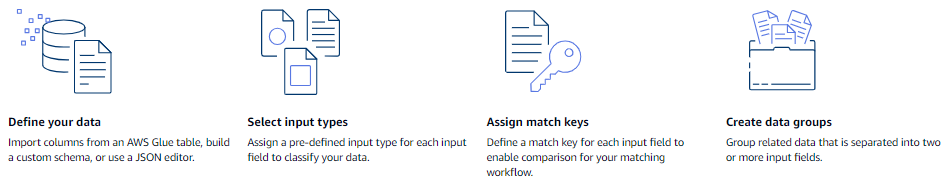

# Define input data using schema mapping

A _schema mapping_ defines the input data that you want to
resolve. It also provides metadata about the input data, such as the attribute types of the
columns (input fields) and which columns to match on.

When you create a schema mapping, you first define your input fields and attribute types,
and then define your match keys and group related data. The following diagram summarizes how to
create a schema mapping.

Before you create a schema mapping, you must first set up AWS Entity Resolution and prepare your data tables.
For more information, see [Set up AWS Entity Resolution](setting-up.md "setting-up.md") and [Prepare input data tables](prepare-data-tables.md "prepare-data-tables.md").

After you create a schema mapping, you can do one of the following:

- [Create
  a matching workflow](create-matching-workflow.md "create-matching-workflow.md") to find matches between different data inputs.
- [Create an ID namespace source](create-id-namespace-source.md "create-id-namespace-source.md") that you can use in an ID mapping workflow to
  translate data from a source to a target.
- [Create an ID mapping workflow
  within the same AWS account](creating-id-mapping-workflow-same-account.md "creating-id-mapping-workflow-same-account.md") using your schema mapping as the source.

###### Topics

- [Creating a schema mapping](create-schema-mapping.md "create-schema-mapping.md")
- [Cloning a schema mapping](clone-schema-mapping.md "clone-schema-mapping.md")
- [Editing a schema mapping](edit-schema-mapping.md "edit-schema-mapping.md")
- [Deleting a schema mapping](delete-schema-mapping.md "delete-schema-mapping.md")
