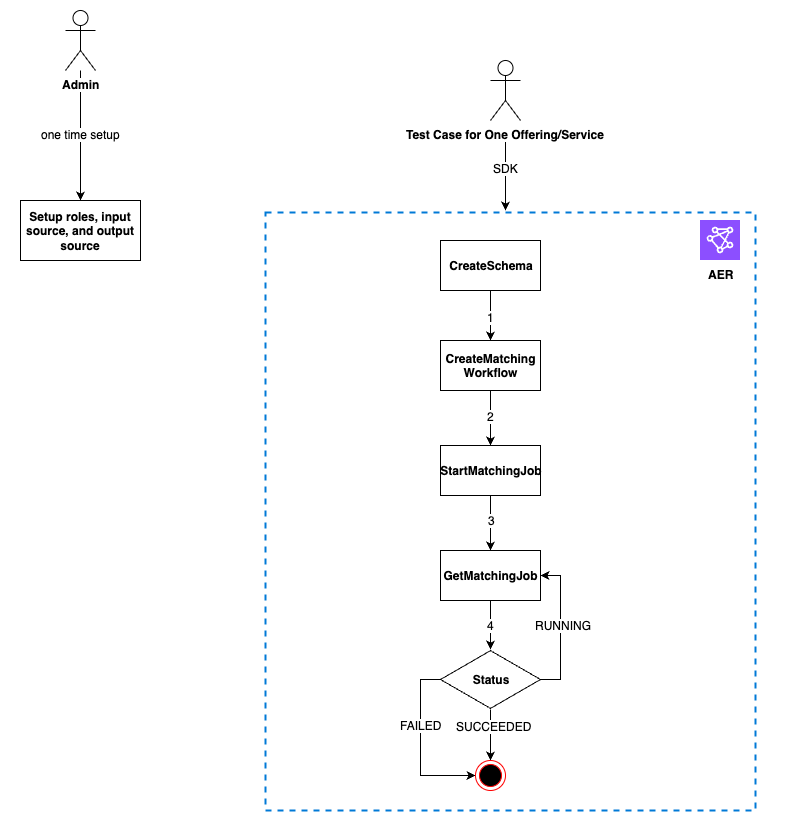

# Testing a provider integration

While AWS Entity Resolution hosts data matching services, a provider integration is a crucial third-party
component for the end-to-end matching workflow. There are several tests that AWS Entity Resolution has defined
for the providers that adds a safeguard when this integration fails. This approach provides an
opportunity for providers to monitor their service health according to these end-to-end test
cases.

Providers can use their test accounts and their own data to run these end-to-end test
cases using the AWS Entity Resolution Software Development Kit (SDK). If there are any issues from providers,
AWS Entity Resolution uses the preferred escalation path to escalate the issue. In addition, providers need to
implement their own monitoring on the test results. Providers need to share their
AWS account IDs that are used to run these tests with AWS Entity Resolution.

A successful run means a provider can set up their data, use their own service through
AWS Entity Resolution, and job status returns **Completed** with no errors. This can be
accomplished programmatically using the APIs provided by AWS Entity Resolution.

For example, providers can set up their S3 bucket, input source, roles, schema, and
workflows according to their services. After these setups are completed, providers can run
these workflows once a day with 200 records to test their service. In this approach, providers
use their choice of SDK and run an end-to-end test for their services that are offered through
AWS Data Exchange using their test accounts. Providers are expected to run these tests for each of their
offerings or services.

###### Note

Providers need to provide AWS Entity Resolution the AWS account ID (`accountId)` that they
use to run these workflows for testing. Additionally, providers need to monitor these tests
and ensure that they pass, meaning that providers need enable notification in case of
failures an address the issue accordingly.

The following diagram shows a typical end-to-end workflow test case.



###### To test a provider integration

1. (_One-time setup_) Set up resources for AWS Entity Resolution by
   following the procedures in [Set up AWS Entity Resolution](setting-up.md "setting-up.md").

After you have completed the one-time setup procedures, you should have your roles,
data, and data source ready. You are now ready to test the provider integration using
either the AWS Entity Resolution console or APIs. 2. Test the provider integration using either the AWS Entity Resolution APIs or console.

API

###### To test a provider integration using the AWS Entity Resolution APIs

1. Create a schema mapping using the [CreateSchemaMapping API](../apireference/API_CreateSchemaMapping.md "../apireference/API_CreateSchemaMapping.md"). For a complete list of
   supported programming languages, see the [See Also](../apireference/API_CreateSchemaMapping.md#API_CreateSchemaMapping_SeeAlso "../apireference/API_CreateSchemaMapping.md#API_CreateSchemaMapping_SeeAlso") section of the [CreateSchemaMapping API](../apireference/API_CreateSchemaMapping.md "../apireference/API_CreateSchemaMapping.md").

Schema mapping is the process by which you tell AWS Entity Resolution how to interpret your data
for matching. You define the schema of the input data table that you want AWS Entity
Resolution to read into a matching workflow.

When creating a schema mapping, a [unique identifier](glossary.md#unique-id-defn "glossary.md#unique-id-defn") must be designated and assigned to
each row of input data that AWS Entity Resolution reads. For example:
`Primary_key`, `Row_ID`, `Record_ID`.

###### Example Creating a schema mapping for data source containing `id` and

`email`

The following is an example of a schema mapping for a data source that
contains `id` and `email`:

```
[
  {
    "fieldName": "id",
    "type": "UNIQUE_ID"
  },
  {
    "fieldName": "email",
    "type": "EMAIL_ADDRESS"
  }
]
```

###### Example Creating a schema mapping for data source containing `id` and

`email` using Java SDK

The following is an example of a schema mapping for a data source that
contains `id` and `email` using the Java SDK:

```
EntityResolutionClient.createSchemaMapping(
            CreateSchemaMappingRequest.builder()
                                      .schemaName(<schema-name>)
                                      .mappedInputFields([
                                            SchemaInputAttribute.builder().fieldName("id").type("UNIQUE_ID").build(),
                                            SchemaInputAttribute.builder().fieldName("email").type("EMAIL_ADDRESS").build()
                                       ])
                                      .build()

)

```

2. Create a matching workflow using the [CreateMatchingWorkflow API](../apireference/API_CreateMatchingWorkflow.md "../apireference/API_CreateMatchingWorkflow.md"). For a complete list of
   supported programming languages, see the [See Also](../apireference/API_CreateMatchingWorkflow.md#API_CreateMatchingWorkflow_SeeAlso "../apireference/API_CreateMatchingWorkflow.md#API_CreateMatchingWorkflow_SeeAlso") section of the [CreateMatchingWorkflow API](../apireference/API_CreateMatchingWorkflow.md "../apireference/API_CreateMatchingWorkflow.md").

###### Example Creating a matching workflow using Java SDK

The following is an example of a matching workflow using the Java SDK:

```
EntityResolutionClient.createMatchingWorkflow(
            CreateMatchingWorkflowRequest.builder()
                                         .workflowName(<workflow-name>)
                                         .inputSourceConfig(
                                             InputSource.builder().inputSourceARN(<glue-inputsource-from-step1>).schemaName(<schema-name-from-step2>).build()
                                         )
                                         .outputSourceConfig(OutputSource.builder().outputS3Path(<output-s3-path>).output(<output-1>, <output-2>, <output-3>).build())
                                         .resolutionTechniques(ResolutionTechniques.builder()
                                                                                   .resolutionType(PROVIDER)
                                                                                   .providerProperties(ProviderProperties.builder()
                                                                                                                         .providerServiceArn(<provider-arn>)
                                                                                                                         .providerConfiguration(<configuration-depending-on-service>)
                                                                                                                         .intermediateSourceConfiguration(<intermedaite-s3-path>)
                                                                                                                         .build())
                                                                                   .build()
                                         .roleArn(<role-from-step1>)
                                         .build()

)
```

After the matching workflow is set up, you can run a workflow. 3. Run a matching workflow using the [StartMatchingJob API](../apireference/API_StartMatchingJob.md "../apireference/API_StartMatchingJob.md"). To run a matching workflow, you
must have created a matching workflow using the `CreateMatchingWorkflow`
endpoint.

For a complete list of supported programming languages, see the [See Also](../apireference/API_StartMatchingJob.md#API_StartMatchingJob_SeeAlso "../apireference/API_StartMatchingJob.md#API_StartMatchingJob_SeeAlso") section of the [StartMatchingJob API](../apireference/API_StartMatchingJob.md "../apireference/API_StartMatchingJob.md").

###### Example Running a matching workflow using Java SDK

The following is an example of a running matching workflow using the Java
SDK:

```
EntityResolutionClient.startMatchingJob(StartMatchingJobRequest.builder()
                .workflowName(<name-of-workflow-from-step3)
                .build()
)
```

4. Monitor the status of a workflow using the [GetMatchingJob API](../apireference/API_GetMatchingJob.md "../apireference/API_GetMatchingJob.md").

This API returns the status, metrics, and errors (if there are any) that are
associated with a job.

###### Example Monitoring a matching workflow using Java SDK

The following is an example of a monitoring a matching workflow job using the
Java SDK:

```
EntityResolutionClient.getMatchingJob(GetMatchingJobRequest.builder()
                .workflowName(<name-of-workflow-from-step3)
                .jobId(jobId-from-startMatchingJob)
                .build()
)
```

The end-to-end test is complete if the workflow has completed
successfully.

Console

###### To test a provider integration using the AWS Entity Resolution console

1. Create a schema mapping by following the steps in [Creating a schema mapping](create-schema-mapping.md "create-schema-mapping.md").

Schema mapping is the process by which you tell AWS Entity Resolution how to interpret your data
for matching. You define the schema of the input data table that you want AWS Entity Resolution to
read into a matching workflow.

When creating a schema mapping, a [unique identifier](glossary.md#unique-id-defn "glossary.md#unique-id-defn") must be designated and assigned to
each row of input data that AWS Entity Resolution reads. For example: `Primary_key`,
`Row_ID`, `Record_ID`.

###### Example Schema mapping for data source containing `id` and

`email`

The following is an example of a schema mapping for a data source that
contains `id` and `email`:

```
[
  {
    "fieldName": "id",
    "type": "UNIQUE_ID"
  },
  {
    "fieldName": "email",
    "type": "EMAIL_ADDRESS"
  }
]
```

2. Create and run matching workflow by following the steps in [Creating a provider service-based matching
   workflow](create-matching-workflow-provider.md "create-matching-workflow-provider.md").

Creating a matching workflow is the process that you set up to specify the input
data to match together and how the matching should be performed. In the
provider-based workflow, if an account has a subscription with a provider service
through AWS Data Exchange, you can match your known identifiers with your preferred provider.
Depending on which provider and which service you are using to perform an end to end
test, you can configure your matching workflow accordingly.

The AWS Entity Resolution console combines the actions of create and run in a single button.
After you select **Create and run,** a message appears, indicating
that the matching workflow has been created and that the job has started. 3. Monitor the status of the workflow on the **Matching
workflows** page.

The end-to-end test is complete if the workflow has completed successfully
(**Job status** is **Completed**).

On the **Metrics** tab of the matching workflow detail page,
you can view the following under **Last job metrics**:

    * The **Job ID**.
    * The **Status** of the matching workflow job:
     **Queued**, **In progress**,
     **Completed**, **Failed**
    * The **Time completed** for the workflow job.
    * The number of **Records processed**.
    * The number of **Records not processed**.
    * The **Unique match IDs generated.**
    * The number of **Input records**.

You can also view the job metrics for matching workflow jobs that have been
previously run under the **Job history**.
