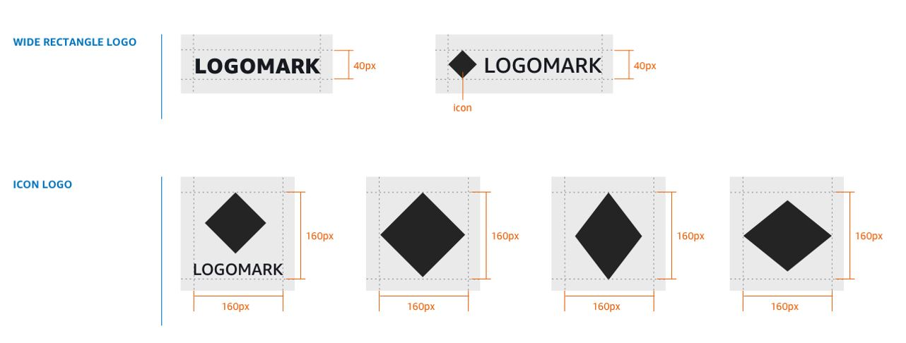
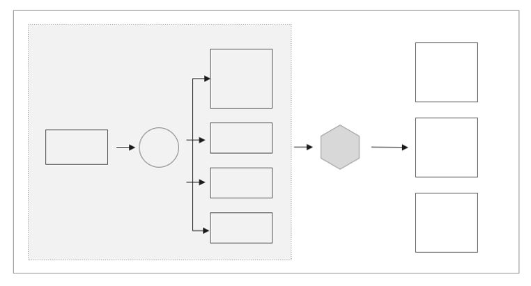

# Partner asset guidelines

EventBridge partners need to adhere to the guidelines described in this topic when creating logo assets and diagrams.

## Logo guidelines

All logo assets need to be vector graphic files with transparent background and in SVG format.

## Diagram guidelines

1. If the diagrams are vector files, provide the diagrams in SVG files, otherwise, in image file format (for example, . PNG).
2. Provide the diagrams in white background.
3. Do not include the title in the diagram. You can provide the title separately.

