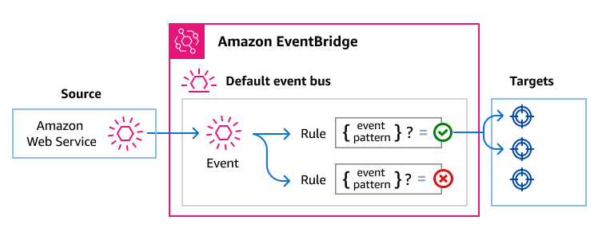

# AWS Events Reference

An _event_ indicates a change in an environment or service. For
example:

- Amazon EC2 generates an event when the state of an instance changes, such as from pending to
  running.
- AWS CloudFormation generates an event when it creates, updates, or deletes a stack.
- AWS CloudTrail publishes events when you make API calls.
  For a list of AWS services that generate events, see [Events](events.md "events.md").

## Using events to connect AWS services

Amazon EventBridge is a serverless service that uses events to connect application
components together, making it easier for you to build scalable event-driven applications.
Event-driven architecture is a style of building loosely-coupled software systems that work
together by emitting and responding to events. Using EventBridge to deliver AWS events from one service to another enables you to create EDA applications.

Here's how it works:

Many AWS services generate and send events to the EventBridge
default event bus. (An event bus is a router that receives events and delivers them
to zero or more destinations, or _targets_.) Rules you specify for the
event bus evaluate events as they arrive. Each rule checks whether an event matches the
rule's _event pattern_. If the event does match, the event bus sends
the event to the specified target(s).

For more information, see [Event buses](../userguide/eb-event-bus.md "../userguide/eb-event-bus.md")
and [Rules](../userguide/eb-rules.md "../userguide/eb-rules.md") in the _EventBridge User Guide_.
