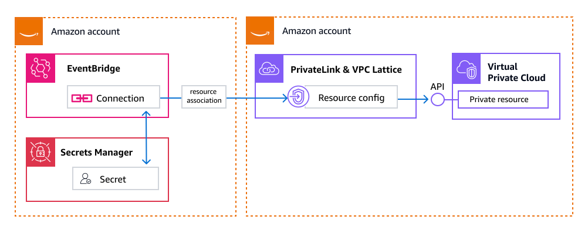

# Connecting to private APIs in

EventBridge

You can create connections to private HTTPS endpoints, to provide secure
point-to-point network access to resources in VPCs or on-premises without having to
traverse the public internet. For example, you can create a connection to access an
HTTPS-based application behind an Amazon Elastic Load Balancer.

EventBridge creates connections to private HTTPS endpoints by utilizing _resource
configurations_ created in VPC Lattice. A resource configuration is a logical
object that identifies the resource and specifies how and who can access it. To create a
connection to a private API in EventBridge, you specify the resource configuration for the private API.
For more information, see [Resource configuration in
VPC Lattice](../../../vpc-lattice/latest/ug/resource-configuration.md "../../../vpc-lattice/latest/ug/resource-configuration.md") in the _Amazon VPC Lattice User Guide_.

EventBridge then creates a _resource association_ that enables EventBridge to
access the private API. For more information, see [Manage resource associations](../../../vpc-lattice/latest/ug/service-network-associations.md#service-network-resource-config-associations "../../../vpc-lattice/latest/ug/service-network-associations.md#service-network-resource-config-associations") in the _Amazon VPC Lattice User
Guide_.

While EventBridge manages the resource association, it creates the association using your
credentials, so you retain visibility into the resource association operation.


You can create connections that access private APIs in other AWS accounts. For more information, see [Cross-account private APIs](connection-private-cross-region.md "connection-private-cross-region.md").

## Permissions for connecting to private APIs

The following policy example includes the minimal necessary permissions for creating a connection to a private API.

JSON

```
`{
 "Version":"2012-10-17",
 "Statement": [
 {
 "Action": [
 "vpc-lattice:CreateServiceNetworkResourceAssociation",
 "vpc-lattice:GetResourceConfiguration",
 "vpc-lattice:AssociateViaAWSService-EventsAndStates",
 "events:CreateConnection"
 ],
 "Resource": [
 "*"
 ],
 "Effect": "Allow"
 }
 ]
}`

```

The following policy example includes the minimal necessary permissions for updating a connection to a private API.

JSON

```
`{
 "Version":"2012-10-17",
 "Statement": [
 {
 "Action": [
 "vpc-lattice:CreateServiceNetworkResourceAssociation",
 "vpc-lattice:GetResourceConfiguration",
 "vpc-lattice:AssociateViaAWSService-EventsAndStates",
 "events:UpdateConnection"
 ],
 "Resource": [
 "*"
 ],
 "Effect": "Allow"
 }
 ]
}`

```

## Monitoring creation of connections to private APIs

When you create a connection to a private API, the following logs are generated:

In the account in which the connection was created, AWS CloudTrail
logs a `CreateServiceNetworkResourceAssociation` event.

In this log, `sourceIPAddress`, `userAgent`, and
`serviceNetworkIdentifier` are set to the EventBridge service principal,
`events.amazonaws.com`.

```
{
  "eventTime": "2024-11-21T00:00:00Z",
  "eventSource": "vpc-lattice.amazonaws.com",
  "eventName": "CreateServiceNetworkResourceAssociation",
  "awsRegion": "`region`",
  "sourceIPAddress": "events.amazonaws.com",
  "userAgent": "events.amazonaws.com",
  "requestParameters": {
    "x-amzn-vpc-lattice-association-source-arn": "***",
    "x-amzn-vpc-lattice-service-network-identifier": "***",
    "clientToken": "`token`",
    "serviceNetworkIdentifier": "events.amazonaws.com",
    "resourceConfigurationIdentifier": "arn:`partition`:vpc-lattice:`region`:`account-id`:resourceconfiguration/`resource-configuration-id`",
    "tags": {
        "ManagedByServiceAWSEventBridge": "`account-id`:`connection-name`"
    }
}
```

In the account which contains the private API , AWS CloudTrail logs a
`CreateServiceNetworkResourceAssociationBySharee` event.

This log includes:

- `callerAccountId`: The AWS account in which the connection was
  created
- `accountId`: The AWS account that contains the private API.
- `resource-configuration-arn`: The VPC Lattice resource configuration for the
  private API.

```
{
  "eventTime": "2024-11-21T06:31:42Z",
  "eventSource": "vpc-lattice.amazonaws.com",
  "eventName": "CreateServiceNetworkResourceAssociationBySharee",
  "awsRegion": "`region`",
  "sourceIPAddress": "vpc-lattice.amazonaws.com",
  "userAgent": "`user-agent`",
  "additionalEventData": {
      "callerAccountId": "`consumer-account-id`"
  },
  "resources": [
      {
          "accountId": "`provider-account-id`",
          "type": "AWS::VpcLattice::ServiceNetworkResourceAssociation",
          "ARN": "`resource-configuration-arn`"
      }
  ]
}
```

In the case of cross-account connections to private APIs, the account containing
the connection will not receive AWS CloudTrail or VPC Lattice logs for
the invocation of the private API.

## Managing service network resource associations for connections

When you specify the VPC Lattice resource configuration for the private API to which you
want to connect, EventBridge enables the connection by creating a resource association
between the VPC Lattice resource configuration and a VPC Lattice service network owned by
the EventBridge service. While EventBridge manages the resource association, it creates the
association using your credentials, so you retain visibility into the resource
association. This means you can list and describe the resource associations.

Use [describe-connection](../../../cli/latest/reference/events/describe-connection.md "../../../cli/latest/reference/events/describe-connection.md")
to return a connection description that includes the Amazon
Resource Names (ARNs) of the resource configuration and resource association.

You cannot delete resource associations created by EventBridge. If you delete a
connection, EventBridge deletes any corresponding resource associations.

For more information, see [Manage resource associations](../../../vpc-lattice/latest/ug/service-network-associations.md#service-network-resource-config-associations "../../../vpc-lattice/latest/ug/service-network-associations.md#service-network-resource-config-associations") in the _Amazon VPC Lattice User
Guide_.

## Connecting to on-premise

private APIs

Using access to VPC resources through
AWS PrivateLink and VPC Lattice, you can connect to on-premise private APIs. To do so, you must configure a network route between your VPC and your on-premise environment. For example, you can
use [AWS Direct Connect](../../../directconnect/latest/UserGuide/Welcome.md "../../../directconnect/latest/UserGuide/Welcome.md") or [AWS Site-to-Site VPN](../../../vpn/latest/s2svpn/VPC_VPN.md "../../../vpn/latest/s2svpn/VPC_VPN.md") to establish such a route.
