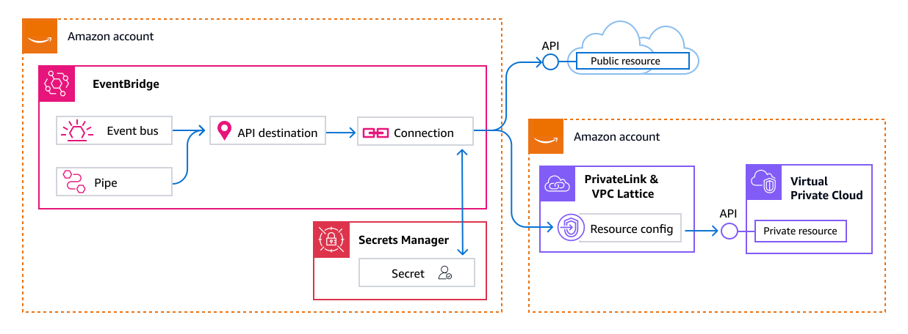

# API destinations as targets in Amazon EventBridge

EventBridge _API destinations_ are HTTPS endpoints that you can invoke as the
target of an event bus rule, or pipe, similar to how you invoke an AWS service or resource
as a target. Using API destinations, you can route [events](eb-events.md "eb-events.md")
between AWS services, integrated software as a service (SaaS) applications, and public or
private applications by using API calls.

When you specify an API destination as a rule or pipe target, EventBridge invokes the HTTPS
endpoint for any event that matches the [event
pattern](eb-event-patterns.md "eb-event-patterns.md") specified in the rule or pipe and then delivers the event information
with the request. With EventBridge, you can use any HTTP method except CONNECT and TRACE for the
request. The most common HTTP methods to use are PUT and POST.

You can also use input transformers to customize the event to the parameters of a specific
HTTP endpoint parameters. For more information, see [Amazon EventBridge input transformation](eb-transform-target-input.md "eb-transform-target-input.md").

EventBridge API destinations use _connections_ to define the authorization
method and credentials and network connectivity for EventBridge to use when connecting to a given HTTPS endpoint.
Connections support both public and private APIs. For more information, see [Connections](eb-target-connection.md "eb-target-connection.md").

###### Note

EventBridge API destinations currently only support public domain names with publicly trusted certificates for HTTPS endpoints when using private APIs. API destinations do not support mutual TLS (mTLS).

###### Important

EventBridge requests to an API destination endpoint must have a maximum client execution
timeout of 5 seconds. If the target endpoint takes longer than 5 seconds to respond,
EventBridge times out the request. EventBridge retries timed out requests up to the maximums that are
configured on your retry policy.

- For event buses, by default the maximums are 24 hours and 185 times.
- For pipes, retries are determined the pipe source type and its configuration.
  EventBridge will retry until the event expires from the source, or the maximum event age or retry attempts configured has reached.
  After the maximum number of retries, events are sent to your [dead-letter queue](eb-rule-dlq.md "eb-rule-dlq.md") if you have one.Otherwise, the event
  is dropped.

The following video demonstrates the use of API
destinations:

## Service-linked role for API

destinations

When you create a connection for an API destination, the service-linked role [AmazonEventBridgeApiDestinationsServiceRolePolicy](eb-use-identity-based.md#api-destination-slr-policy "eb-use-identity-based.md#api-destination-slr-policy") is added to your account.
EventBridge uses this service-linked role to create and store a secret
in Secrets Manager. To grant the necessary permissions to the service-linked role, EventBridge
attaches the **AmazonEventBridgeApiDestinationsServiceRolePolicy** policy to the role.
The policy limits the permissions granted to only those necessary for the role to
interact with the secret for the connection. No other permissions are included, and the
role can interact only with the connections in your account to manage the secret.

For more information about service-linked roles, see [Using service-linked
roles](../../../IAM/latest/UserGuide/using-service-linked-roles.md "../../../IAM/latest/UserGuide/using-service-linked-roles.md") in the _IAM User Guide_.

## Headers in requests to API

destinations

The following section details how EventBridge handles HTTP headers in requests to API
destinations.

### Headers included in requests

to API destinations

In addition to the authorization headers defined for the connection used for an
API destination, EventBridge includes the following headers in each request.

| Header key      | Header value                                                                                                                                          |
| --------------- | ----------------------------------------------------------------------------------------------------------------------------------------------------- |
| User-Agent      | Amazon/EventBridge/ApiDestinations                                                                                                                    |
| Content-Type    | If no custom Content-Type value is specified, EventBridge includes the following default value as Content-Type: application/json; charset=utf-8 |
| Range           | bytes=0-1048575                                                                                                                                       |
| Accept-Encoding | gzip,deflate                                                                                                                                          |
| Connection      | close                                                                                                                                                 |
| Content-Length  | An entity header that indicates the size of the entity-body, in bytes, sent to the recipient.                                                      |
| Host            | A request header that specifies the host and port number of the server where the request is being sent.                                            |

### Headers that cannot be

overridden in requests to API destinations

EventBridge does not allow you to override the following headers:

- User-Agent
- Range

### Headers EventBridge removes from

requests to API destinations

EventBridge removes the following headers for all API destination requests:

- A-IM
- Accept-Charset
- Accept-Datetime
- Accept-Encoding
- Cache-Control
- Connection
- Content-Encoding
- Content-Length
- Content-MD5
- Date
- Expect
- Forwarded
- From
- Host
- HTTP2-Settings
- If-Match
- If-Modified-Since
- If-None-Match
- If-Range
- If-Unmodified-Since
- Max-Forwards
- Origin
- Pragma
- Proxy-Authorization
- Range
- Referer
- TE
- Trailer
- Transfer-Encoding
- User-Agent
- Upgrade
- Via
- Warning

## API destination error codes

When EventBridge tries to deliver an event to an API destination and an error occurs, EventBridge
does the following:

- Retries events associated with error codes `401`, `407`, `409`, `429`, and `5xx`.
- Does not retry events associated with error codes `1xx`, `2xx`, `3xx`, and `4xx`
  (other than those noted above).

EventBridge API destinations read the standard HTTP response header `Retry-After`
to find out how long to wait before making a follow-up request. For event buses, EventBridge
chooses the more conservative value between the defined retry policy and the
`Retry-After` header. If `Retry-After` value is negative, EventBridge
stops retrying delivery for that event.

## How invocation rate affects event

delivery

If you set the invocation rate per second to a value much lower than the number of
invocations generated, events may not be delivered within the 24 hour retry time for
events. For example, if you set the invocation rate to 10 invocations per second, but
thousands of events per second are generated, you will quickly have a backlog of events
to deliver that exceeds 24 hours. To ensure that no events are lost, set up a
dead-letter queue to send events with failed invocations to so you can process the
events at a later time. For more information, see [Using dead-letter queues to process undelivered events in EventBridge](eb-rule-dlq.md "eb-rule-dlq.md").

## Region availability

API destinations to public HTTPS endpoints are supported in the following AWS Regions:

- US East (N. Virginia)
- US East (Ohio)
- US West (N. California)
- US West (Oregon)
- Africa (Cape Town)
- Asia Pacific (Hong Kong)
- Asia Pacific (Tokyo)
- Asia Pacific (Seoul)
- Asia Pacific (Osaka)
- Asia Pacific (Mumbai)
- Asia Pacific (Hyderabad)
- Asia Pacific (Singapore)
- Asia Pacific (Sydney)
- Asia Pacific (Jakarta)
- Canada (Central)
- China (Beijing)
- China (Ningxia)
- Europe (Frankfurt)
- Europe (Zurich)
- Europe (Stockholm)
- Europe (Milan)
- Europe (Spain)
- Europe (Ireland)
- Europe (London)
- Europe (Paris)
- Middle East (UAE)
- Middle East (Bahrain)
- South America (São Paulo)
