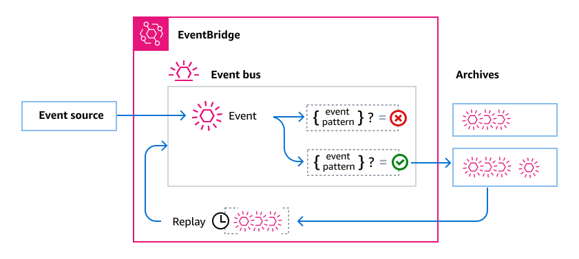

# Archiving and replaying events in Amazon EventBridge

In EventBridge, you can create an archive of events so that you
can easily _replay_, or resend them to the event bus that originally received them, at a later time. For example, you might want to replay events to
recover from errors, or to validate new functionality in your application.

## Archiving events

When you create an archive, you can specify:

- Which events to send to the archive.

You can specify an event pattern for EventBridge to use when filtering the events it sends to the archive.

- How long to retain events in the archive.

You can specify the number of days to retain events in the archive. By default, EventBridge stores events in an archive indefinitely.

Each archive receives events from a single _source_ event bus. You cannot change the source event bus once an archive is created. You can create multiple archives for a given event bus.



EventBridge charges apply to archives. Please refer to [Amazon EventBridge Pricing](https://aws.amazon.com/eventbridge/pricing/ "https://aws.amazon.com/eventbridge/pricing/") for details.

### Encrypting archive events

By default, EventBridge encrypts event data in an archive using 256-bit Advanced Encryption Standard (AES-256) under an
[AWS owned CMK](../../../kms/latest/developerguide/concepts.md#aws-owned-cmk "../../../kms/latest/developerguide/concepts.md#aws-owned-cmk"),
which helps secure your data from unauthorized access.

### Event delivery

Keep in the following considerations in mind about how EventBridge delivers events to
archives:

- There may be a delay between an event being received on an event bus and the event arriving in the archive.
  We recommend you delay replaying archived events for 10 minutes
  to make sure all events are replayed.
- The `EventCount` and `SizeBytes` values of the [`DescribeArchive`](../APIReference/API_DescribeArchive.md "../APIReference/API_DescribeArchive.md") operation have a reconciliation period of 24 hours.
  Therefore, any recently-expired or newly-archived events may not be immediately reflected in these values.

### Preventing replayed events from being delivered to an archive

When you create an archive, EventBridge generates a [managed rule](eb-rules.md#eb-rules-managed "eb-rules.md#eb-rules-managed") on the source event bus that prevents replayed events from
being sent to the archive. The managed rule adds the following event pattern, which
filters events based on whether it contains a `replay-name` field. (EventBridge
adds this field to events when it replays them.)

```
{
  "replay-name": [{
    "exists": false
  }]
}
```

## Replaying events from an archive

After you create an archive, you can then replay events
from the archive. For example, if you update an application with additional functionality,
you can replay historical events to ensure that the events are reprocessed to keep the
application consistent. You can also use an archive to replay events for new functionality.

When you replay events from an archive, you specify:

- The time frame from which to select events to replay.
- Optionally, specific rules on the event bus to which EventBridge should replay the selected events.

Archive events can only be replayed to the source event bus.

You can have a maximum of ten active concurrent replays per account per AWS Region.

Replaying events does not remove them from the archive. You can replay events in multiple replays. EventBridge only removes events when they exceed the archive retention period, or you delete the archive itself.

EventBridge deletes replays after 90 days.

You can cancel replays while their status is `Starting` or `Running`.
For more information, see [Canceling event replays](eb-replay-cancel.md "eb-replay-cancel.md").

### Identifying events that have been replayed

When EventBridge sends an event from an archive to the source event bus during a replay,
it adds a metadata field to the event, `replay-name`, which contains the
name of the replay. You can use this field to identify replayed events when they are
delivered to a target.

EventBridge also uses this field to make sure that replayed events aren't sent to archives.

### Considerations when replaying events from an archive

Keep the following considerations in mind when replaying events from an archive:

- There may be a delay between an event being received on an event bus and the event arriving in the archive.
  We recommend you delay replaying archived events for 10 minutes
  to make sure all events are replayed.
- Events aren't necessarily replayed in the same order that they were added to the archive.
  A replay processes events to replay based on the time in the event, and replays them on one
  minute intervals. If you specify an event start time and an event end time that covers a 20
  minute time range, the events are replayed from the first minute of that 20 minute range
  first. Then the events from the second minute are replayed.
- You can use the `DescribeReplay` operation of the EventBridge API to determine the
  progress of a replay. `EventLastReplayedTime` returns the time stamp of the
  last event replayed.
- Events are replayed based on, but separate from, the `PutEvents` transactions
  per second limit for the AWS account. You can request an increase to the limit for
  PutEvents. For more information, see [Amazon
  EventBridge Quotas](cloudwatch-limits-eventbridge.md "cloudwatch-limits-eventbridge.md").

The following video demonstrates the use of archive and replay:
