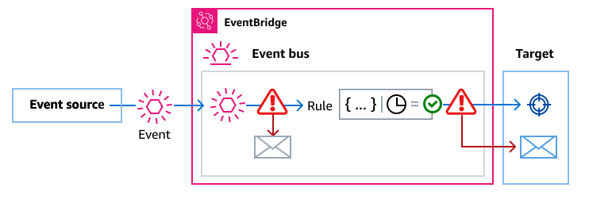

# Using dead-letter queues to capture encrypted

event errors in EventBridge

If you configure customer managed key encryption on an event bus, we
recommend that you specify a dead-letter queue (DLQ) for that event bus. EventBridge sends
custom and partner events to this DLQ if it encounters a non-retriable error
while processing the event on the event bus. A non-retriable error is one where
user action is required to resolve the underlying issue, such as the specified
customer managed key being disabled or missing.

- If a non-retriable encryption or decryption error occurs while EventBridge is processing the event on the event bus, the event is
  sent to the DLQ for the _event bus_, if one is
  specified.
- If a non-retriable encryption or decryption error occurs while
  EventBridge is attempting to send the event to a target, including input
  transformations and target-specific settings, the event is sent to the DLQ for
  the _target_, if one is specified.

For more information, including considerations when using DLQs, and instructions
on setting permissions, see [Using dead-letter queues](eb-rule-dlq.md "eb-rule-dlq.md").
