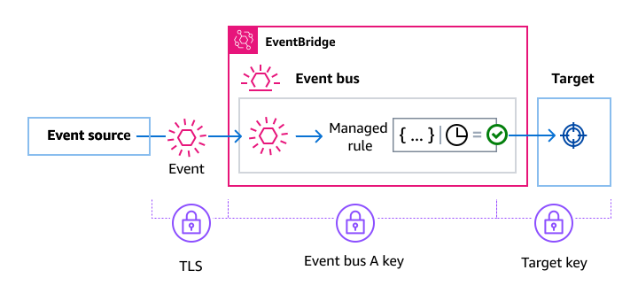

# Event encryption for managed rules in EventBridge

AWS services can create and manage event bus rules in your
AWS account that are needed for certain functions in those
services. As part of a managed rule, the AWS service can specify
that EventBridge use the customer managed key specified for the rule
target. This gives you the flexibility to specify which customer managed key to use based on the rule target.

In these cases, once a custom or partner event matches against the managed
rule, EventBridge uses the target customer managed key specified by the
managed rule to encrypt the event until it is sent to the rule target. This is
regardless of whether the event bus has been configured to use its own customer managed key for encryption. This is the case even if the target of the
managed rule is another event bus, and that event bus has its own customer managed key specified for encryption. EventBridge continues to use
the target customer managed key specified in the managed rule until the event
is sent to a target that is not an event bus.

For cases where the rule target is an event bus in another Region, you must provide a [multi-Region
key](../../../kms/latest/developerguide/multi-region-keys-overview.md "../../../kms/latest/developerguide/multi-region-keys-overview.md"). The event bus in the first Region encrypts the event using the customer managed key
specified in the managed rule. It then sends the event to the target event bus in the second Region.
That event bus must be able to continue to use the customer managed key until it sends the event to its target.
