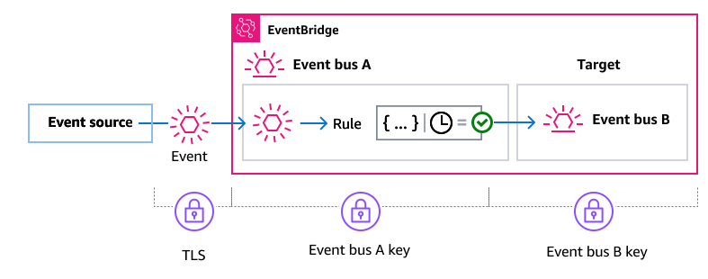
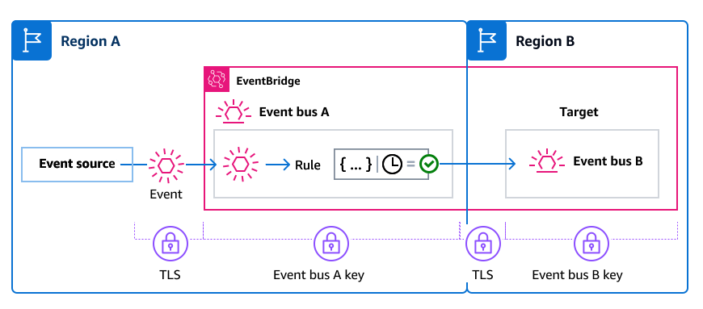

# Encryption in EventBridge when an

event bus is the rule target

When a custom or partner event is sent to an event bus, EventBridge
encrypts that event according to the encryption at rest KMS key configuration
for that event bus - either the default AWS owned key or a
customer managed key, if one has been specified. If an event matches a
rule, EventBridge encrypts the event with the KMS key configuration for
that event bus until the event is sent to the rule target, _unless the
rule target is another event bus_.

- If the target of a rule is another event bus in the same AWS Region:

If the target event bus has a
specified customer managed key, EventBridge encrypts the event with the
customer managed key of the target event bus for delivery instead.

- If the target of a rule is another event bus in a different AWS Region:

EventBridge encrypts the event at rest according to the KMS key configuration
on the first event bus. EventBridge uses TLS to send the event to the second event bus in the different Region,
where it is then encrypted according to the KMS key configuration specified for the target event bus.

