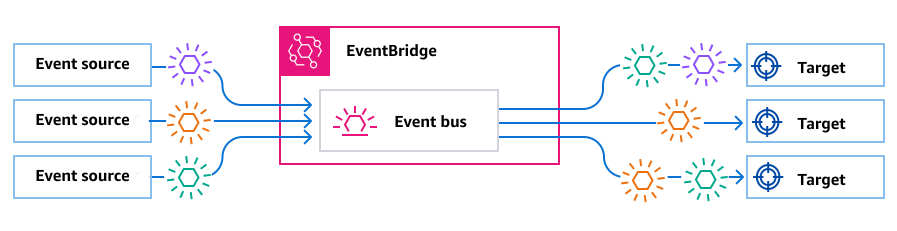
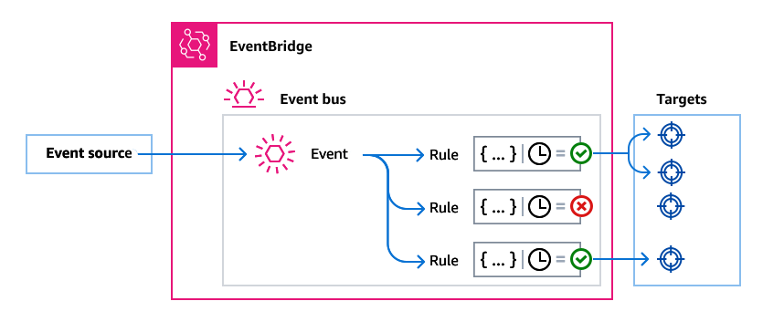

# Event buses in Amazon EventBridge

An event bus is a router that receives [events](eb-events.md "eb-events.md") and
delivers them to zero or more destinations, or _targets_. Event buses are
well-suited for routing events from many sources to many targets, with optional
transformation of events prior to delivery to a target.


[Rules](eb-rules.md "eb-rules.md") associated with the event bus evaluate events as
they arrive. Each rule checks whether an event matches the rule's pattern. If the event does
match, EventBridge sends the event

You associate a rule with a specific event bus, so the rule only applies to events
received by that event bus.

###### Note

You can also process events using EventBridge Pipes. EventBridge Pipes is intended for
point-to-point integrations; each pipe receives events from a single source for
processing and delivery to a single target. Pipes also include support for advanced
transformations and enrichment of events prior to delivery to a target. For more
information, see [Amazon EventBridge Pipes](eb-pipes.md "eb-pipes.md").

## How event buses work in EventBridge

Event buses enable you to route events from multiple sources to multiple destinations,
or _targets_.

At a high level, here's how it works:

1. An event source, which can be an AWS service, your own custom application,
   or a SaaS provider, sends an event to an event bus.
2. EventBridge then evaluates the event against each _rule_ defined
   for that event bus.

For each event that matches a rule, EventBridge then sends the event to the targets
specified for that rule. Optionally, as part of the rule, you can also specify
how EventBridge should transform the event prior to sending it to the target(s).

An event might match multiple rules, and each rule can specify up to five
targets. (An event may not match any rules, in which case EventBridge takes no
action.)



Consider an example using the EventBridge default event bus, which automatically receives
events from AWS services:

1. You create a rule on the default event bus for the `EC2 Instance
State-change Notification` event:
   - You specify that the rule matches events where an Amazon EC2 instance has
     changed its `state` to `running`.

   You do this by specifying JSON that defines the attributes and values
   an event must match to trigger the rule. This is called an
   _event pattern_.

   ```
   {
     "source": ["aws.ec2"],
     "detail-type": ["EC2 Instance State-change Notification"],
       "detail": {
         "state": ["running"]
     }
   }
   ```

   - You specify the target of the rule to be a given Lambda
     function.

2. Whenever an Amazon EC2 instance changes state, Amazon EC2 (the event source)
   automatically sends that event to the default event bus.
3. EventBridge evaluates all events sent to the default event bus against the rule
   you've created.

If the event matches your rule (that is, if the event was an Amazon EC2 instance
changing state to `running`), EventBridge sends the event to the specified
target. In this case, that's the Lambda function.

The following video describes what event buses are and
explains some of the basics of them:

The following video covers the different event buses and
when to use them:
