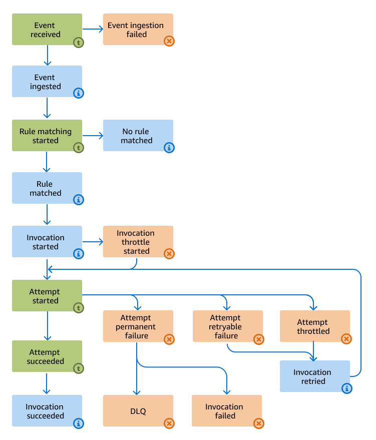

# What Amazon EventBridge logs for event buses

Understanding how EventBridge processes events can aid you in using logs to troubleshoot or debug
event bus issues.

If logging is enabled, EventBridge generates multiple log records as an event is processed.

Here are the main steps EventBridge performs when processing an event:

- An event is sent to an event bus

EventBridge generates logs for events sent from partner sources, replayed from archives, or
sent using `PutEvents`, whether or not they match any rules.

- EventBridge determines if the event matches any rules on the bus.

If the event matches one or more rules, EventBridge proceeds to the next step.

If an AWS event doesn't match any rules, EventBridge discards the event and does not
generate any logs.

- EventBridge invokes the target.

EventBridge retries invoking the target as necessary until:

    + The event has been successfully delivered.
    + Event delivery fails, such as if the retry policy expires or a permanent failure occurs.

    If delivery fails, EventBridge sends the event to a dead-letter queue (DLQ) if one is specified, or drops the event if no DLQ is specified.

The diagram below presents a detailed view of the event processing flow, with all
possible steps represented, along with the log level of each step.

For a complete list of steps, see [Specifying log level](eb-event-bus-logs.md#eb-event-bus-logs-level "eb-event-bus-logs.md#eb-event-bus-logs-level").

