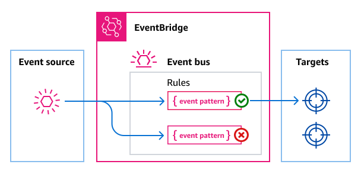
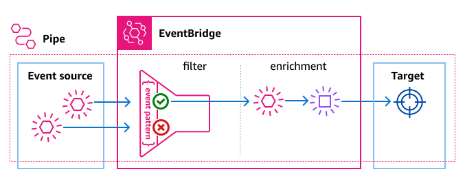

# Amazon EventBridge event patterns

Chances are you won't want to process every single event that gets delivered to a given
event bus or pipe. Rather, you'll likely want to select a subset of all the events
delivered, based on the source of the event, the event type, and/or attributes of those
events.

To specify which events to send to a target, you create an _event
pattern_. An event pattern defines the data EventBridge uses to determine whether to
send the event to the target. If the event pattern matches the event, EventBridge sends the event to
the target. Event patterns have the same structure as the events they match. An event
pattern either matches an event or it doesn't.

For example, consider the following event from Amazon EC2:

```
{
  "version": "0",
  "id": "6a7e8feb-b491-4cf7-a9f1-bf3703467718",
  "detail-type": "EC2 Instance State-change Notification",
  "source": "aws.ec2",
  "account": "111122223333",
  "time": "2017-12-22T18:43:48Z",
  "region": "us-west-1",
  "resources": [
    "arn:aws:ec2:us-west-1:123456789012:instance/i-1234567890abcdef0"
  ],
  "detail": {
    "instance-id": "i-1234567890abcdef0",
    "state": "terminated"
  }
}
```

The following event pattern selects all Amazon EC2 `instance-termination` events.
The event pattern does this by specifying three requirements to match an event:

1. The event source must be Amazon EC2.
2. The event must be an Amazon EC2 state-change notification.
3. The state of the Amazon EC2 instance must be `terminated`.

```
{
  "source": ["aws.ec2"],
  "detail-type": ["EC2 Instance State-change Notification"],
  "detail": {
    "state": ["terminated"]
  }
}
```

Note that in this example, the event pattern includes fields _about_
the event--`source` and `detail-type`--as well as a field from the
event body--`state`.

###### Important

In EventBridge, it is possible to create rules that can lead to higher-than-expected charges
and throttling. For example, you can inadvertently create a rule that leads to an
infinite loop, where a rule is fired recursively without end. Suppose you created a rule
to detect that ACLs have changed on an Amazon S3 bucket, and trigger software to change them
to the desired state. If the rule is not written carefully, the subsequent change to the
ACLs fires the rule again, creating an infinite loop.

For guidance on how to write precise rules and event patterns to minimize such unexpected results,
see [Best practices for rules](eb-rules-best-practices.md "eb-rules-best-practices.md") and [Best practices](eb-patterns-best-practices.md "eb-patterns-best-practices.md").

## Event patterns for event buses

For event buses, you can specify an event pattern for each rule you create for the bus. In
this way, you can select which events to send to specific targets. Event patterns for
event buses can match against the event source, event metadata, and/or event detail
values.



The following video discusses the basics of event patterns
for event buses:

## Event patterns for EventBridge Pipes

For EventBridge Pipes, you can specify event patterns to filter the events from the
pipe source that you want delivered to the pipe target. Since each pipe has a single
event source, event patterns for pipes can match against event metadata and/or detail
values.



Not all event fields can be used to construct pipe event patterns. For more information,
see [Filtering](eb-pipes-event-filtering.md "eb-pipes-event-filtering.md").
