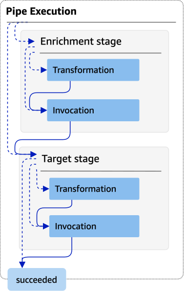
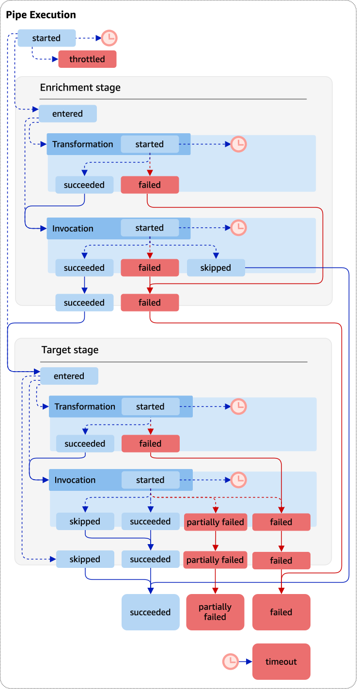

# EventBridge Pipes execution steps

Understanding the flow of pipe execution steps can aid you in troubleshooting or debugging your pipe's performance using logs.

A pipe _execution_ is an event or batch of events received by a pipe that travel to an enrichment or target.
If enabled, EventBridge generates a log record for each execution step it performs as the event batch is processed.

At a high level, the execution contains two _stages_, or collection of steps: enrichment, and target.
Each of these stages consists of transformation and invocation steps.

The main steps of a successful pipe execution follows this flow:

- The pipe execution starts.
- The execution enters the enrichment stage if you have specified an enrichment for
  the events. If you haven't specified an enrichment, the execution proceeds to the target stage.

In the enrichment stage, the pipe performs any transformation you have specified, then
invokes the enrichment.

- In the target stage, the pipe performs any transformation you have specified, then
  invokes the target.

If you haven't specified transformation or target, the execution skips the target stage.

- The pipe execution completes successfully.
  The diagram below demonstrates this flow. Diverging paths are formatted as dotted
  lines.

The diagram below presents a detailed view of the pipe execution flow, with all possible
execution steps represented. Again, diverging paths are formatted as dotted lines

For a complete list of pipe execution steps, see [Specifying EventBridge Pipes log level](eb-pipes-logs.md#eb-pipes-logs-level "eb-pipes-logs.md#eb-pipes-logs-level").

Note that target invocation may result in a partial failure of the batch. For more information, see [Batching behavior](eb-pipes-batching-concurrency.md#pipes-batching "eb-pipes-batching-concurrency.md#pipes-batching").
