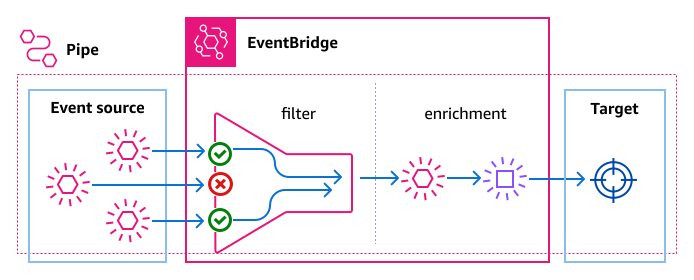

# Amazon EventBridge Pipes

Amazon EventBridge Pipes connects sources to targets. Pipes are intended for point-to-point
integrations between supported [sources](eb-pipes-event-source.md "eb-pipes-event-source.md") and [targets](eb-pipes-event-target.md "eb-pipes-event-target.md"), with support for advanced transformations and
[enrichment](pipes-enrichment.md "pipes-enrichment.md"). It reduces the need for specialized
knowledge and integration code when developing event-driven architectures, fostering consistency
across your company’s applications. To set up a pipe, you choose the source, add optional
filtering, define optional enrichment, and choose the target for the event data.

###### Note

You can also route events using event buses. Event buses are well-suited for many-to-many
routing of events between event-driven services. For more information, see [Event buses in Amazon EventBridge](eb-event-bus.md "eb-event-bus.md").

## How EventBridge Pipes work

At a high level, here's how EventBridge Pipes works:

1. You create a pipe in your account. This includes:
   - Specifying one of the supported [event sources](eb-pipes-event-source.md "eb-pipes-event-source.md") from which you want your pipe to receive events.
   - Optionally, configuring a filter so that the pipe only processes a subset of the events it receives from the source.
   - Optionally, configuring an enrichment step that enhances the event data before sending it to the target.
   - Specifying one of the supported [targets](eb-pipes-event-target.md "eb-pipes-event-target.md") to which you want your pipe to send events.

2. The event source begins sending events to the pipe, and the pipe processes the event before sending it to the target.
   - If you have configured a filter, the pipe evaluates the event and only sends it to the target if it matches that filter.

   You are only charged for those events that match the filter.
   - If you have configured an enrichment, the pipe performs that enrichment on the event before sending it to the target.

   If the events are batched, the enrichment maintains the ordering of the events in the batch.

For example, a pipe could be used to create an e-commerce system. Suppose you have an API
that contains customer information, such as shipping addresses.

1. You then create a pipe with the following:
   - An Amazon SQS
     order received message queue as the event source.
   - An EventBridge API Destination as an enrichment
   - An AWS Step Functions state machine as the target

2. Then, when an Amazon SQS order received message appears in the queue, it is sent to your pipe.
3. The pipe then sends that data to the EventBridge API Destination enrichment, which returns the customer
   information for that order.
4. Lastly, the pipe sends the enriched data to the AWS Step Functions state machine, which processes the
   order.
