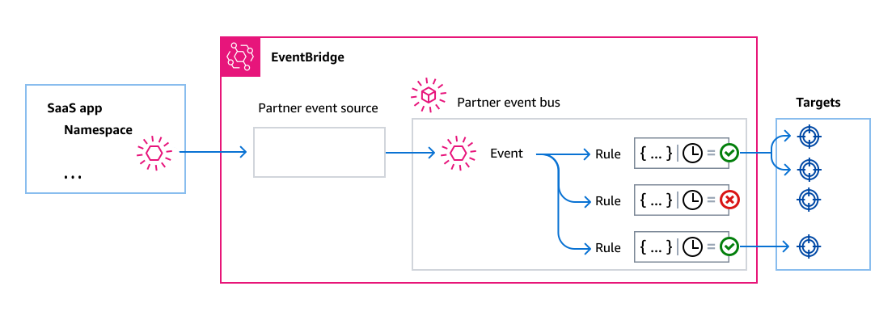

# Receiving events from a SaaS partner with Amazon EventBridge

To receive events from SaaS partner applications and services, you need a _partner event
source_ from the partner. A partner event
source is a resource created by a partner that you can then accept as an event source. To accept the partner event source, you create a custom event
bus and match it to the partner event source.


The following video covers SaaS integrations with EventBridge:

###### Topics

- [Supported SaaS partner integrations](#eb-supported-integrations "#eb-supported-integrations")
- [Configuring Amazon EventBridge to receive events from a SaaS
  integration](#eb-saas-integration "#eb-saas-integration")
- [Receiving SaaS events from AWS Lambda function URLs in Amazon EventBridge](eb-saas-furls.md "eb-saas-furls.md")
- [Receiving events from Salesforce in Amazon EventBridge](eb-saas-salesforce.md "eb-saas-salesforce.md")

## Supported SaaS partner integrations

EventBridge supports the following SaaS partner integrations:

- [Adobe](https://console.aws.amazon.com//events/#/partners/adobe.com?page=overview "https://console.aws.amazon.com//events/#/partners/adobe.com?page=overview")
- [Auth0](https://console.aws.amazon.com//events/#/partners/auth0.com?page=overview "https://console.aws.amazon.com//events/#/partners/auth0.com?page=overview")
- [Blitline](https://console.aws.amazon.com//events/#/partners/blitline.com?page=overview "https://console.aws.amazon.com//events/#/partners/blitline.com?page=overview")
- [Buildkite](https://console.aws.amazon.com//events/#/partners/buildkite.com?page=overview "https://console.aws.amazon.com//events/#/partners/buildkite.com?page=overview")
- [Chargebee](https://console.aws.amazon.com//events/#/partners/chargebee.com?page=overview "https://console.aws.amazon.com//events/#/partners/chargebee.com?page=overview")
- [Checkout.com](https://console.aws.amazon.com//events/#/partners/checkout.com?page=overview "https://console.aws.amazon.com//events/#/partners/checkout.com?page=overview")
- [CleverTap](https://console.aws.amazon.com//events/#/partners/clevertap.com?page=overview "https://console.aws.amazon.com//events/#/partners/clevertap.com?page=overview")
- [Datadog](https://console.aws.amazon.com//events/#/partners/datadoghq.com?page=overview "https://console.aws.amazon.com//events/#/partners/datadoghq.com?page=overview")
- [Epsagon](https://console.aws.amazon.com//events/#/partners/epsagon.com?page=overview "https://console.aws.amazon.com//events/#/partners/epsagon.com?page=overview")
- [Freshworks](https://console.aws.amazon.com//events/#/partners/freshworks.com?page=overview "https://console.aws.amazon.com//events/#/partners/freshworks.com?page=overview")
- [Genesys](https://console.aws.amazon.com//events/#/partners/genesys.com?page=overview "https://console.aws.amazon.com//events/#/partners/genesys.com?page=overview")
- [GS2](https://console.aws.amazon.com//events/#/partners/gs2.io?page=overview "https://console.aws.amazon.com//events/#/partners/gs2.io?page=overview")
- [Guidewire](https://console.aws.amazon.com//events/#/partners/guidewire.com?page=overview "https://console.aws.amazon.com//events/#/partners/guidewire.com?page=overview")
- [Karte](https://console.aws.amazon.com//events/#/partners/karte.io?page=overview "https://console.aws.amazon.com//events/#/partners/karte.io?page=overview")
- [Kloudless](https://console.aws.amazon.com//events/#/partners/kloudless.com?page=overview "https://console.aws.amazon.com//events/#/partners/kloudless.com?page=overview")
- [Mackerel](https://console.aws.amazon.com//events/#/partners/mackerel.io?page=overview "https://console.aws.amazon.com//events/#/partners/mackerel.io?page=overview")
- [MongoDB](https://console.aws.amazon.com//events/#/partners/mongodb.com?page=overview "https://console.aws.amazon.com//events/#/partners/mongodb.com?page=overview")
- [New
  Relic](https://console.aws.amazon.com//events/#/partners/newrelic.com?page=overview "https://console.aws.amazon.com//events/#/partners/newrelic.com?page=overview")
- [OneLogin](https://console.aws.amazon.com//events/#/partners/onelogin.com?page=overview "https://console.aws.amazon.com//events/#/partners/onelogin.com?page=overview")
- [Opsgenie](https://console.aws.amazon.com//events/#/partners/opsgenie.com?page=overview "https://console.aws.amazon.com//events/#/partners/opsgenie.com?page=overview")
- [PagerDuty](https://console.aws.amazon.com//events/#/partners/pagerduty.com?page=overview "https://console.aws.amazon.com//events/#/partners/pagerduty.com?page=overview")
- [Payshield](https://console.aws.amazon.com//events/#/partners/payshield.com.au?page=overview "https://console.aws.amazon.com//events/#/partners/payshield.com.au?page=overview")
- [SaaSus
  Platform](https://console.aws.amazon.com//events/#/partners/saasus.io?page=overview "https://console.aws.amazon.com//events/#/partners/saasus.io?page=overview")
- [SailPoint](https://console.aws.amazon.com//events/#/partners/sailpoint.com?page=overview "https://console.aws.amazon.com//events/#/partners/sailpoint.com?page=overview")
- [Saviynt](https://console.aws.amazon.com//events/#/partners/saviynt.com?page=overview "https://console.aws.amazon.com//events/#/partners/saviynt.com?page=overview")
- [Segment](https://console.aws.amazon.com//events/#/partners/segment.com?page=overview "https://console.aws.amazon.com//events/#/partners/segment.com?page=overview")
- [Shopify](https://console.aws.amazon.com//events/#/partners/shopify.com?page=overview "https://console.aws.amazon.com//events/#/partners/shopify.com?page=overview")
- [SignalFx](https://console.aws.amazon.com//events/#/partners/signalfx.com?page=overview "https://console.aws.amazon.com//events/#/partners/signalfx.com?page=overview")
- [Site24x7](https://console.aws.amazon.com//events/#/partners/site24x7.com?page=overview "https://console.aws.amazon.com//events/#/partners/site24x7.com?page=overview")
- [Stax](https://console.aws.amazon.com//events/#/partners/stax.io "https://console.aws.amazon.com//events/#/partners/stax.io")
- [Stripe](https://console.aws.amazon.com//events/#/partners/stripe.com "https://console.aws.amazon.com//events/#/partners/stripe.com")
- [SugarCRM](https://console.aws.amazon.com//events/#/partners/sugarcrm.com?page=overview "https://console.aws.amazon.com//events/#/partners/sugarcrm.com?page=overview")
- [SugarCRM](https://console.aws.amazon.com//events/#/partners/sugarcrm.com?page=overview "https://console.aws.amazon.com//events/#/partners/sugarcrm.com?page=overview")
- [Symantec](https://console.aws.amazon.com//events/#/partners/symantec.com?page=overview "https://console.aws.amazon.com//events/#/partners/symantec.com?page=overview")
- [Thundra](https://console.aws.amazon.com//events/#/partners/thundra.io?page=overview "https://console.aws.amazon.com//events/#/partners/thundra.io?page=overview")
- [TriggerMesh](https://console.aws.amazon.com//events/#/partners/triggermesh.com?page=overview "https://console.aws.amazon.com//events/#/partners/triggermesh.com?page=overview")
- [Whispir](https://console.aws.amazon.com//events/#/partners/whispir.com?page=overview "https://console.aws.amazon.com//events/#/partners/whispir.com?page=overview")
- [Zendesk](https://console.aws.amazon.com//events/#/partners/zendesk.com?page=overview "https://console.aws.amazon.com//events/#/partners/zendesk.com?page=overview")
- [Amazon Seller
  Partner API](https://console.aws.amazon.com//events/#/partners/sellingpartnerapi.amazon.com?page=overview "https://console.aws.amazon.com//events/#/partners/sellingpartnerapi.amazon.com?page=overview")

## Configuring Amazon EventBridge to receive events from a SaaS

integration

Configuring EventBridge to receive partner events consists of two main steps:

- Creating the partner event source
- Associating that partner source with a partner event bus

###### Note

Any events published by a partner to a partner event source that has not been
associated with an event bus will be immediately dropped. Those events will not be
persisted at rest in EventBridge.

###### Create a partner event source (console only)

1. Open the Amazon EventBridge console at [https://console.aws.amazon.com/events/](https://console.aws.amazon.com/events/ "https://console.aws.amazon.com/events/").
2. In the navigation pane, choose **Partner event sources**.
3. Find the partner that you want and then choose **Set up** for that
   partner.
4. To copy your account ID to the clipboard, choose **Copy**.
5. In the navigation pane, choose **Partner event sources**.
6. Go to the partner's website and follow the instructions to create a partner event
   source using your account ID. The event source that you create is available to only your
   account.

###### Associate the partner source with a partner event bus (console)

1. In the EventBridge console, choose **Partner event sources** in
   the navigation pane.
2. Select the button next to the partner event source and then choose **Associate
   with event bus**.

The status of the event source changes from `Pending` to
`Active`, and the name of the event bus updates to match the partner event
source name. You can now start creating rules that match events from the partner event
source.

###### Associate the partner source with a partner event bus (AWS CLI)

- Use [`create-event-bus`](../../../cli/latest/reference/events/create-event-bus.md "../../../cli/latest/reference/events/create-event-bus.md") to create a partner event bus associated with the partner event source.

Both `name` and `event-source-name` should be set to the partner event source name.

For example:

```
aws events create-event-bus \
    --name "`aws.partner/saas-integration/name`" \
    --event-source-name "`aws.partner/saas-integration/name`" \
    --region `us-east-1`
```

After EventBridge creates the event bus, you can call [`describe-event-source`](../../../cli/latest/reference/events/describe-event-source.md "../../../cli/latest/reference/events/describe-event-source.md")
to return details about the partner source. The `State` of the partner source should be `ACTIVE`.

```
aws events describe-event-source
--name "`aws.partner/saas-integration/name`"
```

###### Note

Calling [`put-permission`](../../../cli/latest/reference/events/put-permission.md "../../../cli/latest/reference/events/put-permission.md") on a partner event bus returns an error. Only
the partner account of the event source associated with the partner event bus is
permitted to send events to it.

###### Associate the partner source with a partner event bus (CloudFormation)

1. Create a CloudFormation template that provisions an [`AWS::Events::EventBus`](../../../AWSCloudFormation/latest/UserGuide/aws-resource-events-eventbus.md "../../../AWSCloudFormation/latest/UserGuide/aws-resource-events-eventbus.md") resource with the partner event source.

Both `Name` and `EventSourceName` should be set to the partner event source name. For example:

```
AWSTemplateFormatVersion: 2010-09-09

Description:
   Cloudformation template to create Event Bus for receiving partner events

Resources:
  ExamplePartnerEventBus:
    Type: AWS::Events::EventBus
    Properties:
      EventSourceName: '`aws.partner/saas-integration/name`'
      Name: '`aws.partner/saas-integration/name`'
```

2. Use [`cloudformation create-stack`](../../../cli/latest/reference/cloudformation/create-stack.md "../../../cli/latest/reference/cloudformation/create-stack.md") or the CloudFormation console to create a stack from the template. For example:

```
aws cloudformation create-stack --stack-name `eventbridge-saas` --template-body `file://template.yml` --region `us-east-1`
```

###### Note

Including an [`AWS::Events::EventBusPolicy`](../../../AWSCloudFormation/latest/UserGuide/aws-resource-events-eventbuspolicy.md "../../../AWSCloudFormation/latest/UserGuide/aws-resource-events-eventbuspolicy.md") resource for the partner event bus
in your template will result in an error. Only the partner account of the event source
associated with the partner event bus is permitted to send events to it.
