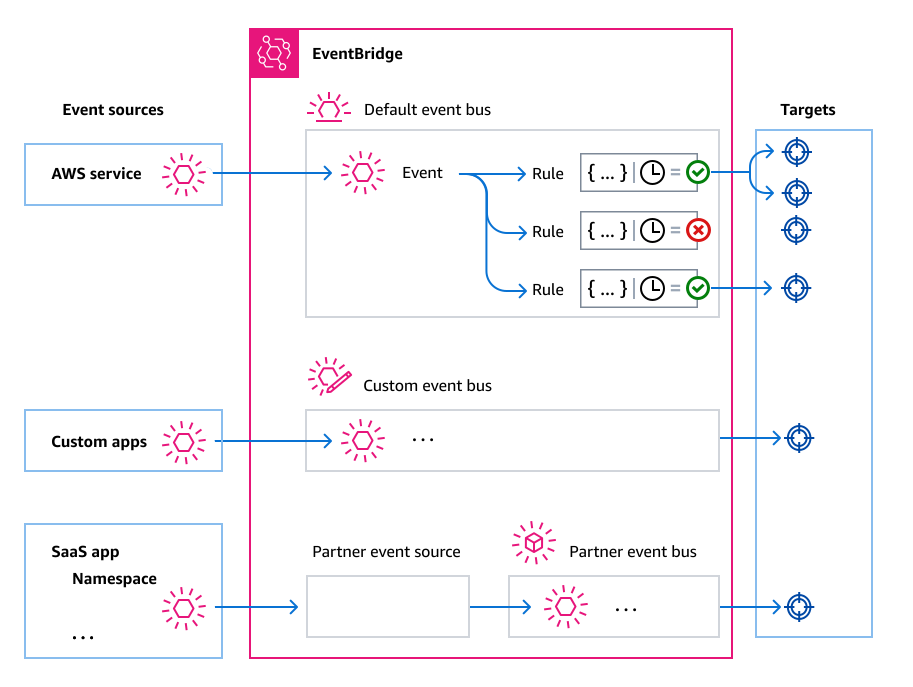

# Event bus concepts in Amazon EventBridge

Here's a closer look at the main components of an event driven architecture built on
event buses.

## Event buses

An event bus is a router that receives [events](eb-events.md "eb-events.md") and
delivers them to zero or more destinations,or _targets_. Use an
event bus when you need to route events from many sources to many targets, with
optional transformation of events prior to delivery to a target.

Your account includes a _default event bus_ that automatically
receives events from AWS services. You can also:

- Create additional event buses, called _custom event
  buses_, and specify which events they receive.
- Create _[partner event
  buses](eb-saas.md "eb-saas.md")_, which receive events from SaaS partners.

Common use cases for event buses include:

- Using an event bus as a broker between different workloads, services, or
  systems.
- Using multiple event buses in your applications to divide up the event
  traffic. For example, creating a bus to process events containing personal
  identification information (PII), and another bus for events that
  don't.
- Aggregating events by sending events from multiple event buses to a
  centralized event bus. This centralized bus can be in the same account as
  the other buses, but can also be in a different account or Region.

## Events

At its simplest, an EventBridge event is a JSON object sent to an event bus or pipe.

In the context of event-driven architecture (EDA), an event often represents an
indicator of a change in a resource or environment.

For more information, see [Events in Amazon EventBridge](eb-events.md "eb-events.md").

## Event sources

EventBridge can receive events from event sources including:

- AWS services
- Custom applications
- Software as a service (SaaS) partners

## Rules

A rule receives incoming events and sends them as appropriate to targets for
processing. You can specify how each rule invokes their target(s) based on
either:

- An [event pattern](eb-event-patterns.md "eb-event-patterns.md"), which contains
  one or more filters to match events. Event patterns can include filters that
  match on:
  - Event metadata – Data
    _about_ the event, such as the event source,
    or the account or Region in which the event originated.
  - Event data – The properties
    of the event itself. These properties vary according to
    event.
  - Event content – The actual
    property _values_ of the event data.

- A schedule to invoke the target(s) at regular intervals.

You can [specify a scheduled rule
within EventBridge](eb-create-rule-schedule.md "eb-create-rule-schedule.md"), or by using [EventBridge Scheduler](using-eventbridge-scheduler.md "using-eventbridge-scheduler.md").

###### Note

While you can create rules that run on a schedule, EventBridge now
offers a more flexible and powerful way to create, run, and manage scheduled tasks
centrally: EventBridge Scheduler. With EventBridge Scheduler, you can create schedules using cron
and rate expressions for recurring patterns, or configure one-time invocations. You can set
up flexible time windows for delivery, define retry limits, and set the maximum retention
time for failed API invocations.

Scheduler is highly customizable, and offers improved scalability over scheduled rules, with a wider set of target API operations and AWS services.
We recommend that you use Scheduler to invoke targets on a schedule.

For more information, see [Create a schedule](using-eventbridge-scheduler.md#using-eventbridge-scheduler-create "using-eventbridge-scheduler.md#using-eventbridge-scheduler-create").

Each rule is defined for a specific event bus, and only apply to events on that
event bus.

A single rule can send an event to up to five targets.

By default, you can configure up to 300 rules per event bus. This quota can be
raised to thousands of rules in the [Service Quotas console](https://console.aws.amazon.com/servicequotas/home "https://console.aws.amazon.com/servicequotas/home").
Since the rule limit apply to each bus, if you require even more rules, you can
create additional custom event buses in your account.

You can customize how events are received in your account by creating event buses
with different permissions for different services.

To customize the structure or date of an event before EventBridge passes it to a target,
use the [input transformer](eb-transform-target-input.md "eb-transform-target-input.md") to edit
the information before it goes to the target.

For more information, see [Rules in Amazon EventBridge](eb-rules.md "eb-rules.md").

## Targets

A target is a resource or endpoint to which EventBridge sends an event when the event
matches the event pattern defined for a rule.

A target can receive multiple events from multiple event buses.

For more information, see [Event bus targets in Amazon EventBridge](eb-targets.md "eb-targets.md") .

## Advanced features for event

buses

EventBridge includes the following features to help you develop, manage, and use event
buses.

**Using API destinations to enable REST API calls between
services**

EventBridge _[API
destinations](eb-api-destinations.md "eb-api-destinations.md")_ are HTTP endpoints that you can set as the target
of a rule, in the same way that you would send event data to an AWS service or
resource. By using API destinations, you can use API calls to route events between
AWS services, integrated SaaS applications, and your applications outside of
AWS. When you create an API destination, you specify a connection to use for it.
Each connection includes the details about the authorization type and parameters to
use to authorize with the API destination endpoint.

**Archiving and replaying events to aid development and disaster
recovery**

You can _[archive](eb-archive-event.md "eb-archive-event.md")_, or
save, events and then [replay](eb-replay-archived-event.md "eb-replay-archived-event.md") them at
a later time from the archive. Archiving is useful for:

- Testing an application because you have a store of events to use rather
  than having to wait for new events.
- Hydrating a new service when it first comes online.
- Adding more durability to your event-driven applications.

**Using the Schema Registry to jump-start event pattern
creation**

When you build serverless applications that use EventBridge, it can be helpful to know
the structure of typical events without having to generate the event. The event
structure are described in [schemas](eb-schema.md "eb-schema.md"), which are
available for all events generated by AWS services on EventBridge.

For events that don't come from AWS services, you can:

- Create or upload custom schemas.
- Use Schema Discovery to have EventBridge automatically create schemas for events
  sent to the event bus.

Once you have a schema for an event, you can download code bindings for popular
programming languages.

**Managing resources and access with policies**

To organize AWS resources or to track costs in EventBridge, you can assign a custom
label, or _[tag](eb-tagging.md "eb-tagging.md")_, to AWS
resources. Using [tag-based policies](eb-tag-policies.md "eb-tag-policies.md"), you can
control what resources can and can’t do within EventBridge.

In addition to tag-based policies, EventBridge supports [identity-based](eb-use-identity-based.md "eb-use-identity-based.md") and [resource-based](eb-use-resource-based.md "eb-use-resource-based.md") policies to control access
to EventBridge. Use identity-based policies to control the permissions of a group, role, or
user. Use resource-based policies to give specific permissions to each resource,
such as a Lambda function or Amazon SNS topic.
