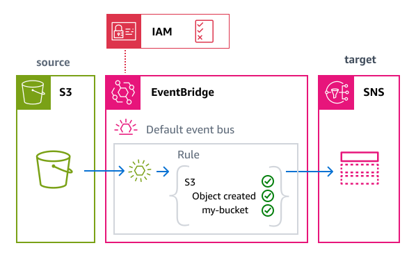

# Getting started: Create an Amazon EventBridge event bus

rule

To get familiar with EventBridge rules and their capabilities, we'll use a CloudFormation template to set
up an event bus rule and associated components, including an event source, event pattern, and
target. Then we can explore how rules work to select the events you want.

The template creates a rule on the default event bus. This rule uses an event pattern to
filter for events from a specific Amazon S3 bucket. The rule sends matching events to the specified
target, an Amazon SNS topic. Every time an object is created in the bucket, the rule sends a
notification to the topic, which then sends an email to your specified email address.

The deployed resources consist of:

- An Amazon S3 bucket with EventBridge notifications enabled to act as the event source.
- An Amazon SNS topic and email subscription as the target for notifications.
- An execution role that grants EventBridge the necessary permissions to publish to the Amazon SNS topic.
- The rule itself, which:

      + Defines an event pattern that matches only `Object Created` events from the specific Amazon S3 bucket.
      + Specifies the Amazon SNS topic as a target to which EventBridge delivers matching events.

  For specific technical details of the template, see [Template details](#event-bus-rule-get-started-template-details "#event-bus-rule-get-started-template-details").



## Before you begin

To receive Amazon S3 events in EventBridge, you must enable EventBridge within Amazon S3. This topic assumes EventBridge is enabled. For more information, see
[Enabling EventBridge](../../../AmazonS3/latest/userguide/enable-event-notifications-eventbridge.md "../../../AmazonS3/latest/userguide/enable-event-notifications-eventbridge.md") in the _Amazon S3 User Guide_.

## Creating the rule using CloudFormation

To create the rule and its associated resources, we'll create a CloudFormation template
and use it to create a stack containing a sample rule, complete with source and
target.

###### Important

You will be billed for the Amazon resources used if you create a stack from this template.

First, create the CloudFormation template.

1. In the [Template](#event-bus-rule-get-started-template "#event-bus-rule-get-started-template") section, click the copy icon on the **JSON** or **YAML** tab to copy the template contents.
2. Paste the template contents into a new file.
3. Save the file locally.
   Next, use the template you've saved to provision a CloudFormation stack.

###### Create the stack using CloudFormation (console)

1. Open the CloudFormation console at [https://console.aws.amazon.com/cloudformation/](https://console.aws.amazon.com/cloudformation/ "https://console.aws.amazon.com/cloudformation/").
2. On the **Stacks** page, from the **Create stack** menu, choose **with new resources (standard)**.
3. Specify the template:
   1. Under **Prerequisite**, choose **Choose an existing template**.
   2. Under **Specify template**, choose **Upload a template file**.
   3. Choose **Choose file**, navigate to the template file, and choose it.
   4. Choose **Next**.

4. Specify the stack details:
   1. Enter a stack name.
   2. For parameters, accept the default values for **BucketName**, **SNSTopicDisplayName**, **SNSTopicName**, and **RuleName**, or enter your own.
   3. For **EmailAddress**, enter a valid email address where you want to receive notifications.
   4. Choose **Next**.

5. Configure the stack options:
   1. Under **Stack failure options**, choose **Delete all newly created resources**.

   ###### Note

   Choosing this option prevents you from possibly being billed for resources whose deletion policy specifies they be retained even if the stack creation fails.
   For more information, see [`DeletionPolicy` attribute](../../../AWSCloudFormation/latest/UserGuide/aws-attribute-deletionpolicy.md "../../../AWSCloudFormation/latest/UserGuide/aws-attribute-deletionpolicy.md")
   in the _CloudFormation User Guide_. 2. Accept all other default values. 3. Under **Capabilities**, check the box to acknowledge that CloudFormation might create IAM resources in your account. 4. Choose **Next**.

6. Review the stack details and choose **Submit**.

###### Create the stack using CloudFormation (AWS CLI)

You can also use the AWS CLI to create the stack.

- Use the [`create-stack`](../../../cli/latest/reference/cloudformation/create-stack.md "../../../cli/latest/reference/cloudformation/create-stack.md") command.

      + Accept the default template parameter values, specifying the stack name and your email address.
       Use the `template-body` parameter to pass the template contents, or
       `template-url` to specify a URL location.


      ```
      aws cloudformation create-stack \
        --stack-name `eventbridge-rule-tutorial` \
        --template-body `template-contents` \
        --parameters ParameterKey=EmailAddress,ParameterValue=`your.email@example.com` \
        --capabilities CAPABILITY_IAM
      ```
      + Override the default value(s) of one or more
       template parameters. For example:


      ```
      aws cloudformation create-stack \
        --stack-name `eventbridge-rule-tutorial` \
        ----template-body `template-contents` \
        --parameters \
          ParameterKey=EmailAddress,ParameterValue=`your.email@example.com` \
          ParameterKey=BucketName,ParameterValue=`my-custom-bucket-name` \
          ParameterKey=RuleName,ParameterValue=`my-custom-rule-name` \
        --capabilities CAPABILITY_IAM
      ```

  CloudFormation creates the stack. Once the stack creation is complete, the stack resources
  are ready to use. You can use the **Resources** tab on the stack
  detail page to view the resources that were provisioned in your account.

After the stack is created, you will receive a subscription confirmation email at the address you provided. You must confirm this subscription to receive notifications.

## Exploring rule capabilities

Once the rule has been created, you can use the EventBridge console to observe rule operation and test event delivery.

1. Open the EventBridge console at [https://console.aws.amazon.com/events/home?#/rules](https://console.aws.amazon.com/events/home?#/rules "https://console.aws.amazon.com/events/home?#/rules").
2. Choose the rule you created.

On the rule detail page, the **Rule details** section displays information about the rule, including its event pattern and targets.

### Examining the event

pattern

Before we test the rule operation, let's examine the event pattern we've specified
to control which events are sent to the target. The rule will only send events that match
the pattern criteria to the target. In this case, we only want the event that Amazon S3 generates when
an object is created in our specific bucket.

- On the rule detail page, under **Event pattern**, you can see the event
  pattern selects only events where:
  - The source is the Amazon S3 service (`aws.s3`)
  - The detail-type is `Object Created`
  - The bucket name matches the name of the bucket we created

```
{
  "source": ["aws.s3"],
  "detail-type": ["Object Created"],
  "detail": {
    "bucket": {
      "name": ["`eventbridge-rule-example-source`"]
    }
  }
}
```

### Sending events through the rule

Next, we'll generate events in the event source to test that the rule matching and delivery is operating correctly. To do this, we'll upload an object to the S3 bucket we specified as the event source.

1. Open the Amazon S3 console at [https://console.aws.amazon.com/s3/](https://console.aws.amazon.com/s3/ "https://console.aws.amazon.com/s3/").
2. In the **Buckets** list, choose the bucket you created with the template (default name: `eventbridge-rule-example-source`).
3. Choose **Upload**.
4. Upload a test file to generate an `Object Created` event:
   1. Choose **Add files** and select a file from your computer.
   2. Choose **Upload**.

5. Wait a few moments for the event to be processed by EventBridge and for the notification to be sent.
6. Check your email for a notification about the object creation event. The email will contain details about the S3 event, including the bucket name and the object key.

### Viewing rule metrics

You can view metrics for your rule to confirm that events are being processed correctly.

1. In the [EventBridge console](https://console.aws.amazon.com/s3/ "https://console.aws.amazon.com/s3/"), choose your rule.
2. Choose the **Metrics** tab.
3. You can view metrics such as:
   - **Invocations**: the number of times the rule was triggered.
   - **TriggeredRules**: the number of rules that were triggered by matching events.

## Clean up: deleting resources

As a final step, we'll delete the stack and the resources it contains.

###### Important

You will be billed for the Amazon resources contained in the stack for as long as it exists.

1. Open the CloudFormation console at [https://console.aws.amazon.com/cloudformation/](https://console.aws.amazon.com/cloudformation/ "https://console.aws.amazon.com/cloudformation/").
2. On the **Stacks** page, choose the stack created from the template, and choose **Delete**, then confirm **Delete**.

CloudFormation initiates deletion of the stack and all resources it includes.

## CloudFormation template details

This template creates resources and grants permissions in your account.

### Resources

The CloudFormation template for this tutorial will create the following resources in your
account:

###### Important

You will be billed for the Amazon resources used if you create a stack from this template.

- [`AWS::S3::Bucket`](../../../AWSCloudFormation/latest/TemplateReference/aws-resource-s3-bucket.md "../../../AWSCloudFormation/latest/TemplateReference/aws-resource-s3-bucket.md"):
  An Amazon S3 bucket that acts as the event source for the rule, with EventBridge notifications enabled.
- [`AWS::SNS::Topic`](../../../AWSCloudFormation/latest/TemplateReference/aws-resource-sns-topic.md "../../../AWSCloudFormation/latest/TemplateReference/aws-resource-sns-topic.md"):
  An Amazon SNS topic that acts as the target for the events matched by the rule.
- [`AWS::SNS::Subscription`](../../../AWSCloudFormation/latest/TemplateReference/aws-resource-sns-subscription.md "../../../AWSCloudFormation/latest/TemplateReference/aws-resource-sns-subscription.md"):
  An email subscription to the SNS topic.
- [`AWS::IAM::Role`](../../../AWSCloudFormation/latest/TemplateReference/aws-resource-iam-role.md "../../../AWSCloudFormation/latest/TemplateReference/aws-resource-iam-role.md"): An IAM execution role granting permissions to the EventBridge service in your account.
- [`AWS::Events::Rule`](../../../AWSCloudFormation/latest/TemplateReference/aws-resource-events-rule.md "../../../AWSCloudFormation/latest/TemplateReference/aws-resource-events-rule.md"): The rule connecting the
  Amazon S3 bucket events to the Amazon SNS topic.

### Permissions

The template includes an `AWS::IAM::Role` resource that represents an
execution role. This role grants the EventBridge service
(`events.amazonaws.com`) the following permissions in your
account.

The following permissions are granted through the managed policy `AmazonSNSFullAccess`:

- Full access to Amazon SNS resources and operations

## CloudFormation template

Save the following YAML code as a separate file to use as the CloudFormation template for this tutorial.

YAML

```
AWSTemplateFormatVersion: '2010-09-09'
Description: '[AWSDocs] EventBridge: event-bus-rule-get-started'

Parameters:
  BucketName:
    Type: String
    Description: Name of the S3 bucket
    Default: eventbridge-rule-example-source

  SNSTopicDisplayName:
    Type: String
    Description: Display name for the SNS topic
    Default: eventbridge-rule-example-target

  SNSTopicName:
    Type: String
    Description: Name for the SNS topic
    Default: eventbridge-rule-example-target

  RuleName:
    Type: String
    Description: Name for the EventBridge rule
    Default: eventbridge-rule-example

  EmailAddress:
    Type: String
    Description: Email address to receive notifications
    AllowedPattern: '^[a-zA-Z0-9._%+-]+@[a-zA-Z0-9.-]+[a-zA-Z0-9-]*(\\.[a-zA-Z0-9-]+)*$'

Resources:
  # S3 Bucket with notifications enabled
  S3Bucket:
    Type: AWS::S3::Bucket
    Properties:
      BucketName: !Ref BucketName
      NotificationConfiguration:
        EventBridgeConfiguration:
          EventBridgeEnabled: true

  # SNS Topic for email notifications
  SNSTopic:
    Type: AWS::SNS::Topic
    Properties:
      DisplayName: !Ref SNSTopicDisplayName
      TopicName: !Ref SNSTopicName

  # SNS Subscription for email
  SNSSubscription:
    Type: AWS::SNS::Subscription
    Properties:
      Protocol: email
      Endpoint: !Ref EmailAddress
      TopicArn: !Ref SNSTopic

  # EventBridge Rule to match S3 object creation events and send them to the SNS topic
  EventBridgeRule:
    Type: AWS::Events::Rule
    Properties:
      Name: !Ref RuleName
      Description: "Rule to detect S3 object creation and send email notification"
      EventPattern:
        source:
          - aws.s3
        detail-type:
          - "Object Created"
        detail:
          bucket:
            name:
              - !Ref BucketName
      State: ENABLED
      Targets:
        - Id: SendToSNS
          Arn: !Ref SNSTopic
          RoleArn: !GetAtt EventBridgeRole.Arn

  # IAM Role for EventBridge to publish to SNS
  EventBridgeRole:
    Type: AWS::IAM::Role
    Properties:
      AssumeRolePolicyDocument:
        Version: '2012-10-17		 	 	 '
        Statement:
          - Effect: Allow
            Principal:
              Service: events.amazonaws.com
            Action: sts:AssumeRole
      ManagedPolicyArns:
        - arn:aws:iam::aws:policy/AmazonSNSFullAccess

Outputs:
  BucketName:
    Description: Name of the S3 bucket
    Value: !Ref S3Bucket
  SNSTopicARN:
    Description: ARN of the SNS topic
    Value: !Ref SNSTopic
  EmailSubscription:
    Description: Email address for notifications
    Value: !Ref EmailAddress
```

JSON

```
{
  "AWSTemplateFormatVersion": "2010-09-09",
  "Description": "[AWSDocs] EventBridge: event-bus-rule-get-started",
  "Parameters": {
    "BucketName": {
      "Type": "String",
      "Description": "Name of the S3 bucket",
      "Default": "eventbridge-rule-example-source"
    },
    "SNSTopicDisplayName": {
      "Type": "String",
      "Description": "Display name for the SNS topic",
      "Default": "eventbridge-rule-example-target"
    },
    "SNSTopicName": {
      "Type": "String",
      "Description": "Name for the SNS topic",
      "Default": "eventbridge-rule-example-target"
    },
    "RuleName": {
      "Type": "String",
      "Description": "Name for the EventBridge rule",
      "Default": "eventbridge-rule-example"
    },
    "EmailAddress": {
      "Type": "String",
      "Description": "Email address to receive notifications",
      "AllowedPattern": "^[a-zA-Z0-9._%+-]+@[a-zA-Z0-9.-]+[a-zA-Z0-9-]*(\\.[a-zA-Z0-9-]+)*$"
    }
  },
  "Resources": {
    "S3Bucket": {
      "Type": "AWS::S3::Bucket",
      "Properties": {
        "BucketName": {
          "Ref": "BucketName"
        },
        "NotificationConfiguration": {
          "EventBridgeConfiguration": {
            "EventBridgeEnabled": true
          }
        }
      }
    },
    "SNSTopic": {
      "Type": "AWS::SNS::Topic",
      "Properties": {
        "DisplayName": {
          "Ref": "SNSTopicDisplayName"
        },
        "TopicName": {
          "Ref": "SNSTopicName"
        }
      }
    },
    "SNSSubscription": {
      "Type": "AWS::SNS::Subscription",
      "Properties": {
        "Protocol": "email",
        "Endpoint": {
          "Ref": "EmailAddress"
        },
        "TopicArn": {
          "Ref": "SNSTopic"
        }
      }
    },
    "EventBridgeRule": {
      "Type": "AWS::Events::Rule",
      "Properties": {
        "Name": {
          "Ref": "RuleName"
        },
        "Description": "Rule to detect S3 object creation and send email notification",
        "EventPattern": {
          "source": [
            "aws.s3"
          ],
          "detail-type": [
            "Object Created"
          ],
          "detail": {
            "bucket": {
              "name": [
                {
                  "Ref": "BucketName"
                }
              ]
            }
          }
        },
        "State": "ENABLED",
        "Targets": [
          {
            "Id": "SendToSNS",
            "Arn": {
              "Ref": "SNSTopic"
            },
            "RoleArn": {
              "Fn::GetAtt": [
                "EventBridgeRole",
                "Arn"
              ]
            }
          }
        ]
      }
    },
    "EventBridgeRole": {
      "Type": "AWS::IAM::Role",
      "Properties": {
        "AssumeRolePolicyDocument": {
          "Version": "2012-10-17",
          "Statement": [
            {
              "Effect": "Allow",
              "Principal": {
                "Service": "events.amazonaws.com"
              },
              "Action": "sts:AssumeRole"
            }
          ]
        },
        "ManagedPolicyArns": [
          "arn:aws:iam::aws:policy/AmazonSNSFullAccess"
        ]
      }
    }
  },
  "Outputs": {
    "BucketName": {
      "Description": "Name of the S3 bucket",
      "Value": {
        "Ref": "S3Bucket"
      }
    },
    "SNSTopicARN": {
      "Description": "ARN of the SNS topic",
      "Value": {
        "Ref": "SNSTopic"
      }
    },
    "EmailSubscription": {
      "Description": "Email address for notifications",
      "Value": {
        "Ref": "EmailAddress"
      }
    }
  }
}
```
