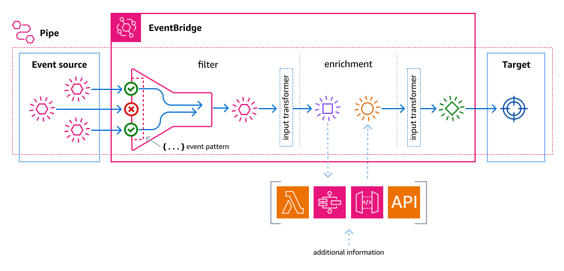

# Amazon EventBridge Pipes concepts

Here's a closer look at the basic components of EventBridge Pipes.

## Pipe

A pipe routes events from a single source to a single target. The pipe also includes the
ability to filter for specific events, and to perform enrichments on the event data before
it is sent to the target.

## Source

EventBridge Pipes receives event data from a variety of sources, applies optional filters and
enrichment to that data, and sends it to a target. If a source enforces order to the events
sent to pipes, that order is maintained throughout the entire process to the target.

For
more information about sources, see [Amazon EventBridge Pipes sources](eb-pipes-event-source.md "eb-pipes-event-source.md").

## Filters

A pipe can filter a given source’s events and then process only a subset of those
events. To configure filtering on a pipe, you define an event pattern the pipe uses to
determine which events to send to the target.

You are only charged for those events that match the filter.

For more information, see [Event filtering in Amazon EventBridge Pipes](eb-pipes-event-filtering.md "eb-pipes-event-filtering.md").

## Enrichment

With the enrichment step of EventBridge Pipes, you can enhance the data from the source before
sending it to the target. For example, you might receive _Ticket
created_ events that don’t include the full ticket data. Using enrichment, you
can have a Lambda function call the `get-ticket` API for the full ticket details.
The pipe can then send that information to a [target](eb-pipes-event-target.md "eb-pipes-event-target.md").

For more information about enriching event data, see [Event enrichment in Amazon EventBridge Pipes](pipes-enrichment.md "pipes-enrichment.md").

## Target

After the event data has been filtered and enriched, you can specify the pipe send it to
a specific target, such as an Amazon Kinesis stream or an Amazon CloudWatch log group. For a list of the
available targets, see [Amazon EventBridge Pipes targets](eb-pipes-event-target.md "eb-pipes-event-target.md").

You can transform the data after it’s enhanced and before it’s sent by the pipe to the
target. For more information, see [Amazon EventBridge Pipes input transformation](eb-pipes-input-transformation.md "eb-pipes-input-transformation.md").

Multiple pipes, each with a different source, can send events to the same target.

You can also use pipes and event buses together to send events to multiple targets.
A common use case is to create a pipe with an event bus as its target;
the pipe sends events to the event bus, which then sends those events on to multiple targets.
For example, you could create a pipe with a DynamoDB stream for a source, and an event bus as the target.
The pipe receives events from the DynamoDB stream and sends them to the event bus,
which then sends them on to multiple targets according to the rules you've specified on the event bus.
