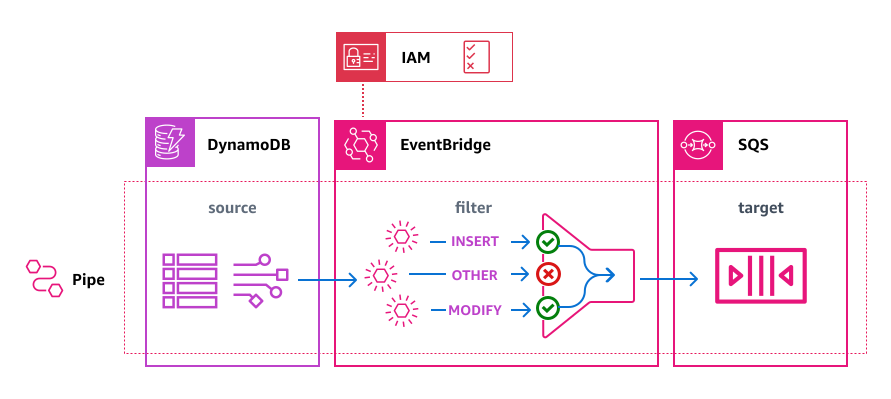
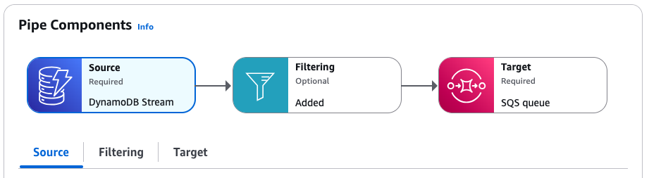

# Getting started: Create an Amazon EventBridge pipe

To get familiar with pipes and their capabilities, we'll use a CloudFormation template to set up an
EventBridge pipe and associated components. Then we can explore various pipe features.

###### Tip

For a more comprehensive, hands-on learning experience, try the [EventBridge Pipes Workshop](https://catalog.workshops.aws/eb-pipes "https://catalog.workshops.aws/eb-pipes").
This interactive workshop walks you through building and troubleshooting a pipe that connects DynamoDB to API Gateway with a Lambda enrichment.

The template creates an EventBridge pipe that connects a stream from a DynamoDB table to an Amazon SQS
queue. Every time a record is created or modified in the database table, the pipe sends the
resulting event to the queue.

The deployed pipe consists of:

- A DynamoDB table (and stream) to act as the pipe source, and an Amazon SQS queue as the target.
- An execution role that grants EventBridge the necessary permissions to access the DynamoDB table and Amazon SQS queue.
- The pipe itself, which contains an event filter that selects only events generated when a
  table item is created (inserted) or modified.
  For specific technical details of the template, see [Template details](#pipes-get-started-template-details "#pipes-get-started-template-details").



## Creating the pipe using CloudFormation

To create the pipe and its associated resources, we'll create a CloudFormation template
and use it to create a stack containing a sample pipe, complete with source and
target.

###### Important

You will be billed for the Amazon resources used if you create a stack from this template.

First, create the CloudFormation template.

1. In the [Template](#pipes-get-started-template "#pipes-get-started-template") section, click the copy icon on the **JSON** or **YAML** tab to copy the template contents.
2. Paste the template contents into a new file.
3. Save the file locally.
   Next, use the template you've saved to provision a CloudFormation stack.

4. Open the CloudFormation console at [https://console.aws.amazon.com/cloudformation/](https://console.aws.amazon.com/cloudformation/ "https://console.aws.amazon.com/cloudformation/").
5. On the **Stacks** page, from the **Create stack** menu, choose **with new resources (standard)**.
6. Specify the template:
   1. Under **Prerequisite**, choose **Choose an existing template**.
   2. Under **Specify template**, choose **Upload a template file**.
   3. Choose **Choose file**, navigate to the template file, and choose it.
   4. Choose **Next**.

7. Specify the stack details:
   1. Enter a stack name.
   2. For parameters, accept the default values or enter your own.
   3. Choose **Next**.

8. Configure the stack options:
   1. Under **Stack failure options**, choose **Delete all newly created resources**.

   ###### Note

   Choosing this option prevents you from possibly being billed for resources whose deletion policy specifies they be retained even if the stack creation fails.
   For more information, see [`DeletionPolicy` attribute](../../../AWSCloudFormation/latest/UserGuide/aws-attribute-deletionpolicy.md "../../../AWSCloudFormation/latest/UserGuide/aws-attribute-deletionpolicy.md")
   in the _CloudFormation User Guide_. 2. Accept all other default values. 3. Under **Capabilities**, check the box to acknowledge that CloudFormation might create IAM resources in your account. 4. Choose **Next**.

9. Review the stack details and choose **Submit**.

###### Create the stack using CloudFormation (AWS CLI)

You can also use the AWS CLI to create the stack.

- Use the [`create-stack`](../../../cli/latest/reference/cloudformation/create-stack.md "../../../cli/latest/reference/cloudformation/create-stack.md") command.

      + Accept the default
       template parameter values, specifying the stack name. Use the `template-body` parameter to pass the template contents, or
       `template-url` to specify a URL location.


      ```
      aws cloudformation create-stack \
        --stack-name `eventbridge-rule-tutorial` \
        --template-body `template-contents` \
        --capabilities CAPABILITY_IAM
      ```
      + Override the default value(s) of one or more
       template parameters. For example:


      ```
      aws cloudformation create-stack \
        --stack-name `eventbridge-rule-tutorial` \
        --template-body `template-contents` \
        --parameters \
          ParameterKey=SourceTableName,ParameterValue=`pipe-example-source` \
          ParameterKey=TargetQueueName,ParameterValue=`pipe-example-target` \
          ParameterKey=PipeName,ParameterValue=`pipe-with-filtering-example` \
        --capabilities CAPABILITY_IAM
      ```

  CloudFormation creates the stack. Once the stack creation is complete, the stack resources
  are ready to use. You can use the **Resources** tab on the stack
  detail page to view the resources that where provisioned in your account.

## Exploring pipe capabilities

Once the pipe has been created, you can use the EventBridge console to observe pipe operation and test event delivery.

1. Open the EventBridge console at [https://console.aws.amazon.com/events/home?#/pipes](https://console.aws.amazon.com/events/home?#/pipes "https://console.aws.amazon.com/events/home?#/pipes").
2. Choose the pipe you created.

On the pipe detail page, the **Pipe Components** section displays the
resources that make up the pipe, and contains tabs that provide more details on each
component.



You can find the execution role we created for the pipe on the **Settings** tab, in the **Permissions** section.

### Examining the pipe filter

Before we test the pipe operation, let's examine the filter we've specified to control which events are sent to the target.
The pipe will only send events that match the filter criteria to the target; all others are discarded. In this case, we only want
events generated when table entries are created or modified being sent to the Amazon SQS queue.

- On the pipe detail page, under **Pipe Components**, choose the **Filtering** tab.

We've included a filter that selects only events where the `eventName` is set to
`INSERT` or `MODIFY`.

```
{
  "eventName": ["INSERT", "MODIFY"]
}
```

### Sending events through the

pipe

Next, we'll generate events in the pipe source to test that the pipe filtering and delivery is operating correctly. To do this, we'll create and edit an item in the DynamoDB table we specified as the pipe source.

1. On the pipe detail page, under **Pipe Components**, choose the **Source** tab.
2. Under **Source**, choose the DynamoDB stream name.

This opens the DynamoDB console in a separate window, with the source table details displayed. 3. Choose **Explore items**. 4. Generate an `INSERT` event by creating an item in the table:

    1. Choose **Create item**.
    2. Add values for the **Album** and **Artist** attributes.
    3. Choose **Create item**.

5. Generate a `DELETE` and an `INSERT` event by editing the item:
   1. Choose the item from the list, and from the **Actions** menu, choose **Edit item**.
   2. Enter a new value for the **Album** or **Artist** attribute.
   3. Tick the box that confirms you are changing the value of the item keys, and then choose **Recreate item**.

   This results in the item being deleted and then recreated, generating a `DELETE` event, and then a new `INSERT` event.

6. Generate a `MODIFY` event by adding an attribute to the item:
   1. Choose the item from the list, and from the **Actions** menu, choose **Edit item**.
   2. From the **Add new attribute** menu, choose **Number**.
   3. For the attribute name, enter **Year**, and then enter a value for the attribute. Choose **Save and close**.

### Confirming event delivery through

the pipe

Finally, we'll confirm that the pipe successfully filtered and delivered the events we generated by creating and editing the table item in DynamoDB.

1. On the pipe detail page, under **Pipe Components**, choose the **Target** tab.
2. Under **Target**, choose the Amazon SQS queue name.

This opens the Amazon SQS console in a separate window, with the target queue details displayed. 3. Choose **Send and receive messages**. 4. Under **Receive messages**, choose **Poll for messages**.

Amazon SQS loads messages received into the queue. Click on an individual message to see its details.

There should be three event messages in the queue:

    * Two of type `INSERT`, one generated when you first created the table item, and the other generated when you recreated the item by changing a key value.
    * One of type `MODIFY`, generated when you added an attribute to the table item.

Notice that there isn't an event message of type `DELETE` in the queue, even though one was generated when you deleted and recreated the table item by changing a key value.
The pipe filter we specified only selects on
`INSERT` and `MODIFY`, so the pipe filtered out the `DELETE` event rather than deliver it to the queue.

## Clean up: deleting resources

As a final step, we'll delete the stack and the resources it contains.

###### Important

You will be billed for the Amazon resources contained in the stack for as long as it exists.

1. Open the CloudFormation console at [https://console.aws.amazon.com/cloudformation/](https://console.aws.amazon.com/cloudformation/ "https://console.aws.amazon.com/cloudformation/").
2. On the **Stacks** page, choose the stack created from the template, and choose **Delete**, then confirm **Delete**.

CloudFormation initiates deletion of the stack and all resources it includes.

## CloudFormation template details

This template creates resources and grants permissions in your account.

### Resources

The CloudFormation template for this tutorial will create the following resources in your
account:

###### Important

You will be billed for the Amazon resources used if you create a stack from this template.

- [`AWS::DynamoDB::Table`](../../../AWSCloudFormation/latest/UserGuide/aws-resource-dynamodb-table.md "../../../AWSCloudFormation/latest/UserGuide/aws-resource-dynamodb-table.md"):
  A DynamoDB table that acts as the event source for the pipe.
- [`AWS::SQS::Queue`](../../../AWSCloudFormation/latest/UserGuide/aws-resource-sqs-queue.md "../../../AWSCloudFormation/latest/UserGuide/aws-resource-sqs-queue.md"):
  An Amazon SQS queue that acts as the target for the events flowing through the pipe.
- [`AWS::IAM::Role`](../../../AWSCloudFormation/latest/UserGuide/aws-resource-iam-role.md "../../../AWSCloudFormation/latest/UserGuide/aws-resource-iam-role.md"): An IAM execution role granting permissions to the EventBridge Pipes service in your account.
- [`AWS::Pipes::Pipe`](../../../AWSCloudFormation/latest/UserGuide/aws-resource-pipes-pipe.md "../../../AWSCloudFormation/latest/UserGuide/aws-resource-pipes-pipe.md"): The pipe connecting the
  DynamoDB table to the Amazon SQS queue.

### Permissions

The template includes an `AWS::IAM::Role` resource that represents an
execution role. This role grants the EventBridge Pipes service
(`pipes.amazonaws.com`) the following permissions in your
account.

The following permissions are scoped to the DynamoDB table and stream the template creates as the event source for the pipe:

- `dynamodb:DescribeStream`
- `dynamodb:GetRecords`
- `dynamodb:GetShardIterator`
- `dynamodb:ListStreams`

The following permission is scoped to the Amazon SQS queue the stack creates as the target of the pipe:

- `sqs:SendMessage`

## CloudFormation template

Save the following JSON or YAML code as a separate file to use as the CloudFormation template for this tutorial.

JSON

```
{
  "AWSTemplateFormatVersion": "2010-09-09",

 "Description" : "[AWSDocs] EventBridge: pipes-get-started",

  "Parameters" : {
    "SourceTableName" : {
      "Type" : "String",
      "Default" : "pipe-example-source",
      "Description" : "Specify the name of the table to provision as the pipe source, or accept the default."
    },
  "TargetQueueName" : {
    "Type" : "String",
    "Default" : "pipe-example-target",
    "Description" : "Specify the name of the queue to provision as the pipe target, or accept the default."
  },
    "PipeName" : {
      "Type" : "String",
      "Default" : "pipe-with-filtering-example",
      "Description" : "Specify the name of the table to provision as the pipe source, or accept the default."
    }
},
  "Resources": {
    "PipeSourceDynamoDBTable": {
      "Type": "AWS::DynamoDB::Table",
      "Properties": {
        "AttributeDefinitions": [{
            "AttributeName": "Album",
            "AttributeType": "S"
          },
          {
            "AttributeName": "Artist",
            "AttributeType": "S"
          }

        ],
        "KeySchema": [{
            "AttributeName": "Album",
            "KeyType": "HASH"

          },
          {
            "AttributeName": "Artist",
            "KeyType": "RANGE"
          }
        ],
        "ProvisionedThroughput": {
          "ReadCapacityUnits": 10,
          "WriteCapacityUnits": 10
        },
        "StreamSpecification": {
          "StreamViewType": "NEW_AND_OLD_IMAGES"
        },
        "TableName": { "Ref" : "SourceTableName" }
      }
    },
    "PipeTargetQueue": {
      "Type": "AWS::SQS::Queue",
      "Properties": {
        "QueueName": { "Ref" : "TargetQueueName" }
      }
    },
    "PipeTutorialPipeRole": {
      "Type": "AWS::IAM::Role",
      "Properties": {
        "AssumeRolePolicyDocument": {
          "Version": "2012-10-17",
          "Statement": [{
            "Effect": "Allow",
            "Principal": {
              "Service": "pipes.amazonaws.com"
            },
            "Action": "sts:AssumeRole",
            "Condition": {
              "StringLike": {
                "aws:SourceArn": {
	"Fn::Join": [
		"",
                [
                  "arn:",
                  { "Ref": "AWS::Partition" },
                  ":pipes:",
                  { "Ref": "AWS::Region" },
                  ":",
                  { "Ref": "AWS::AccountId" },
                  ":pipe/",
                  { "Ref": "PipeName" }
               ]
	]
       },
                "aws:SourceAccount": { "Ref" : "AWS::AccountId" }
              }
            }
          }]
        },
        "Description" : "EventBridge Pipe template example. Execution role that grants the pipe the permissions necessary to send events to the specified pipe.",
        "Path": "/",
        "Policies": [{
            "PolicyName": "SourcePermissions",
            "PolicyDocument": {
              "Version": "2012-10-17",
              "Statement": [{
                "Effect": "Allow",
                "Action": [
                  "dynamodb:DescribeStream",
                  "dynamodb:GetRecords",
                  "dynamodb:GetShardIterator",
                  "dynamodb:ListStreams"
                ],
                "Resource": [
                  { "Fn::GetAtt" : [ "PipeSourceDynamoDBTable", "StreamArn" ] }
                ]
              }]
            }
          },
          {
            "PolicyName": "TargetPermissions",
            "PolicyDocument": {
              "Version": "2012-10-17",
              "Statement": [{
                "Effect": "Allow",
                "Action": [
                  "sqs:SendMessage"
                ],
                "Resource": [
                  { "Fn::GetAtt" : [ "PipeTargetQueue", "Arn" ] }
                ]
              }]
            }
          }
        ]
      }
  },
    "PipeWithFiltering": {
      "Type": "AWS::Pipes::Pipe",
      "Properties": {
        "Description" : "EventBridge Pipe template example. Pipe that receives events from a DynamoDB stream, applies a filter, and sends matching events on to an SQS Queue.",
        "Name": { "Ref" : "PipeName" },
        "RoleArn": {"Fn::GetAtt" : ["PipeTutorialPipeRole", "Arn"] },
        "Source": { "Fn::GetAtt" : [ "PipeSourceDynamoDBTable", "StreamArn" ] },
        "SourceParameters": {
          "DynamoDBStreamParameters" : {
            "StartingPosition" : "LATEST"
         },
        "FilterCriteria" : {
          "Filters" : [ {
            "Pattern" : "{ \"eventName\": [\"INSERT\", \"MODIFY\"] }"
         }]
        }
        },
        "Target": { "Fn::GetAtt" : [ "PipeTargetQueue", "Arn" ] }
      }
    }
  }
}

```

YAML

```
AWSTemplateFormatVersion: '2010-09-09'
Description: '[AWSDocs] EventBridge: pipes-get-started'
Parameters:
  SourceTableName:
    Type: String
    Default: pipe-example-source
    Description: Specify the name of the table to provision as the pipe source, or accept the default.
  TargetQueueName:
    Type: String
    Default: pipe-example-target
    Description: Specify the name of the queue to provision as the pipe target, or accept the default.
  PipeName:
    Type: String
    Default: pipe-with-filtering-example
    Description: Specify the name of the table to provision as the pipe source, or accept the default.
Resources:
  PipeSourceDynamoDBTable:
    Type: AWS::DynamoDB::Table
    Properties:
      AttributeDefinitions:
        - AttributeName: Album
          AttributeType: S
        - AttributeName: Artist
          AttributeType: S
      KeySchema:
        - AttributeName: Album
          KeyType: HASH
        - AttributeName: Artist
          KeyType: RANGE
      ProvisionedThroughput:
        ReadCapacityUnits: 10
        WriteCapacityUnits: 10
      StreamSpecification:
        StreamViewType: NEW_AND_OLD_IMAGES
      TableName: !Ref SourceTableName
  PipeTargetQueue:
    Type: AWS::SQS::Queue
    Properties:
      QueueName: !Ref TargetQueueName
  PipeTutorialPipeRole:
    Type: AWS::IAM::Role
    Properties:
      AssumeRolePolicyDocument:
        Version: '2012-10-17'
        Statement:
          - Effect: Allow
            Principal:
              Service: pipes.amazonaws.com
            Action: sts:AssumeRole
            Condition:
              StringLike:
                aws:SourceArn: !Join
                  - ''
                  - - 'arn:'
                    - !Ref AWS::Partition
                    - ':pipes:'
                    - !Ref AWS::Region
                    - ':'
                    - !Ref AWS::AccountId
                    - ':pipe/'
                    - !Ref PipeName
                aws:SourceAccount: !Ref AWS::AccountId
      Description: EventBridge Pipe template example. Execution role that grants the pipe the permissions necessary to send events to the specified pipe.
      Path: /
      Policies:
        - PolicyName: SourcePermissions
          PolicyDocument:
            Version: '2012-10-17'
            Statement:
              - Effect: Allow
                Action:
                  - dynamodb:DescribeStream
                  - dynamodb:GetRecords
                  - dynamodb:GetShardIterator
                  - dynamodb:ListStreams
                Resource:
                  - !GetAtt PipeSourceDynamoDBTable.StreamArn
        - PolicyName: TargetPermissions
          PolicyDocument:
            Version: '2012-10-17'
            Statement:
              - Effect: Allow
                Action:
                  - sqs:SendMessage
                Resource:
                  - !GetAtt PipeTargetQueue.Arn
  PipeWithFiltering:
    Type: AWS::Pipes::Pipe
    Properties:
      Description: EventBridge Pipe template example. Pipe that receives events from a DynamoDB stream, applies a filter, and sends matching events on to an SQS Queue.
      Name: !Ref PipeName
      RoleArn: !GetAtt PipeTutorialPipeRole.Arn
      Source: !GetAtt PipeSourceDynamoDBTable.StreamArn
      SourceParameters:
        DynamoDBStreamParameters:
          StartingPosition: LATEST
        FilterCriteria:
          Filters:
            - Pattern: '{ "eventName": ["INSERT", "MODIFY"] }'
      Target: !GetAtt PipeTargetQueue.Arn
```
