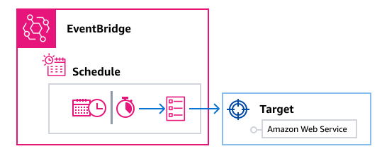

# Amazon EventBridge Scheduler

[Amazon EventBridge Scheduler](../../../scheduler/latest/UserGuide/what-is-scheduler.md "../../../scheduler/latest/UserGuide/what-is-scheduler.md") is a serverless scheduler that allows you to create, run, and manage tasks
from one central, managed service. With EventBridge Scheduler, you can create schedules using cron and rate expressions for recurring patterns, or configure one-time invocations. You can set
up flexible time windows for delivery, define retry limits, and set the maximum retention time for failed API invocations.

EventBridge Scheduler is highly customizable, and offers improved scalability over [EventBridge scheduled rules](eb-create-rule-schedule.md "eb-create-rule-schedule.md"), with a wider set of target API operations and AWS services.
We recommend that you use EventBridge Scheduler to invoke targets on a schedule.

## Set up the execution role

When you create a new schedule, EventBridge Scheduler must have permission to invoke its target API operation on your behalf. You grant these permissions to EventBridge Scheduler
using an _execution role_. The permission policy you attach to your schedule's execution role defines the required permissions.
These permissions depend on the target API you want EventBridge Scheduler to invoke.

When you use the EventBridge Scheduler console to create a schedule, as in the following procedure, EventBridge Scheduler automatically sets up an execution role based on your selected target.
If you want to create a schedule using one of the EventBridge Scheduler SDKs, the AWS CLI, or CloudFormation, you must have an existing execution role that grants the permissions
EventBridge Scheduler requires to invoke a target. For more information about manually setting up an execution role for your schedule, see [Setting up an execution role](../../../scheduler/latest/UserGuide/setting-up.md#setting-up-execution-role "../../../scheduler/latest/UserGuide/setting-up.md#setting-up-execution-role")
in the _EventBridge Scheduler User Guide_.

## Related resources

For more information about EventBridge Scheduler, see the following:

- [EventBridge Scheduler User Guide](../../../scheduler/latest/UserGuide/what-is-scheduler.md "../../../scheduler/latest/UserGuide/what-is-scheduler.md")
- [EventBridge Scheduler API Reference](../../../scheduler/latest/APIReference/Welcome.md "../../../scheduler/latest/APIReference/Welcome.md")
- [EventBridge Scheduler Pricing](https://aws.amazon.com/eventbridge/pricing/#Scheduler "https://aws.amazon.com/eventbridge/pricing/#Scheduler")

## Create a schedule

###### To create a schedule by using the console

1.  Open the Amazon EventBridge Scheduler console at [https://console.aws.amazon.com/scheduler/home](https://console.aws.amazon.com/scheduler/home/ "https://console.aws.amazon.com/scheduler/home/").
2.  On the **Schedules** page, choose **Create schedule**.
3.  On the **Specify schedule detail** page, in the **Schedule name and description** section, do the following:
    1. For **Schedule name**, enter a name for your
       schedule. For example, `MyTestSchedule`.
    2. (Optional) For **Description**, enter a
       description for your schedule. For example, `My first
schedule`.
    3. For **Schedule group**, choose a schedule group from
       the dropdown list. If you don't have a group, choose
       **default**. To create a schedule group, choose
       **create your own schedule**.

    You use schedule groups to add tags to groups of schedules.

4.  1. Choose your schedule options.

    | Occurrence                                                                                                                                               | Do this...                                                                                                                                                                                                                                                                                                                                                                                                                                                                                                                                                                                                                                                                                                                                                                                                                                                                                                                                                            |
    | -------------------------------------------------------------------------------------------------------------------------------------------------------- | --------------------------------------------------------------------------------------------------------------------------------------------------------------------------------------------------------------------------------------------------------------------------------------------------------------------------------------------------------------------------------------------------------------------------------------------------------------------------------------------------------------------------------------------------------------------------------------------------------------------------------------------------------------------------------------------------------------------------------------------------------------------------------------------------------------------------------------------------------------------------------------------------------------------------------------------------------------------- |
    | **One-time schedule** A one-time schedule invokes a target only once at the date and time that you specify.                                        | For **Date and time**, do the following: • Enter a valid date in `YYYY/MM/DD` format. • Enter a timestamp in 24-hour `hh:mm` format. • For **Timezone**, choose the timezone.                                                                                                                                                                                                                                                                                                                                                                                                                                                                                                                                                                                                                                                                                                                                                                    |
    | **Recurring schedule** A recurring schedule invokes a target at a rate that you specify using a \*_cron_ • expression or rate expression. | 1. For **Schedule type**, do one of the following: • To use a cron expression to define the schedule, choose **Cron-based schedule\* • and enter the cron expression. • To use a rate expression to define the schedule, choose **Rate-based schedule* • and enter the rate expression. For more information about cron and rate expressions, see [Schedule types on EventBridge Scheduler](../../../scheduler/latest/UserGuide/schedule-types.md#cron-based "../../../scheduler/latest/UserGuide/schedule-types.md#cron-based") in the *Amazon EventBridge Scheduler User Guide*. 2. For **Flexible time window**, choose **Off** to turn off the option, or choose one of the pre-defined time windows. For example, if you choose \*\*15 minutes* • and you set a recurring schedule to invoke its target once every hour, the schedule runs within 15 minutes after the start of every hour. |

5.  (Optional) If you chose **Recurring schedule** in the previous step,
    in the **Timeframe** section, do the following:
    1. For **Timezone**,
       choose a timezone.
    2. For **Start date and time**, enter a valid date in
       `YYYY/MM/DD` format, and then specify a timestamp in
       24-hour `hh:mm` format.
    3. For **End date and time**, enter a valid date in
       `YYYY/MM/DD` format, and then specify a timestamp in
       24-hour `hh:mm` format.

6.  Choose **Next**.
7.  On the **Select target** page, choose the AWS API operation that EventBridge Scheduler invokes:
    1. For **Target API**, choose **Templated targets**.
    2. Choose **Amazon EventBridge PutEvents**.
    3. Under **PutEvents**, specify the following:
       - For **EventBridge event bus**, choose the event bus from the drop-down menu. For example, `default`.

       You can also create a new event bus in the EventBridge console by choosing **Create new event bus**.
       - For **Detail-type**, enter the detail type of the events you want to match. For example, `Object Created`.
       - For **Source**, enter the name of the service that is the source of the events.

       For AWS service events, specify the service prefix as the source. Do not
       include the `aws.` prefix. For example, for Amazon S3 events, enter
       `s3`.

       To determine a service's prefix, see
       [The condition keys table](service-authorization/latest/reference/reference_policies_actions-resources-contextkeys.md#context_keys_table "service-authorization/latest/reference/reference_policies_actions-resources-contextkeys.md#context_keys_table")
       in the _Service Authorization Reference_. For more information about source and detail-type event values, see [AWS service event metadata](../ref/events-structure.md "../ref/events-structure.md") in the _Events Reference_.>.
       - (Optional): For **Detail**, enter an event pattern to further filter the events EventBridge Scheduler sends to EventBridge.

       For more information, see [Amazon EventBridge event patterns](eb-event-patterns.md "eb-event-patterns.md").

8.  Choose **Next**.
9.  On the **Settings** page, do the following:
    1.  To turn on the schedule, under **Schedule
        state**, toggle **Enable schedule**.
    2.  To configure a retry policy for your schedule, under
        **Retry policy and dead-letter queue (DLQ)**,
        do the following:

            * Toggle **Retry**.
            * For **Maximum age of event**,
             enter the maximum **hour(s)** and
             **min(s)** that EventBridge Scheduler must keep an
             unprocessed event.
            * The maximum time is 24 hours.
            * For **Maximum retries**, enter the
             maximum number of times EventBridge Scheduler retries the schedule if the
             target returns an error.

             The maximum value is 185 retries.

        With retry policies, if a schedule fails to invoke its target,
        EventBridge Scheduler re-runs the schedule. If configured, you must set the maximum
        retention time and retries for the schedule.

    3.  Choose where EventBridge Scheduler stores undelivered events.

    | **Dead-letter queue (DLQ)** option                                                 | Do this...                                                                                                                                          |
    | ------------------------------------------------------------------------------------- | --------------------------------------------------------------------------------------------------------------------------------------------------- |
    | Don't store                                                                           | Choose **None**.                                                                                                                                    |
    | Store the event in the same AWS account where you're creating the schedule         | 1. Choose **Select an Amazon SQS queue in my AWS account as a DLQ**. 2. Choose the Amazon Resource Name (ARN) of the Amazon SQS queue.     |
    | Store the event in a different AWS account from where you're creating the schedule | 1. Choose **Specify an Amazon SQS queue in other AWS accounts as a DLQ**. 2. Enter the Amazon Resource Name (ARN) of the Amazon SQS queue. |
    4. To use a customer managed key to encrypt your target input, under
       **Encryption**, choose **Customize
       encryption settings (advanced)**.

    If you choose this option, enter an existing KMS key ARN or choose
    **Create an AWS KMS key** to navigate to the
    AWS KMS console. For more information about how EventBridge Scheduler encrypts your data
    at rest, see [Encryption at
    rest](../../../scheduler/latest/UserGuide/encryption-rest.md "../../../scheduler/latest/UserGuide/encryption-rest.md") in the _Amazon EventBridge Scheduler User
    Guide_. 5. To have EventBridge Scheduler create a new execution role for you, choose
    **Create new role for this schedule**.
    Then, enter a name for **Role name**. If you choose
    this option, EventBridge Scheduler attaches the required permissions necessary for
    your templated target to the role.

10. Choose **Next**.
11. In the **Review and create schedule** page, review the
    details of your schedule. In each section, choose **Edit** to
    go back to that step and edit its details.
12. Choose **Create schedule**.

You can view a list of your new and existing schedules on the
**Schedules** page. Under the
**Status** column, verify that your new schedule is
**Enabled**.
