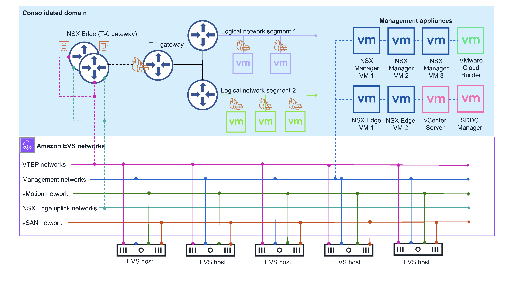

# Amazon EVS architecture

Amazon EVS implements a VMware Cloud Foundation (VCF) consolidated architecture model.
In this model, VCF management components and customer workloads run together on a consolidated domain.
The Amazon EVS environment is managed from a single vCenter Server with vSphere resource pools that provide isolation between management and customer workloads.

The consolidated domain that Amazon EVS deploys contains the following VCF management components:

- ESX hosts
- vCenter Server instance
- SDDC Manager
- vSAN datastore
- Three-node NSX Manager cluster
- vSphere cluster
- NSX Edge cluster
  The following diagram shows an example Amazon EVS architecture that’s been deployed in an Amazon EVS environment, and shows how the components in the environment are connected.
  In the diagram, the Amazon EVS environment with a consolidated domain architecture is shaded in blue.
  The underlying Amazon EVS network topology is illustrated within the solid purple line.

## Network topology

An Amazon EVS environment has two separate management network layers:

**Amazon VPC**

The Amazon VPC and the Amazon EVS VLAN subnets that are created in the VPC during environment creation form the underlay network for your VCF deployment.
This infrastructure provide connectivity for NSX overlay networks, host management, vMotion, and VSAN.
Amazon VPC Route Server enables dynamic routing between the underlay network and overlay networks.
For more information, see [Concepts and components of Amazon EVS](concepts.md "concepts.md").

###### Note

Amazon EVS VLAN subnets are used to facilitate VCF underlay communication only.
Guest virtual machines running customer workloads must be deployed on NSX overlay networks.
Deployment of guest virtual machines on the Amazon EVS VLAN subnet underlay network is not supported.

**VMware NSX overlay network**

Amazon EVS configures an NSX overlay network on your behalf as part of the deployment.
You can configure additional NSX overlay networks to achieve network isolation between different workloads or applications within your Amazon EVS environment.
For more information, see [Overlay Design for VMware Cloud Foundation](https://techdocs.broadcom.com/us/en/vmware-cis/vcf/vcf-5-2-and-earlier/5-2/vcf-design-5-2/nsx-t-design-for-the-management-domain/overlay-design-for-nsx-t-data-center-for-the-management-domain.html#GUID-025420AC-D915-439A-BF2A-D3C9F2FAB433-en "https://techdocs.broadcom.com/us/en/vmware-cis/vcf/vcf-5-2-and-earlier/5-2/vcf-design-5-2/nsx-t-design-for-the-management-domain/overlay-design-for-nsx-t-data-center-for-the-management-domain.html#GUID-025420AC-D915-439A-BF2A-D3C9F2FAB433-en") in the VMware Cloud Foundation product documentation.

###### Note

Amazon EVS supports only one tier-0 gateway for an Active/Standby NSX Edge cluster with two NSX Edge nodes.
This tier-0 gateway connects to and advertises all overlay networks that you configure for use with Amazon EVS.

The two network layers are connected by an Active/Standby NSX Edge cluster with two NSX Edge nodes.
The NSX Edge nodes enable communication over the VPC between virtual machines in the VLANs, as well as internet connectivity, and private connectivity using Direct Connect or AWS Site-to-Site VPN with a transit gateway.

### Amazon EVS networking considerations

The management network requires the following networking resource configurations.
You provide these inputs during Amazon EVS environment creation.
For more information, see [Concepts and components of Amazon EVS](concepts.md "concepts.md").

- An Amazon VPC.
  Ensure that your VPC IPv4 CIDR block is sized appropriately to accommodate the required VPC subnet and Amazon EVS VLAN subnets that Amazon EVS provisions during environment creation.
  For more information, see [Amazon EVS VLAN subnet](concepts.md#concepts-evs-network "concepts.md#concepts-evs-network").

###### Note

Amazon EVS does not support IPv6 at this time.

- A service access subnet in your VPC.
  Amazon EVS uses this subnet to maintain a persistent connection to your SDDC Manager appliance.
  For more information, see [Service access subnet](concepts.md#concepts-service-access-subnet "concepts.md#concepts-service-access-subnet").

###### Note

Amazon EVS only supports Single-AZ deployments at this time. All VPC subnets that Amazon EVS uses must exist in a single Availability Zone in a Region where the service is available.

###### Note

All VPC subnets require associated route tables that are configured according to your organization’s networking requirements.

- A primary DNS server IP address and a secondary DNS server IP address in the VPC’s DHCP option set to resolve host IP addresses.
  Amazon EVS also requires that you create a DNS forward lookup zone with A records and a reverse lookup zone with PTR records for each VCF management appliance and Amazon EVS host in your deployment.
  For more information, see [Configure DNS servers](getting-started.md#getting-started-config-dns "getting-started.md#getting-started-config-dns").
- Amazon EVS VLAN subnet CIDR blocks for each VLAN subnet that Amazon EVS provisions for you during environment creation.
  CIDR blocks must have a minimum size of /28 netmask and a maximum size of /24 netmask.
  CIDR blocks must be non-overlapping.
- An Amazon VPC Route Server instance with Route Server propagation enabled.
- Two Route Server endpoints in the service access subnet.
- Two Route Server peers that peer the NSX Edge nodes that Amazon EVS provisions with Route Server endpoints.

### Tier-0 gateway

The tier-0 gateway handles all north-south traffic between the logical and physical networks and is created on the NSX overlay network.
This tier-0 gateway is created as a part of Amazon EVS deployment.

###### Note

Amazon EVS supports only one tier-0 gateway for an Active/Standby NSX Edge cluster with two NSX Edge nodes.

### Tier-1 gateway

The tier-1 gateway handles east-west traffic between routed network segments within an environment and is created on the NSX overlay network.
The tier-1 gateway has downlink connections to segments and uplink connections to the tier-0 gateway.
You can create and configure additional Tier-1 gateways if you need them.

### NSX Edge cluster

Amazon EVS uses the NSX Manager interface to deploy an NSX Edge cluster with two NSX Edge nodes that run in Active/Standby mode.
This NSX Edge cluster provides the platform on which the Tier-0 and Tier-1 gateways run, along with IPsec VPN connections and their BGP routing machinery.

## Amazon EVS resources

Amazon EVS provisions the following AWS resources during environment creation.
These resources appear in the VPC that you allow Amazon EVS to access, and are visible in the AWS Management Console and AWS CLI after they are created.

###### Important

Modification of these resources outside of the Amazon EVS console and API could impact the availability and stability of your Amazon EVS environment.

- Amazon EVS elastic network interfaces that enable connectivity to your VCF appliances and hosts.
- Amazon EVS ESX hosts that run on Amazon EC2 bare metal instances.
  For more information, see [Amazon EVS host](concepts.md#concepts-evs-host "concepts.md#concepts-evs-host").

###### Important

Your Amazon EVS environment must have a minimum of 4 hosts and no more than 16 hosts. Amazon EVS only support environments with 4-16 hosts.

- Amazon EVS VLAN subnets that connect your VPC to VCF appliances.
  For more information, see [Amazon EVS VLAN subnet](concepts.md#concepts-evs-network "concepts.md#concepts-evs-network").
