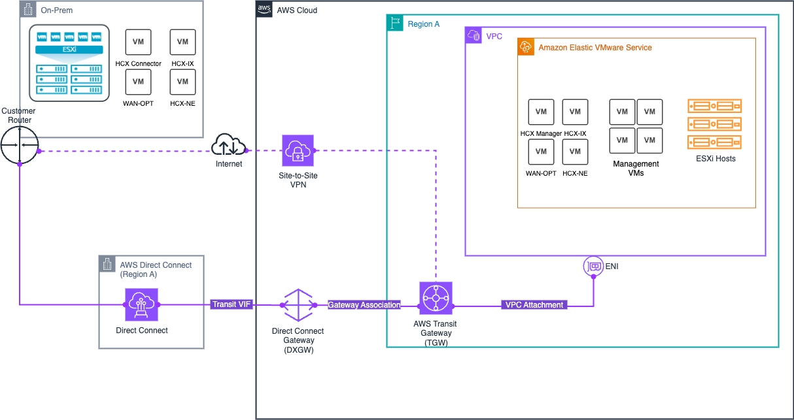
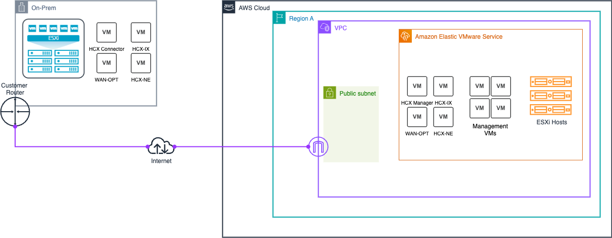

# Migrate workloads to Amazon EVS using VMware HCX

After Amazon EVS is deployed, you can deploy VMware HCX with private or public internet connectivity to facilitate migration of workloads to Amazon EVS.
For more information, see [Getting Started with VMware HCX](https://techdocs.broadcom.com/us/en/vmware-cis/hcx/vmware-hcx/4-10/getting-started-with-vmware-hcx-4-10.html "https://techdocs.broadcom.com/us/en/vmware-cis/hcx/vmware-hcx/4-10/getting-started-with-vmware-hcx-4-10.html") in the _VMware HCX User Guide_.

###### Important

HCX internet-based migration is generally not recommended for:

- Applications sensitive to network jitter or latency.
- Time-critical vMotion operations.
- Large-scale migrations with strict performance requirements.
  For these scenarios, we recommend using HCX private connectivity.
  A private dedicated connection offers more reliable performance compared to internet-based connections.

## HCX connectivity options

You can migrate workloads to Amazon EVS using private connectivity with AWS Direct Connect or Site-to-Site VPN connection, or using public connectivity.

Depending on your situation and connectivity options, you may prefer to use public or private connectivity with HCX.
For example, some sites may have private connectivity with greater performance consistency, but lower throughput due to VPN encryption or limited link speeds. Likewise, you may have high throughput public internet connectivity that has more variance in performance.
With Amazon EVS, you have the choice to use whichever connectivity option works best for you.

The following table compares the differences between HCX private and public connectivity.

| Private connectivity                                                                                                                                                                                                                                     | Public connectivity                                                                                                                                                                                                                                                                                             |
| -------------------------------------------------------------------------------------------------------------------------------------------------------------------------------------------------------------------------------------------------------- | --------------------------------------------------------------------------------------------------------------------------------------------------------------------------------------------------------------------------------------------------------------------------------------------------------------- |
| **Overview**                                                                                                                                                                                                                                             | **Overview**                                                                                                                                                                                                                                                                                                    |
| Uses only private connections within the VPC.<br>You can optionally use AWS Direct Connect or Site-to-Site VPN with a transit gateway for external network connectivity.                                                                                 | Uses public internet connectivity with Elastic IP addresses, enabling migrations without a dedicated private connection.                                                                                                                                                                                        |
| **Best suited for**                                                                                                                                                                                                                                      | **Best suited for**                                                                                                                                                                                                                                                                                             |
| • Time-sensitive vMotion operations.<br>• Large-scale migrations.<br>• Applications sensitive to latency/jitter.<br>• High-volume data transfers.<br>• Organizations with existing AWS Direct Connect/AWS Site-to-Site VPN.                              | • Locations without AWS Direct Connect/AWS Site-to-Site VPN.<br>• Cost-sensitive projects.                                                                                                                                                                                                                      |
| **Key benefits**                                                                                                                                                                                                                                         | **Key benefits**                                                                                                                                                                                                                                                                                                |
| • Consistent low-latency connectivity.<br>• Dedicated bandwidth allocation.<br>• More reliable network performance.<br>• Default HCX encryption can be disabled for private environments to optimize performance.<br>• No public IP management required. | • Faster setup than private connectivity.<br>• Cost-effective for smaller migrations.                                                                                                                                                                                                                           |
| **Key considerations**                                                                                                                                                                                                                                   | **Key considerations**                                                                                                                                                                                                                                                                                          |
| • More complex initial setup.<br>• Higher upfront infrastructure costs.<br>• Longer implementation timeline.<br>• No direct internet connectivity for any HCX component.                                                                                 | • More variable network performance.<br>• Bandwidth limitations are possible.<br>• Higher latency than private connectivity.<br>• Each component requires a dedicated Elastic IP address allocated from the public IPAM pool.<br>• EIP associations enable direct internet connectivity for each HCX component. |

## HCX private connectivity architecture

The HCX private connectivity solution integrates several components:

- **Amazon EVS network components**
  - Uses only private VLAN subnets for secure communication, including a private HCX VLAN.
  - Supports network ACLs for traffic control.
  - Supports dynamic BGP propagation of routes through a private VPC route server.

- **AWS managed network transit options for on-premises connectivity**
  - AWS Direct Connect + AWS Transit Gateway enables you to connect your on-premises network to Amazon EVS over a private dedicated connection.
    For more information, see [AWS Direct Connect + AWS Transit Gateway](../../../whitepapers/latest/aws-vpc-connectivity-options/aws-direct-connect-aws-transit-gateway.md "../../../whitepapers/latest/aws-vpc-connectivity-options/aws-direct-connect-aws-transit-gateway.md").
  - AWS Site-to-Site VPN + AWS Transit Gateway provides the option of creating an IPsec VPN connection between your remote network and the transit gateway over the internet.
    For more information, see [AWS Transit Gateway + AWS Site-to-Site VPN](../../../whitepapers/latest/aws-vpc-connectivity-options/aws-transit-gateway-vpn.md "../../../whitepapers/latest/aws-vpc-connectivity-options/aws-transit-gateway-vpn.md").

###### Note

Amazon EVS does not support connectivity via an AWS Direct Connect private virtual interface (VIF), or via an AWS Site-to-Site VPN connection that terminates directly into the underlay VPC.

The following diagram illustrates the HCX private connectivity architecture, showing how you can use AWS Direct Connect and Site-to-Site VPN with the transit gateway to enable secure workload migration through a private dedicated connection.



## HCX internet connectivity architecture

The HCX internet connectivity solution consists of several components working together:

- **Amazon EVS network components**
  - Uses an isolated public HCX VLAN subnet to enable internet connectvity between Amazon EVS and your on-premises HCX appliances.
  - Supports network ACLs for traffic control.
  - Supports dynamic BGP propagation of routes through a public VPC route server.

- **IPAM and public IP management**
  - Amazon VPC IP Address Manager (IPAM) manages public IPv4 address allocation from the Amazon-owned public IPAM pool.
  - Secondary VPC CIDR block (/28) is allocated from the IPAM pool, creating an isolated public subnet separate from the main VPC CIDR.

For more information, see [Configure HCX public internet connectivity](evs-env-hcx-internet-access.md "evs-env-hcx-internet-access.md").

The following diagram illustrates the HCX internet connectivity architecture.



## HCX migration setup

This tutorial describes how to configure VMware HCX to migrate your workloads to Amazon EVS.

### Prerequisites

Before using VMware HCX with Amazon EVS, ensure that HCX prerequisites have been met.
For more information, see [VMware HCX prerequisites](setting-up.md#hcx-prereqs "setting-up.md#hcx-prereqs").

###### Important

Amazon EVS has unique requirements for HCX public internet connectivity.

If you need HCX public connectivity, you must meet the following requirements:

- Create an IPAM and a public IPv4 IPAM pool with CIDR that has a a minimum netmask length of /28.
- Allocate at least two Elastic IP addresses (EIPs) from the IPAM pool for the HCX Manager and HCX Interconnect (HCX-IX) appliances.
  Allocate an additional Elastic IP address for each HCX network appliance that you need to deploy.
- Add the public IPv4 CIDR block as an additional CIDR to your VPC.
  For more information, see [HCX internet connectivity setup](getting-started.md#hcx-internet-config "getting-started.md#hcx-internet-config").

### Check the status of the HCX VLAN subnet

A VLAN is created for HCX as a part of the standard Amazon EVS deployment.
Follow these steps to check that the HCX VLAN subnet is properly configured.

###### Example

Amazon EVS console

1. Go to the Amazon EVS console.
2. In the navigation pane, choose **Environments**.
3. Select the Amazon EVS environment.
4. Select the **Networks and connectivity** tab.
5. Under **VLANs**, identify the HCX VLAN and check that the **State** is **Created** and **Public** is **true**.

AWS CLI

1. Run the following command, using the environment ID for your environment and the Region name that contains your resources.

```
aws evs list-environment-vlans  --region <region-name> --environment-id env-abcde12345
```

2. In the response output, identify the VLAN with a `functionName` of `hcx` and
   check that the `vlanState` is `CREATED` and `isPublic` is set to `true`.
   The following is a sample response.

```
{
    "environmentVlans": [{
            "vlanId": 50,
            "cidr": "10.10.4.0/24",
            "availabilityZone": "us-east-2b",
            "functionName": "vTep",
            "subnetId": "subnet-0ce640ac79e7f4dbc",
            "createdAt": "2025-09-09T12:09:37.526000-07:00",
            "modifiedAt": "2025-09-09T12:35:00.596000-07:00",
            "vlanState": "CREATED",
            "stateDetails": "VLAN successfully created",
            "eipAssociations": [],
            "isPublic": false
        },
        {
            "vlanId": 80,
            "cidr": "18.97.141.240/28",
            "availabilityZone": "us-east-2b",
            "functionName": "hcx",
            "subnetId": "subnet-0f080c94782cc74b4",
            "createdAt": "2025-09-09T12:09:37.675000-07:00",
            "modifiedAt": "2025-09-09T12:35:00.359000-07:00",
            "vlanState": "CREATED",
            "stateDetails": "VLAN successfully created",
            "eipAssociations": [{
                    "assocationId": "eipassoc-0be981accbbdf443a",
                    "allocationId": "eipalloc-0cef80396f4a0cc24",
                    "ipAddress": "18.97.141.245"
                },
                {
                    "assocationId": "eipassoc-0d5572f66b7952e9d",
                    "allocationId": "eipalloc-003fc9807d35d1ad3",
                    "ipAddress": "18.97.141.244"
                }
            ],
            "isPublic": true
        }
    ]
}
```

### Check that the HCX VLAN subnet is associated with a network ACL

Follow these steps to check that the HCX VLAN subnet is associated with a network ACL.
For more information about network ACL association, see [Create a network ACL to control Amazon EVS VLAN subnet traffic](getting-started.md#getting-started-create-nacl-vlan-traffic "getting-started.md#getting-started-create-nacl-vlan-traffic").

###### Important

If you are connecting over the internet, associating an Elastic IP address with a VLAN provides direct internet access to all resources on that VLAN.
Ensure that you have appropriate network access control lists configured to restrict access as needed for your security requirements.

###### Important

EC2 security groups do not function on elastic network interfaces that are attached to Amazon EVS VLAN subnets.
To control traffic to and from Amazon EVS VLAN subnets, you must use a network access control list (ACL).

###### Example

Amazon VPC console

1. Go to the Amazon VPC console.
2. In the navigation pane, choose **Network ACLs**.
3. Select the network ACL that your VLAN subnets are associated with.
4. Select the **Subnet associations** tab.
5. Check that the HCX VLAN subnet is listed among the associated subnets.

AWS CLI

1. Run the following command, using the HCX VLAN subnet ID in the `Values` filter.

```
aws ec2 describe-network-acls --filters "Name=subnet-id,Values=subnet-abcdefg9876543210"
```

2. Check that the correct network ACL is returned in the response.

### Check that EVS VLAN subnets are explicitly associated with a route table

Amazon EVS requires that all of the EVS VLAN subnets be explicitly associated with a route table in your VPC.
For HCX internet connectivity, your HCX public VLAN subnet must be explicitly associated with a public route table in your VPC that routes to an internet gateway.
Follow these steps to check the explicit route table association.

###### Example

Amazon VPC console

1. Go to the [VPC console](https://console.aws.amazon.com/vpc "https://console.aws.amazon.com/vpc").
2. In the navigation pane, choose **Route tables**.
3. Choose the route table that your EVS VLAN subnets should be explicitly associated with.
4. Select the **Subnet associations** tab.
5. Under **Explicit subnet associations**, check that all EVS VLAN subnets are listed.
   If a VLAN subnet is not listed here, the VLAN subnet is implicitly associated with the main route table.
   For Amazon EVS to function properly, you must explicitly associate all VLAN subnets with a route table.
   For the HCX public VLAN subnet, you must have an associated public route table with an internet gateway as the target.
   To address this issue, choose **Edit subnet associations** and add the missing VLAN subnet(s).

AWS CLI

1. Open a terminal session.
2. Run the following example command to retrieve details about all of your EVS VLAN subnets, including route table association.
   If a VLAN subnet is not listed here, the VLAN subnet is implicitly associated with the main route table.
   For Amazon EVS to function properly, you must explicitly associate all VLAN subnets with a route table.
   For the HCX public VLAN subnet, you must have an associated public route table with an internet gateway as the target.

```
aws ec2 describe-subnets
```

3. Explicitly associate your EVS VLAN subnets with a route table in your VPC.
   Below is an example command.

```
aws ec2 associate-route-table \
--route-table-id rtb-0123456789abcdef0 \
--subnet-id subnet-01234a1b2cde1234f
```

### (For HCX internet connectivity) Check that EIPs are associated with the HCX VLAN subnet

For each HCX network appliance that you deploy, you must have an EIP from the IPAM pool associated with an HCX public VLAN subnet.
You are required to associate at least two EIPs with the HCX public VLAN subnet for the HCX Manager and HCX Interconnect (HCX-IX) appliances.
Follow these steps to check that the necessary EIP associations exist.

###### Important

HCX public internet connectivity fails if you do not associate at least two EIPs from the IPAM pool with an HCX public VLAN subnet.

###### Note

You cannot associate the first two EIPs or the last EIP from the public IPAM CIDR block with a VLAN subnet.
These EIPs are reserved as network,default gateway, and broadcast addresses.
Amazon EVS throws a validation error if you attempt to associate these EIPs with a VLAN subnet.

###### Example

Amazon EVS console

1. Go to the [Amazon EVS console](https://console.aws.amazon.com/evs "https://console.aws.amazon.com/evs").
2. On the navigation menu, choose **Environments**.
3. Select the environment.
4. Under the **Networks and connectivity** tab, select the HCX public VLAN.
5. Check the **EIP associations** tab to confirm that the EIPs have been associated with the HCX public VLAN.

AWS CLI

1. To check which EIPs are associated with the HCX VLAN subnet, use the `list-environment-vlans` command.
   For `environment-id`, use the unique ID for the EVS environment that contains the HCX VLAN.

```
aws evs list-environment-vlans \
  --environment-id "env-605uove256" \
```

The command returns details about your VLANs, including EIP associations:

```
{
  "environmentVlans": [
    {
      "vlanId": 80,
      "cidr": "18.97.137.0/28",
      "availabilityZone": "us-east-2c",
      "functionName": "hcx",
      "subnetId": "subnet-02f9a4ee9e1208cfc",
      "createdAt": "2025-08-26T22:15:00.200000+00:00",
      "modifiedAt": "2025-08-26T22:20:28.155000+00:00",
      "vlanState": "CREATED",
      "stateDetails": "VLAN successfully created",
      "eipAssociations": [
        {
          "associationId": "eipassoc-09876543210abcdef",
          "allocationId": "eipalloc-0123456789abcdef0",
          "ipAddress": "18.97.137.3"
        },
        {
          "associationId": "eipassoc-12345678901abcdef",
          "allocationId": "eipalloc-1234567890abcdef1",
          "ipAddress": "18.97.137.4"
        },
        {
          "associationId": "eipassoc-23456789012abcdef",
          "allocationId": "eipalloc-2345678901abcdef2",
          "ipAddress": "18.97.137.5"
        }
      ],
      "isPublic": true,
      "networkAclId": "acl-0123456789abcdef0"
    },
    ...
  ]
}
```

The `eipAssociations` array shows the EIP association, including:

    * `associationId` - The unique ID for this EIP association.
    * `allocationId` - The allocation ID of the associated Elastic IP address.
    * `ipAddress` - The IP address assigned to the VLAN.

### Create a distributed port group with the HCX public uplink VLAN ID

Go to the vSphere Client interface and follow the steps in [Add a Distributed Port Group](https://techdocs.broadcom.com/us/en/vmware-cis/vsphere/vsphere/8-0/vsphere-networking-8-0/basic-networking-with-vnetwork-distributed-switches/dvport-groups/add-a-distributed-port-group.html "https://techdocs.broadcom.com/us/en/vmware-cis/vsphere/vsphere/8-0/vsphere-networking-8-0/basic-networking-with-vnetwork-distributed-switches/dvport-groups/add-a-distributed-port-group.html") to add a distributed port group to a vSphere Distributed Switch.

When configuring failback within the vSphere Client interface, ensure that uplink1 is an active uplink and uplink2 is a standby uplink to enable Active/Standby failover.
For the VLAN setting in the vSphere Client interface, enter the HCX VLAN ID that you previously identified.

### (Optional) Set up HCX WAN Optimization

###### Note

The WAN optimization feature is no longer available in HCX 4.11.3.
For more information, see the [HCX 4.11.3 Release Notes](https://techdocs.broadcom.com/us/en/vmware-cis/hcx/vmware-hcx/4-11/hcx-4-11-release-notes/vmware-hcx-4113-release-notes.html "https://techdocs.broadcom.com/us/en/vmware-cis/hcx/vmware-hcx/4-11/hcx-4-11-release-notes/vmware-hcx-4113-release-notes.html").

The HCX WAN Optimization service (HCX-WO) improves the performance characteristics of private lines or internet path by applying WAN optimization techniques like data reduction and WAN path conditioning.
The HCX WAN Optimization service is recommended on deployments that are not able to dedicate 10Gbit paths for migrations.
In 10Gbit, low latency deployments, using WAN Optimization may not yield improved migration performance.
For more information, see [VMware HCX Deployment Considerations and Best Practices](https://www.vmware.com/docs/vmw-hcx-deployment-considerations-and-best-practices "https://www.vmware.com/docs/vmw-hcx-deployment-considerations-and-best-practices").

The HCX WAN Optimization service is deployed in conjunction with the HCX WAN Interconnect service appliance (HCX-IX).
HCX-IX is responsible for data replication between the enterprise environment and the Amazon EVS environment.

To use the HCX WAN Optimization service with Amazon EVS, you need to use a distributed port group on the HCX VLAN subnet.
Use the distributed port group that was created in the [earlier step](#hcx-create-port-group "#hcx-create-port-group").

### (Optional) Enable HCX Mobility Optimized Networking

HCX Mobility Optimized Networking (MON) is a feature of the HCX Network Extension Service.
MON-enabled network extensions improve traffic flows for migrated virtual machines by enabling selective routing within your Amazon EVS environment.
MON allows you to configure the optimal path for migrating workload traffic to Amazon EVS when stretching Layer 2 networks, avoiding a long round-trip network path through the source gateway.
This feature is available for all Amazon EVS deployments.
For more information, see [Configuring Mobility Optimized Networking](https://techdocs.broadcom.com/us/en/vmware-cis/hcx/vmware-hcx/4-10/vmware-hcx-user-guide-4-10/extending-networks-with-vmware-hcx/hcx-network-extension-with-mobility-optimized-networking/configuring-hcx-mobility-optimized-networking.html "https://techdocs.broadcom.com/us/en/vmware-cis/hcx/vmware-hcx/4-10/vmware-hcx-user-guide-4-10/extending-networks-with-vmware-hcx/hcx-network-extension-with-mobility-optimized-networking/configuring-hcx-mobility-optimized-networking.html") in the VMware HCX User Guide.

###### Important

Before you enable HCX MON, read the following limitations and unsupported configurations for HCX Network Extension.

[Restrictions and Limitations for Network Extension](https://techdocs.broadcom.com/us/en/vmware-cis/hcx/vmware-hcx/4-10/vmware-hcx-user-guide-4-10/extending-networks-with-vmware-hcx/about-vmware-hcx-network-extension/restrictions-and-limitations-for-network-extension.html "https://techdocs.broadcom.com/us/en/vmware-cis/hcx/vmware-hcx/4-10/vmware-hcx-user-guide-4-10/extending-networks-with-vmware-hcx/about-vmware-hcx-network-extension/restrictions-and-limitations-for-network-extension.html")

[Restrictions and Limitations for Mobility Optimized Networking Topologies](https://techdocs.broadcom.com/us/en/vmware-cis/hcx/vmware-hcx/4-10/vmware-hcx-user-guide-4-10/extending-networks-with-vmware-hcx/hcx-network-extension-with-mobility-optimized-networking/limitations-for-mobility-optimized-networking.html "https://techdocs.broadcom.com/us/en/vmware-cis/hcx/vmware-hcx/4-10/vmware-hcx-user-guide-4-10/extending-networks-with-vmware-hcx/hcx-network-extension-with-mobility-optimized-networking/limitations-for-mobility-optimized-networking.html")

###### Important

Before you enable HCX MON, make sure that in the NSX interface you’ve configured route redistribution for the destination network CIDR.
For more information, see [Configure BGP and Route Redistribution](https://techdocs.broadcom.com/us/en/vmware-cis/nsx/nsxt-dc/3-2/administration-guide/nsx-cloud-overview/nsx-t-supported-features-for-nsx-cloud/service-insertion-for-your-public-cloud/task-set-up-bgp-on-the-vpn-tunnel.html "https://techdocs.broadcom.com/us/en/vmware-cis/nsx/nsxt-dc/3-2/administration-guide/nsx-cloud-overview/nsx-t-supported-features-for-nsx-cloud/service-insertion-for-your-public-cloud/task-set-up-bgp-on-the-vpn-tunnel.html") in the VMware NSX documentation.

### Verify HCX connectivity

VMware HCX includes built-in diagnostic tools that can be used to test connectivity.
For more information, see [VMware HCX Troubleshooting](https://techdocs.broadcom.com/us/en/vmware-cis/hcx/vmware-hcx/4-10/vmware-hcx-user-guide-4-10/vmware-hcx-troubleshooting.html "https://techdocs.broadcom.com/us/en/vmware-cis/hcx/vmware-hcx/4-10/vmware-hcx-user-guide-4-10/vmware-hcx-troubleshooting.html") in the _VMware HCX User Guide_.
