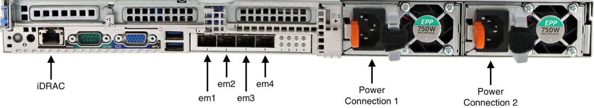
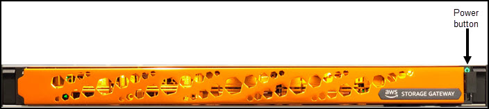

Amazon FSx File Gateway is no longer available to new customers. Existing
customers of FSx File Gateway can continue to use the service normally. For capabilities
similar to FSx File Gateway, visit [this blog post](https://aws.amazon.com/blogs/storage/switch-your-file-share-access-from-amazon-fsx-file-gateway-to-amazon-fsx-for-windows-file-server/ "https://aws.amazon.com/blogs/storage/switch-your-file-share-access-from-amazon-fsx-file-gateway-to-amazon-fsx-for-windows-file-server/").

# Physically installing your hardware appliance

###### Note

End of availability notice: As of May 12, 2025, the AWS Storage Gateway Hardware Appliance
will no longer be offered. Existing customers with the AWS Storage Gateway Hardware
Appliance can continue to use and receive support until May 2028. As an alternative,
you can use the AWS Storage Gateway service to give your applications on-premises and
in-cloud access to virtually unlimited cloud storage.

Your appliance has a 1U form factor and fits in a standard International
Electrotechnical Commission (IEC) compliant 19-inch rack.

**Prerequisites**

To install your hardware appliance, you need the following components:

- Power cables: one required, two recommended.
- Supported network cabling (depending on which Network Interface Card (NIC) is
  included in the hardware appliance). Twinax Copper DAC, SFP+ optical module
  (Intel compatible) or SFP to Base-T copper transceiver.
- Keyboard and monitor, or a keyboard, video, and mouse (KVM) switch
  solution.

###### Note

Before you perform the following procedure, make sure that you meet all of the
requirements for the Storage Gateway Hardware Appliance as described in [Networking and firewall
requirements for the Storage Gateway Hardware Appliance](Requirements.md#appliance-network-requirements "Requirements.md#appliance-network-requirements").

###### To physically install your hardware appliance

1. Unbox your hardware appliance and follow the instructions contained in the box to
   rack-mount the server.

The following image shows the back of the hardware appliance with ports for
connecting power, ethernet, monitor, USB keyboard, and iDRAC.

 2. Plug in a power connection to each of the two power supplies. It's
possible to plug in to only one power connection, but we recommend power
connections to both power supplies for redundancy. 3. Plug an Ethernet cable into the `em1` port to provide an always-on
internet connection. The `em1` port is the first of the four physical
network ports on the rear, from left to right.

###### Note

The hardware appliance doesn't support VLAN trunking. Set up the switch
port to which you are connecting the hardware appliance as a non-trunked VLAN
port. 4. Plug in the keyboard and monitor. 5. Power on the server by pressing the **Power** button on the
front panel, as shown in the following image.

**Next step**

[Accessing the hardware appliance
console](access-hardware-appliance-console.md "access-hardware-appliance-console.md")
