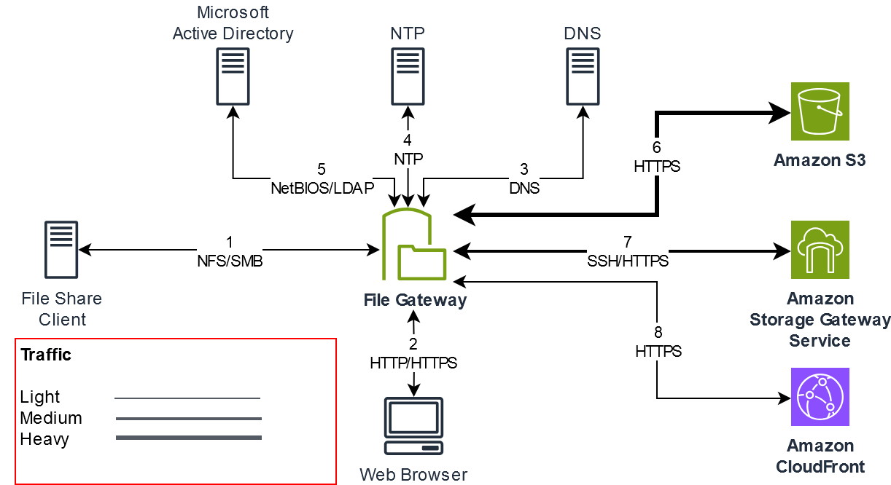
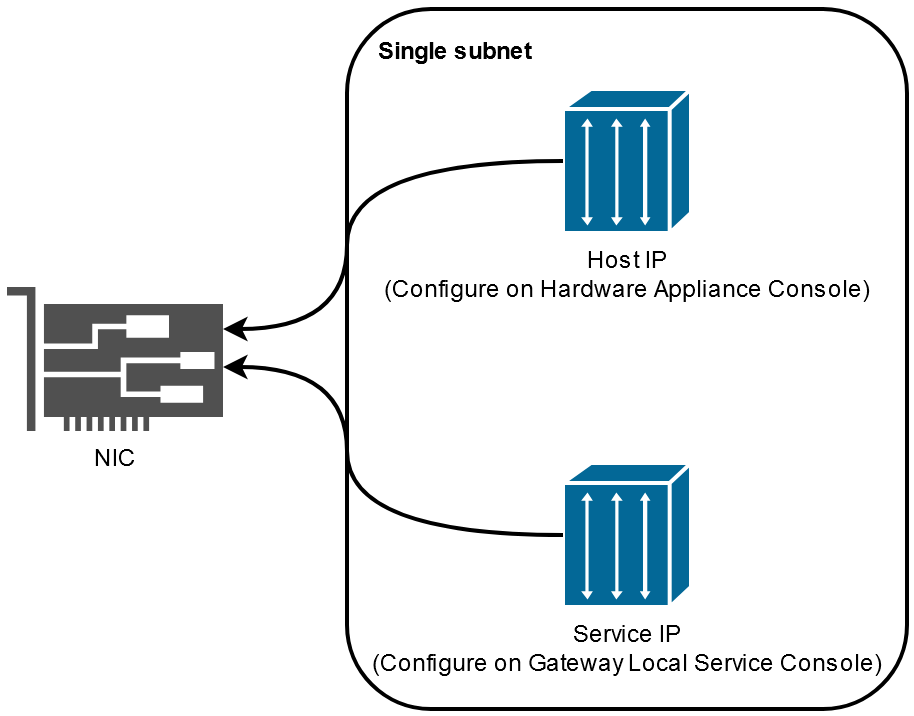

# File Gateway setup requirements

Unless otherwise noted, the following requirements are common to all File Gateway types
in AWS Storage Gateway. Your setup must meet the requirements in this section. Review the
requirements that apply to your gateway setup before you deploy your gateway.

###### Topics

- [Prerequisites](#user-requirements "#user-requirements")
- [Hardware and storage
  requirements](#requirements-hardware-storage "#requirements-hardware-storage")
- [Network and firewall requirements](#networks "#networks")
- [Supported hypervisors and host requirements](#requirements-host "#requirements-host")
- [Supported NFS and SMB clients for
  File Gateway](#requirements-s3-fgw-clients "#requirements-s3-fgw-clients")
- [Supported file system operations for
  File Gateway](#requirements-file-operations "#requirements-file-operations")
- [Managing local disks for your gateway](ManagingLocalStorage-common.md "ManagingLocalStorage-common.md")

## Prerequisites

Before you set up your Amazon S3 File Gateway (S3 File Gateway),
you must meet the following prerequisites:

- Configure Microsoft Active Directory (AD) and create an Active Directory
  service account with the requisite permissions. For more information, see [Active
  Directory service account permission requirements](ad-serviceaccount-permissions.md "ad-serviceaccount-permissions.md").
- Ensure that there is sufficient network bandwidth between the gateway and
  AWS. A minimum of 100 Mbps is required to successfully download, activate, and
  update the gateway.
- Configure the connection you want to use for network traffic between AWS and
  the on-premises environment where you are deploying your gateway. You can
  connect using the public internet, private networking, a VPN, or Direct Connect. If
  you want your gateway to communicate AWS through a private connection to an
  Amazon Virtual Private Cloud, set up the Amazon VPC before you set up your gateway.
- Make sure your gateway can resolve the name of your Active Directory Domain
  Controller. You can use DHCP in your Active Directory domain to handle
  resolution, or specify a DNS server manually from the Network Configuration
  settings menu in the gateway local console.

## Hardware and storage

requirements

The following sections provide information about the minimum required hardware and
storage configurations for your gateway, and the minimum amount of disk space to
allocate for the required storage.

For information about best practices for File Gateway performance,
see [Basic performance guidance for S3 File Gateway](Performance.md#performance-fgw "Performance.md#performance-fgw").

### Hardware requirements for on-premises

VMs

When deploying your gateway on-premises, ensure that the underlying hardware on
which you deploy the gateway virtual machine (VM) can dedicate the following minimum
resources:

- Four virtual processors assigned to the VM
- 16 GiB of reserved RAM for File Gateways
- 80 GiB of disk space for installation of VM image and system data

For more information, see [Maximizing S3 File Gateway throughput](Performance-Throughput.md "Performance-Throughput.md"). For information
about how your hardware affects the performance of the gateway VM, see [Quotas for file shares](fgw-quotas.md#resource-file-limits "fgw-quotas.md#resource-file-limits").

### Requirements for Amazon EC2 instance

types

When deploying your gateway on Amazon Elastic Compute Cloud (Amazon EC2), the instance size must be at
least **`xlarge`** for your gateway to
function. However, for the compute-optimized instance family the size must be at
least **`2xlarge`**.

###### Note

The Storage Gateway AMI is only compatible with x86-based instances that use Intel or
AMD processors. ARM-based instances that use Graviton processors are not
supported.

Use one of the following instance types recommended for your gateway type.

Recommended for File Gateway types

- General-purpose instance family – **m5, m6, or
  m7** instance type. Choose the **xlarge**
  instance size or higher to meet the Storage Gateway processor and RAM
  requirements.
- Compute-optimized instance family – **c5, c6, or
  c7** instance types. Choose the **2xlarge**
  instance size or higher to meet the Storage Gateway processor and RAM
  requirements.
- Memory-optimized instance family – **r5, r6, or
  r7** instance types. Choose the **xlarge**
  instance size or higher to meet the Storage Gateway processor and RAM
  requirements.
- Storage-optimized instance family – **i3, i4 or
  i7** instance types. Choose the **xlarge**
  instance size or higher to meet the Storage Gateway processor and RAM
  requirements.

###### Note

When you launch your gateway in Amazon EC2 and the instance type you choose
supports ephemeral storage, the disks are listed automatically. For more
information about Amazon EC2 instance storage, see [Instance
storage](../../../AWSEC2/latest/UserGuide/InstanceStorage.md "../../../AWSEC2/latest/UserGuide/InstanceStorage.md") in the _Amazon EC2 User Guide._

Application writes are stored in the cache
synchronously, and then asynchronously uploaded to durable storage in
Amazon S3. If the ephemeral storage is lost because an instance stops before
the upload is complete, the data that still resides in the cache and has
not yet written to Amazon Simple Storage Service (Amazon S3) can be lost. Before you stop the
instance that hosts the gateway, make sure that the
`CachePercentDirty` CloudWatch metric is `0`. For
information about ephemeral storage, see [Using ephemeral storage with EC2 gateways](ephemeral-disk-cache.md "ephemeral-disk-cache.md"). For information about monitoring metrics for your Storage Gateway,
see [Monitoring your S3 File Gateway](monitoring-file-gateway.md "monitoring-file-gateway.md").

If you have more than 5 million objects in your S3
bucket and you are using a **gp2** EBS volume, a
minimum root EBS volume of 350 GiB is required for acceptable
performance of your gateway during start up. Newly-created Amazon EC2
File Gateway instances use **gp3** root volumes by
default, which do not have this requirement. For information about how
to increase the volume size, see [Modifying an EBS volume using elastic volumes
(console)](../../../AWSEC2/latest/UserGuide/requesting-ebs-volume-modifications.md#modify-ebs-volume "../../../AWSEC2/latest/UserGuide/requesting-ebs-volume-modifications.md#modify-ebs-volume").

### Storage requirements

In addition to 80 GiB of disk space for the VM, you also need additional disks for
your gateway.

| Gateway type | Cache (minimum) | Cache (maximum) |
| ------------ | --------------- | --------------- |
| File Gateway | 150 GiB         | 64 TiB          |

###### Note

You can configure one or more local drives for your cache, up to the maximum
capacity.

When adding cache to an existing gateway, it's important to create new
disks in your host (hypervisor or Amazon EC2 instance). Don't change the size of
existing disks if the disks have been previously allocated as a cache.

For information about gateway quotas, see [Quotas for file shares](fgw-quotas.md#resource-file-limits "fgw-quotas.md#resource-file-limits").

## Network and firewall requirements

Your gateway requires access to the internet, local networks, Domain Name Service
(DNS) servers, firewalls, routers, and so on.

Network bandwidth requirements vary based on the quantity of data that is uploaded and
downloaded by the gateway. A minimum of 100Mbps is required to successfully download,
activate, and update the gateway. Your data transfer patterns will determine the
bandwidth necessary to support your workload.

Following, you can find information about required ports and how to allow access
through firewalls and routers.

###### Note

In some cases, you might deploy your gateway on Amazon EC2 or use other types of
deployment (including on-premises) with network security policies that restrict
AWS IP address ranges. In these cases, your gateway might experience service
connectivity issues when the AWS IP range values changes. The AWS IP address
range values that you need to use are in the Amazon service subset for the AWS
Region that you activate your gateway in. For the current IP range values, see
[AWS IP
address ranges](../../../general/latest/gr/aws-ip-ranges.md "../../../general/latest/gr/aws-ip-ranges.md") in the _AWS General Reference_.

###### Topics

- [Port requirements](#requirements-network "#requirements-network")
- [Networking and firewall
  requirements for the Storage Gateway Hardware Appliance](#appliance-network-requirements "#appliance-network-requirements")
- [Allowing AWS Storage Gateway access through
  firewalls and routers](#allow-firewall-gateway-access "#allow-firewall-gateway-access")
- [Configuring security groups for your
  Amazon EC2 gateway instance](#EC2GatewayCustomSecurityGroup-common "#EC2GatewayCustomSecurityGroup-common")

### Port requirements

S3 File Gateway requires specific ports to be allowed through your
network security for successful deployment and operation. Some ports are required
for all gateways, while others are required only for specific configurations, such
as when connecting to NFS or SMB clients, VPC endpoints, or Microsoft Active
Directory.

For S3 File Gateway, you only need to use Microsoft Active Directory
when you want to allow domain users to access a Server Message Block (SMB) file
share. You can join your File Gateway to any valid Microsoft Windows domain
(resolvable by DNS).

You can also use the Directory Service to create an [AWS Managed Microsoft AD](../../../directoryservice/latest/admin-guide/directory_microsoft_ad.md "../../../directoryservice/latest/admin-guide/directory_microsoft_ad.md") in the Amazon Web Services Cloud. For most AWS Managed Microsoft AD deployments,
you need to configure the Dynamic Host Configuration Protocol (DHCP) service for
your VPC. For information about creating a DHCP options set, see [Create a DHCP
options set](../../../directoryservice/latest/admin-guide/dhcp_options_set.md "../../../directoryservice/latest/admin-guide/dhcp_options_set.md") in the _AWS Directory Service Administration Guide_.

The following table lists the necessary ports and describes conditional
requirements in the **Notes** column.

Port requirements for
S3 File Gateway

| Network Element            | From               | To                                 | Protocol                                                          | Port  | Inbound | Outbound | Required | Notes                                                                                                                                                                                                                                                                                                                                                                                                                                                                     |
| -------------------------- | ------------------ | ---------------------------------- | ----------------------------------------------------------------- | ----- | ------- | -------- | -------- | ------------------------------------------------------------------------------------------------------------------------------------------------------------------------------------------------------------------------------------------------------------------------------------------------------------------------------------------------------------------------------------------------------------------------------------------------------------------------- |
| Web browser                | Your web browser   | Storage Gateway VM                 | TCP HTTP                                                          | 80    | ✓       | ✓        | ✓        | Used by local systems to obtain the Storage Gateway activation key. Port 80 is used only during activation of a Storage Gateway appliance.<br>A Storage Gateway VM doesn't require port 80 to be publicly accessible. The required level of access to port 80 depends on your network configuration. If you activate your gateway from the Storage Gateway Management Console, the host from which you connect to the console must have access to your gateway's port 80. |
| Web browser                | Storage Gateway VM | AWS                                | TCP HTTPS                                                         | 443   | ✓       | ✓        | ✓        | AWS Management Console (all other operations)                                                                                                                                                                                                                                                                                                                                                                                                                             |
| DNS                        | Storage Gateway VM | Domain Name Service (DNS) server   | TCP & UDP DNS                                                     | 53    | ✓       | ✓        | ✓        | Used for communication between a Storage Gateway VM and the DNS server for IP name resolution.                                                                                                                                                                                                                                                                                                                                                                            |
| NTP                        | Storage Gateway VM | Network Time Protocol (NTP) server | TCP & UDP NTP                                                     | 123   | ✓       | ✓        | ✓        | Used by on-premises systems to synchronize VM time to the host time. A Storage Gateway VM is configured to use the following NTP servers:<br>• 0.amazon.pool.ntp.org<br>• 1.amazon.pool.ntp.org<br>• 2.amazon.pool.ntp.org<br>• 3.amazon.pool.ntp.org<br>NoteNot required for gateways hosted on Amazon EC2.                                                                                                                                                              |
| Storage Gateway            | Storage Gateway VM | Support Endpoint                   | TCP SSH                                                           | 22    | ✓       | ✓        | ✓        | Allows Support to access your gateway to help you with troubleshooting gateway issues. You don't need this port open for the normal operation of your gateway, but it is required for troubleshooting. For a list of support endpoints, see [Support endpoints](../../../general/latest/gr/awssupport.md "../../../general/latest/gr/awssupport.md").                                                                                                                     |
| Storage Gateway            | Storage Gateway VM | AWS                                | TCP HTTPS                                                         | 443   | ✓       | ✓        | ✓        | Management control                                                                                                                                                                                                                                                                                                                                                                                                                                                        |
| Amazon CloudFront          | Storage Gateway VM | AWS                                | TCP HTTPS                                                         | 443   | ✓       | ✓        | ✓        | For activation                                                                                                                                                                                                                                                                                                                                                                                                                                                            |
| VPC                        | Storage Gateway VM | AWS                                | TCP HTTPS                                                         | 443   | ✓       | ✓        | ✓\*      | Management control<br>\*Required only when using VPC endpoints                                                                                                                                                                                                                                                                                                                                                                                                            |
| VPC                        | Storage Gateway VM | AWS                                | TCP HTTPS                                                         | 1026  |         | ✓        | ✓\*      | Control Plane endpoint<br>\*Required only when using VPC endpoints                                                                                                                                                                                                                                                                                                                                                                                                        |
| VPC                        | Storage Gateway VM | AWS                                | TCP HTTPS                                                         | 1027  |         | ✓        | ✓\*      | Anon Control Plane (for activation)<br>\*Required only when using VPC endpoints                                                                                                                                                                                                                                                                                                                                                                                           |
| VPC                        | Storage Gateway VM | AWS                                | TCP HTTPS                                                         | 1028  |         | ✓        | ✓\*      | Proxy endpoint<br>\*Required only when using VPC endpoints                                                                                                                                                                                                                                                                                                                                                                                                                |
| VPC                        | Storage Gateway VM | AWS                                | TCP HTTPS                                                         | 1031  |         | ✓        | ✓\*      | Data Plane<br>\*Required only when using VPC endpoints                                                                                                                                                                                                                                                                                                                                                                                                                    |
| VPC                        | Storage Gateway VM | AWS                                | TCP HTTPS                                                         | 2222  |         | ✓        | ✓\*      | SSH Support Channel for VPCe<br>\*Required only for opening support channel when using VPC endpoints                                                                                                                                                                                                                                                                                                                                                                      |
| VPC                        | Storage Gateway VM | AWS                                | TCP HTTPS                                                         | 443   | ✓       | ✓        | ✓\*      | Management control<br>\*Required only when using VPC endpoints                                                                                                                                                                                                                                                                                                                                                                                                            |
| File share client          | SMB Client         | Storage Gateway VM                 | TCP or UDP SMBv3                                                  | 445   | ✓       | ✓        | ✓\*      | File sharing data transfer session service.<br>Replaces ports 137–139 for Microsoft Windows NT and later.<br>\*Required for SMB only.                                                                                                                                                                                                                                                                                                                                     |
| Microsoft Active Directory | Storage Gateway VM | Active Directory server            | UDP NetBIOS                                                       | 137   | ✓       | ✓        | ✓\*      | Name service<br>\*Required for SMBv1 only.                                                                                                                                                                                                                                                                                                                                                                                                                                |
| Microsoft Active Directory | Storage Gateway VM | Active Directory server            | UDP NetBIOS                                                       | 138   | ✓       | ✓        | ✓\*      | Datagram service<br>\*Required for SMBv1 only.                                                                                                                                                                                                                                                                                                                                                                                                                            |
| Microsoft Active Directory | Storage Gateway VM | Active Directory server            | TCP & UDP LDAP                                                    | 389   | ✓       | ✓        | ✓\*      | Directory System Agent (DSA) client connection<br>\*Required for SMB only.                                                                                                                                                                                                                                                                                                                                                                                                |
| Microsoft Active Directory | Storage Gateway VM | Active Directory server            | TCP & UDP Kerberos                                                | 88    | ✓       | ✓        | ✓\*      | Kerberos<br>\*Required for SMB only.                                                                                                                                                                                                                                                                                                                                                                                                                                      |
| Microsoft Active Directory | Storage Gateway VM | Active Directory server            | TCP Distributed Computing Environment/End Point Mapper (DCE/EMAP) | 135   | ✓       | ✓        | ✓\*      | RPC<br>\*Required for SMB only.                                                                                                                                                                                                                                                                                                                                                                                                                                           |
| File share client          | NFS Client         | Storage Gateway VM                 | TCP or UDP Data NFSv3                                             | 111   | ✓       | ✓        | ✓\*      | File sharing data transfer (for NFS v3 only)<br>\*Required for NFS only.                                                                                                                                                                                                                                                                                                                                                                                                  |
| File share client          | NFS Client         | Storage Gateway VM                 | TCP or UDP NFS                                                    | 2049  | ✓       | ✓        | ✓\*      | File sharing data transfer<br>\*Required for NFS v3 & v4 only.                                                                                                                                                                                                                                                                                                                                                                                                            |
| File share client          | NFS Client         | Storage Gateway VM                 | TCP or UDP NFSv3                                                  | 20048 | ✓       | ✓        | ✓\*      | File sharing data transfer<br>\*Required for NFSv3 only                                                                                                                                                                                                                                                                                                                                                                                                                   |
| File share client          | NFS Client         | Storage Gateway VM                 | TCP or UDP NFSv3                                                  | 8750  | ✓       | ✓        | ✓\*      | File share quota<br>\*Required for NFSv3 only                                                                                                                                                                                                                                                                                                                                                                                                                             |
| File share client          | SMB Client         | Storage Gateway VM                 | TCP or UDP SMBv2                                                  | 139   | ✓       | ✓        | ✓\*      | File sharing data transfer session service<br>\*Required for SMB only                                                                                                                                                                                                                                                                                                                                                                                                     |
| Amazon S3                  | Storage Gateway VM | Amazon S3 service endpoints        | TCP HTTPS                                                         | 443   | ✓       | ✓        | ✓        | For communication from the Storage Gateway VM to the AWS service endpoint. For information about service endpoints, see [Allowing AWS Storage Gateway access through firewalls and routers](Requirements.md#allow-firewall-gateway-access "Requirements.md#allow-firewall-gateway-access").                                                                                                                                                                               |

The following illustration shows network traffic flow for a
basic S3 File Gateway deployment.



### Networking and firewall

requirements for the Storage Gateway Hardware Appliance

Each Storage Gateway Hardware Appliance requires the following network services:

- **Internet access** – an always-on
  network connection to the internet through any network interface on the
  server.
- **DNS services** – DNS services for
  communication between the hardware appliance and DNS server.
- **Time synchronization** – an
  automatically configured Amazon NTP time service must be reachable.
- **IP address** – A DHCP or static IPv4
  address assigned. You cannot assign an IPv6 address.

There are five physical network ports at the rear of the Dell PowerEdge R640
server. From left to right (facing the back of the server) these ports are as
follows:

1. iDRAC
2. `em1`
3. `em2`
4. `em3`
5. `em4`

You can use the iDRAC port for remote server management.


A hardware appliance requires the following ports to operate.

| Protocol | Port | Direction | Source             | Destination             | Usage                     |
| -------- | ---- | --------- | ------------------ | ----------------------- | ------------------------- |
| SSH      | 22   | Outbound  | Hardware appliance | `54.201.223.107`        | Support channel           |
| DNS      | 53   | Outbound  | Hardware appliance | DNS servers             | Name resolution           |
| UDP/NTP  | 123  | Outbound  | Hardware appliance | `*.amazon.pool.ntp.org` | Time synchronization      |
| HTTPS    | 443  | Outbound  | Hardware appliance | `*.amazonaws.com`       | Data transfer             |
| HTTP     | 8080 | Inbound   | AWS                | Hardware appliance      | Activation (only briefly) |

To perform as designed, a hardware appliance requires network and firewall
settings as follows:

- Configure all connected network interfaces in the hardware console.
- Make sure that each network interface is on a unique subnet.
- Provide all connected network interfaces with outbound access to the
  endpoints listed in the diagram preceding.
- Configure at least one network interface to support the hardware
  appliance. For more information, see [Configuring hardware appliance network
  parameters](appliance-configure-network.md "appliance-configure-network.md").

###### Note

For an illustration showing the back of the server with its ports, see [Physically installing your hardware appliance](appliance-rack-mount.md "appliance-rack-mount.md").

All IP addresses on the same network interface (NIC), whether for a gateway or a
host, must be on the same subnet. The following illustration shows the addressing
scheme.



For more information about activating and configuring a hardware appliance, see
[Using the AWS Storage Gateway Hardware Appliance](hardware-appliance.md "hardware-appliance.md").

### Allowing AWS Storage Gateway access through

firewalls and routers

Your gateway requires access to the following Storage Gateway service endpoints to communicate
with AWS. During gateway setup, select the endpoint type for your gateway based on your network environment.
If you use a firewall or router to filter or limit network traffic, you
must configure your firewall and router to allow these service endpoints for
outbound communication to AWS.

###### Note

If you configure private VPC endpoints for your Storage Gateway to use for connection
and data transfer to and from AWS, your gateway does not require access to the
public internet. For more information, see [Activating a
gateway in a virtual private cloud](gateway-private-link.md "gateway-private-link.md").

###### Important

Replace `region` in the following endpoint examples
with the correct AWS Region string for your gateway, such as
`us-west-2`.

Replace `amzn-s3-demo-bucket` with the actual name of
the Amazon S3 bucket in your deployment. You can also use an asterisk
(`*`) in place of `amzn-s3-demo-bucket` to
create a wildcard entry in your firewall rules, which will allow list the
service endpoint for all bucket names.

If your gateways are deployed in AWS Regions in the United States or Canada
and require Federal Information Processing Standard (FIPS) compliant endpoint
connections, replace `s3` with
`s3-fips`.

#### Endpoint types

###### Standard endpoints

These endpoints support IPv4 traffic between your gateway appliance and AWS.

The following service endpoint is required by all gateways for head-bucket
operations.

```
`bucket-name`.s3.`region`.amazonaws.com:443
```

The following service endpoints are required by all gateways for control path
(`anon-cp`, `client-cp`, `proxy-app`) and data
path (`dp-1`) operations.

```
anon-cp.storagegateway.`region`.amazonaws.com:443
client-cp.storagegateway.`region`.amazonaws.com:443
proxy-app.storagegateway.`region`.amazonaws.com:443
dp-1.storagegateway.`region`.amazonaws.com:443
```

The following gateway service endpoint is required to make API calls.

```
storagegateway.`region`.amazonaws.com:443
```

The following example is a gateway service endpoint in the US West (Oregon)
Region (`us-west-2`).

```
storagegateway.us-west-2.amazonaws.com:443
```

###### Dual-stack endpoints

These endpoints support IPv4 and IPv6 traffic between your gateway appliance and AWS.

The following dual-stack service endpoint is required by all gateways for head-bucket operations.

```
bucket-name.s3.dualstack.`region`.amazonaws.com:443
```

The following dual-stack service endpoints are required by all gateways for control path
(activation, controlplane, proxy) and data path (dataplane) operations.

```
activation-storagegateway.`region`.api.aws:443
controlplane-storagegateway.`region`.api.aws:443
proxy-storagegateway.`region`.api.aws:443
dataplane-storagegateway.`region`.api.aws:443
```

The following gateway dual-stack service endpoint is required to make API calls.

```
storagegateway.`region`.api.aws:443
```

The following example is a gateway dual-stack service endpoint in the US West (Oregon)
Region (`us-west-2`).

```
storagegateway.us-west-2.api.aws:443
```

#### Amazon S3 service endpoints

Amazon S3 File Gateway requires the following three types of endpoints to connect to the
Amazon S3 service:

**Amazon S3 service endpoint**

###### Note

For this endpoint only, _do not_ replace
`s3` with `s3-fips` for FIPS-compliant
deployments.

```
s3.amazonaws.com
```

**Amazon S3 regional endpoints**

```
s3.`region`.amazonaws.com (Standard)
s3.dualstack.`region`.amazonaws.com (Dual-stack)
```

The following example shows an Amazon S3 regional endpoint in the
US East (Ohio) Region (`us-east-2`).

```
s3.us-east-2.amazonaws.com
s3.dualstack.us-east-2.amazonaws.com
```

The following example shows standard and dual-stack FIPS-compliant Amazon S3 regional endpoints in the
US West (N. California) Region (`us-west-1`).

```
s3-fips.us-west-1.amazonaws.com
s3-fips.dualstack.us-west-1.amazonaws.com
```

The following examples show the standard and dual-stack Amazon S3 regional endpoints used
by AWS GovCloud (US) Regions:

```
s3-fips.us-gov-east-1.amazonaws.com (AWS GovCloud (US-East) Region (FIPS))
s3-fips.us-gov-west-1.amazonaws.com (AWS GovCloud (US-West) Region (FIPS))
s3.us-gov-east-1.amazonaws.com (AWS GovCloud (US-East) Region (Standard))
s3.us-gov-west-1.amazonaws.com (AWS GovCloud (US-West) Region (Standard))
s3-fips.dualstack.us-gov-east-1.amazonaws.com (AWS GovCloud (US-East) Region (FIPS dual-stack))
s3-fips.dualstack.us-gov-west-1.amazonaws.com (AWS GovCloud (US-West) Region (FIPS dual-stack))
s3.dualstack.us-gov-east-1.amazonaws.com (AWS GovCloud (US-East) Region (Dual-stack))
s3.dualstack.us-gov-west-1.amazonaws.com (AWS GovCloud (US-West) Region (Dual-stack))
```

###### Note

If your gateway can't determine the AWS Region where your Amazon S3
bucket is located, this service endpoint defaults to
`s3.us-east-1.amazonaws.com`. We recommend that you allow
access to the US East (N. Virginia) Region (`us-east-1`) in addition
to the AWS Regions where your gateway is activated, and where your Amazon S3
bucket is located.

**Amazon S3 bucket endpoints**

```
`bucket-name`.s3.`region`.amazonaws.com (Standard)
`bucket-name`.s3.dualstack.`region`.amazonaws.com (Dual-stack)
```

The following examples show standard and dual-stack Amazon S3 bucket endpoints for
a bucket named `amzn-s3-demo-bucket` in the US East (Ohio) Region
(`us-east-2`).

```
`amzn-s3-demo-bucket`.s3.us-east-2.amazonaws.com (Standard)
`amzn-s3-demo-bucket`.s3.dualstack.us-east-2.amazonaws.com (Dual-stack)
```

The following examples show standard and dual-stack FIPS-compliant Amazon S3 bucket endpoints for a bucket
named `amzn-s3-demo-bucket1` in the AWS GovCloud (US-East) Region
(`us-gov-east-1`).

```
`amzn-s3-demo-bucket1`.s3-fips.us-gov-east-1.amazonaws.com (FIPS)
`amzn-s3-demo-bucket1`.s3-fips.dualstack.us-gov-east-1.amazonaws.com (FIPS dual-stack)

```

In addition to the Storage Gateway and Amazon S3 service endpoints, Storage Gateway VMs also require
network access to the following NTP servers:

```
time.aws.com
0.amazon.pool.ntp.org
1.amazon.pool.ntp.org
2.amazon.pool.ntp.org
3.amazon.pool.ntp.org
```

For more information about supported AWS Regions and service endpoints, see [Storage Gateway](../../../general/latest/gr/sg.md "../../../general/latest/gr/sg.md") in the
_AWS General Reference_.

### Configuring security groups for your

Amazon EC2 gateway instance

In AWS Storage Gateway, a security group controls traffic to your Amazon EC2 gateway instance. When you
configure a security group, we recommend the following:

- The security group should not allow incoming connections from the outside
  internet. It should allow only instances within the gateway security group to
  communicate with the gateway.

If you need to allow instances to connect to the gateway from outside its security
group, we recommend that you allow connections only on port 80 (for
activation).

- If you want to activate your gateway from an Amazon EC2 host outside the gateway
  security group, allow incoming connections on port 80 from the IP address of that
  host. If you cannot determine the activating host's IP address, you can open port
  80, activate your gateway, and then close access on port 80 after completing
  activation.
- Allow port 22 access only if you are using Support for troubleshooting purposes. For
  more information, see [You want Support to help troubleshoot
  your Amazon EC2 gateway](troubleshooting-EC2-gateway-issues.md#EC2-EnableAWSSupportAccess "troubleshooting-EC2-gateway-issues.md#EC2-EnableAWSSupportAccess").

For information about the ports to open for your gateway, see [Port requirements](#requirements-network "#requirements-network").

## Supported hypervisors and host requirements

You can run Storage Gateway on-premises as either a virtual machine (VM) appliance or a
physical hardware appliance, or in AWS as an Amazon EC2 instance.

Storage Gateway supports the following hypervisor versions and hosts:

- VMware ESXi Hypervisor (version 7.0 or 8.0) – For this setup, you also
  need a VMware vSphere client to connect to the host.
- Microsoft Hyper-V Hypervisor (2019, 2022, or 2025) –
  For this setup, you need a Microsoft Hyper-V Manager on a Microsoft Windows client computer to connect to the host.
- Linux Kernel-based Virtual Machine (KVM) – A free, open-source
  virtualization technology. KVM is included in all versions of Linux version
  2.6.20 and newer. Storage Gateway is tested and supported for the CentOS/RHEL 7.7,
  RHEL 8.6 Ubuntu 16.04 LTS, and Ubuntu 18.04 LTS distributions. Any other modern
  Linux distribution may work, but function or performance is not guaranteed. We
  recommend this option if you already have a KVM environment up and running and
  you are already familiar with how KVM works.
- Nutanix AHV (Acropolis Hypervisor) beginning with version 10.0.1.1 – A KVM-based virtualization platform that is integrated into the Nutanix hyper-converged infrastructure (HCI) solution.
- Amazon EC2 instance – Storage Gateway provides an Amazon Machine Image (AMI)
  that contains the gateway VM image. For information about how to deploy a
  gateway on Amazon EC2, see [Deploy a default Amazon EC2 host for
  S3 File Gateway](ec2-gateway-file.md "ec2-gateway-file.md").
- Storage Gateway Hardware Appliance – Storage Gateway provides a physical hardware
  appliance as an on-premises deployment option for locations with limited virtual
  machine infrastructure.

###### Note

Storage Gateway doesn’t support recovering a gateway from a VM that was created from
a snapshot or clone of another gateway VM or from your Amazon EC2 AMI. If your gateway VM
malfunctions, activate a new gateway and recover your data to that gateway. For more
information, see [Recovering from an unexpected virtual
machine shutdown](best-practices.md#recover-from-gateway-shutdown "best-practices.md#recover-from-gateway-shutdown").

Storage Gateway doesn’t support dynamic memory and virtual memory ballooning.

## Supported NFS and SMB clients for

File Gateway

File Gateway supports the following clients:

| Operating System Version      | Kernel Version | Supported Protocols |
| ----------------------------- | -------------- | ------------------- |
| Amazon Linux 2023             | 6.1 LTS        | NFSv4.1, NFSv3      |
| Amazon Linux 2                | 5.10 LTS       | NFSv4.1, NFSv3      |
| RHEL 9                        | 5.14           | NFSv4.1, NFSv3      |
| RHEL 8.10                     | 4.18           | NFSv4.1, NFSv3      |
| SUSE 15                       | 6.4            | NFSv4.1, NFSv3      |
| Ubuntu 24.04 LTS              | 6.8 LTS        | NFSv4.1, NFSv3      |
| Ubuntu 22.04 LTS              | 5.15 LTS       | NFSv4.1, NFSv3      |
| Microsoft Windows Server 2025 |                | SMBv2, SMBv3, NFSv3 |
| Microsoft Windows Server 2022 |                | SMBv2, SMBv3, NFSv3 |
| Microsoft Windows 11          |                | SMBv2, SMBv3, NFSv3 |
| Microsoft Windows 10          |                | SMBv2, SMBv3, NFSv3 |

###### Note

Server Message Block (SMB) encryption requires clients that support SMB v3
dialects.

## Supported file system operations for

File Gateway

Your NFS or SMB client can write, read, delete, and truncate files.
When clients send writes to AWS Storage Gateway, it writes to local cache synchronously. Then it
writes to Amazon S3 asynchronously through optimized transfers. Reads are first served
through the local cache. If data is not available, it's fetched through S3 as a
read-through cache.

Writes and reads are optimized in that only the parts that are
changed or requested are transferred through your gateway. Deletes remove objects from
Amazon S3. Directories are managed as folder objects in S3, using the same syntax as in the
Amazon S3 console.

HTTP operations such as `GET`, `PUT`,
`UPDATE`, and `DELETE` can modify files in a file share. These
operations conform to the atomic create, read, update, and delete (CRUD)
functions.
