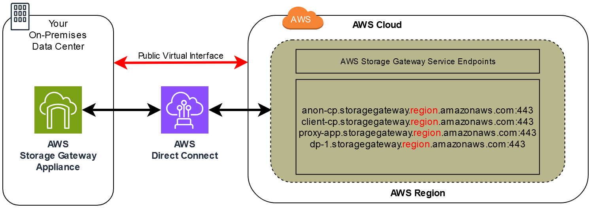

# Using Direct Connect with Storage Gateway

Direct Connect links your internal network to the Amazon Web Services Cloud. By using Direct Connect with
Storage Gateway, you can create a connection for high-throughput workload needs, providing a
dedicated network connection between your on-premises gateway and AWS.

Storage Gateway uses public endpoints. With an Direct Connect connection in place, you can create a
public virtual interface to allow traffic to be routed to the Storage Gateway endpoints. The
public virtual interface bypasses internet service providers in your network path. The
Storage Gateway service public endpoint can be in the same AWS Region as the Direct Connect
location, or it can be in a different AWS Region.

The following illustration shows an example of how Direct Connect works with
Storage Gateway.

The following procedure assumes that you have created a functioning gateway.

###### To use Direct Connect with Storage Gateway

1. Create and establish an AWS Direct Connect connection between your on-premises data
   center and your Storage Gateway endpoint. For more information about how to create a
   connection, see [Getting Started
   with Direct Connect](../../../directconnect/latest/UserGuide/getting_started.md "../../../directconnect/latest/UserGuide/getting_started.md") in the _Direct Connect User Guide._
2. Connect your on-premises Storage Gateway appliance to the Direct Connect router.
3. Create a public virtual interface, and configure your on-premises router
   accordingly. For more information, see [Creating a Virtual Interface](../../../directconnect/latest/UserGuide/create-vif.md "../../../directconnect/latest/UserGuide/create-vif.md") in the _Direct Connect User Guide._
   For details about Direct Connect, see [What is
   Direct Connect?](../../../directconnect/latest/UserGuide/Welcome.md "../../../directconnect/latest/UserGuide/Welcome.md") in the _Direct Connect User Guide_.
