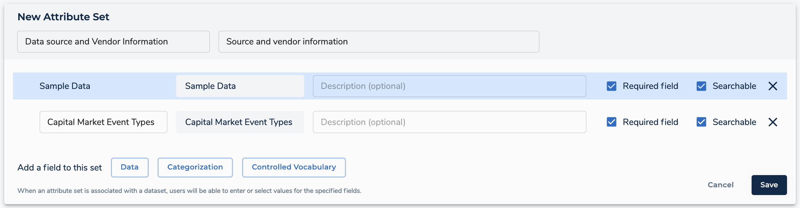

After careful consideration, we decided to end support for Amazon FinSpace, effective October 7, 2026. Amazon FinSpace will no longer accept new customers beginning October 7, 2025. As an existing customer with an Amazon FinSpace environment created before October 7, 2025, you can continue to use the service as normal. After October 7, 2026, you will no longer be able to use Amazon FinSpace. For more information, see
[Amazon FinSpace end of support](amazon-finspace-end-of-support.md "amazon-finspace-end-of-support.md").

# Configuring attribute sets in Amazon FinSpace

###### Important

Amazon FinSpace Dataset Browser will be discontinued on `March 26,
 2025`. Starting `November 29, 2023`, FinSpace will no longer accept the creation of new Dataset Browser
environments. Customers using [Amazon FinSpace with Managed Kdb Insights](https://aws.amazon.com/finspace/features/managed-kdb-insights/ "https://aws.amazon.com/finspace/features/managed-kdb-insights/") will not be affected. For more information, review the [FAQ](https://aws.amazon.com/finspace/faqs/ "https://aws.amazon.com/finspace/faqs/") or contact [AWS Support](https://aws.amazon.com/contact-us/ "https://aws.amazon.com/contact-us/") to assist with your
transition.

Attribute sets are lists of attributes that can be applied to describe datasets. Attributes are metadata fields used to capture additional business context for each dataset.
You can browse and search attributes to find datasets based on the values assigned to them.

###### Note

In order to create attribute sets, you must be a superuser or a member of a group with necessary permissions -
**Manage Attribute Sets**.

## List all attribute sets

###### To list attribute sets

1. Sign in to the FinSpace web application. For more information, see [Signing in to the Amazon FinSpace web application](signing-into-amazon-finspace.md "signing-into-amazon-finspace.md").
2. On the left navigation bar of the home page, choose **Manage Data**.
3. On the **Manage Data** page, choose **Manage Attribute Sets**.
   All the available attributes are listed in a table. You can also choose the more (
   
   ) icon for options to duplicate, disable, or remove an attribute set.

## Create attribute sets

###### To create an attribute set

1. Sign in to the FinSpace web application. For more information, see [Signing in to the Amazon FinSpace web application](signing-into-amazon-finspace.md "signing-into-amazon-finspace.md").
2. On the left navigation bar of the home page, choose **Manage Data**.
3. On the **Manage Data** page, choose **Manage Attribute Sets**.
4. On the **Attribute Sets** page, choose **Create Attribute Set**.
5. Enter a name for the attribute set. For example, `Data source and Vendor Information`.
6. (Optional) Add a description for the attribute.
7. Choose the type of fields to the attribute set.
   - **Data** – A field of type Number, String, or Boolean.
   - **Categorization** – A field that is a type of an already defined category. For example, an `Asset class`.
   - **Controlled Vocabulary** – A field that is a type of an already defined controlled vocabulary. For example, `Data Sensitivity Classification`.

 8. Choose **Save**.

## Edit attribute sets

###### To edit an attribute set

1. Sign in to the FinSpace web application. For more information, see [Signing in to the Amazon FinSpace web application](signing-into-amazon-finspace.md "signing-into-amazon-finspace.md").
2. On the left navigation bar of the home page, choose **Manage Data**.
3. On the **Manage Data** page, choose **Manage Attribute Sets**.
4. On the **Attribute Sets** page, select an attribute set from the list to edit.
5. Choose **Edit This Attribute Set**.
6. Select an existing field to edit and remove it. You cannot change the data type for a field.
7. Choose **Save**.

## Delete an attribute set

###### To delete an attribute set

1. Sign in to the FinSpace web application. For more information, see [Signing in to the Amazon FinSpace web application](signing-into-amazon-finspace.md "signing-into-amazon-finspace.md").
2. On the left navigation bar of the home page, choose **Manage Data**.
3. On the **Manage Data** page, choose **Manage Attribute Sets**.
4. From the list of attribute sets in the table, select the one that you want to delete.
5. Choose the more (
   
   ) icon and then choose **Remove**.
6. On the dialog box that appears, choose **Remove** to confirm deletion.

## Associate an attribute set with a dataset

###### To associate an attribute set to a dataset

1. Sign in to the FinSpace web application. For more information, see [Signing in to the Amazon FinSpace web application](signing-into-amazon-finspace.md "signing-into-amazon-finspace.md").
2. On the homepage, search for a dataset using the search box.
3. On the **Catalog** page, choose the dataset name to view the dataset details page.
4. On the **Data Overview** tab, under **Details About This Dataset** section, choose the **Add Attribute Set** button.
5. From the drop down menu, select one or more attribute set to add.
6. Choose **Add Attribute Set**. The selected attribute sets get added to the dataset.
   You can set values for each of the attribute set you selected and choose **Save** to finish.

###### Note

Under the **Details About This Dataset** section, you can also choose **Edit** to edit the associated attribute or choose **Remove Attribute Set** to remove it from the dataset.
