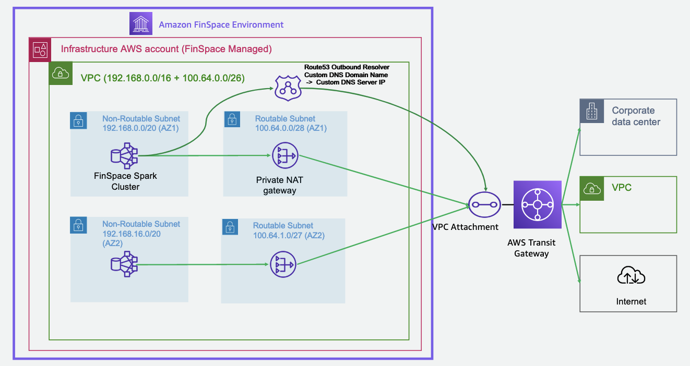

After careful consideration, we decided to end support for Amazon FinSpace, effective October 7, 2026. Amazon FinSpace will no longer accept new customers beginning October 7, 2025. As an existing customer with an Amazon FinSpace environment created before October 7, 2025, you can continue to use the service as normal. After October 7, 2026, you will no longer be able to use Amazon FinSpace. For more information, see
[Amazon FinSpace end of support](amazon-finspace-end-of-support.md "amazon-finspace-end-of-support.md").

# Connecting Amazon FinSpace to your network

###### Important

Amazon FinSpace Dataset Browser will be discontinued on `March 26,
 2025`. Starting `November 29, 2023`, FinSpace will no longer accept the creation of new Dataset Browser
environments. Customers using [Amazon FinSpace with Managed Kdb Insights](https://aws.amazon.com/finspace/features/managed-kdb-insights/ "https://aws.amazon.com/finspace/features/managed-kdb-insights/") will not be affected. For more information, review the [FAQ](https://aws.amazon.com/finspace/faqs/ "https://aws.amazon.com/finspace/faqs/") or contact [AWS Support](https://aws.amazon.com/contact-us/ "https://aws.amazon.com/contact-us/") to assist with your
transition.

You can use a FinSpace virtual private cloud (VPC) connection to allow the compute resources
running in your FinSpace environment infrastructure account to access resources in your
internal network. For example, a FinSpace analyst can connect their FinSpace managed Spark cluster
to an internal code repository or internal application REST service. Using this feature,
you can also connect to databases on your corporate network and access data, which you
could then combine with data in FinSpace.

## How a FinSpace VPC connection works

You create a FinSpace VPC connection by connecting your FinSpace infrastructure account to an
existing transit gateway in your organization. You can configure the transit gateway to
route traffic to other portions of your network. The following diagram shows how a FinSpace
VPC connection works.

The diagram describes a high-level setup of a FinSpace VPC connection:

- Each FinSpace environment contains a dedicated, service-managed AWS account
  called an environment infrastructure account.
- In this account, there is a VPC. This VPC contains non-routable subnets that
  host FinSpace managed compute resources. The VPC also contains routable subnets that
  host a private NAT gateway. The private NAT gateway is connected to a customer
  managed transit gateway through a transit gateway attachment.
- As shown in the diagram, you can connect the transit gateway that you manage to
  additional parts of your network, including your VPCs and on-premises networks.
  You can also configure a network path from this transit gateway to the internet if
  you want to.
- The non-routable subnets that are in the VPC in the FinSpace infrastructure account
  use ranges within a Classless Inter-Domain Routing (CIDR) block of
  _192.168.0.0/16_. The routable subnets use CIDR ranges that
  you provide. This diagram shows an example of using a
  _100.64.0.0/26_ CIDR range, which you provide for use in two
  Availability Zones (AZs).
- In the VPC of the environment infrastructure account, a Route 53 outbound resolver
  forwards custom DNS queries to a custom DNS server that you specify.
- FinSpace creates multiple AZs in a Region and private NAT gateways in every
  AZ.

### DNS resolution

The VPC in the environment infrastructure account contains a Route 53 resolver that
is used by the hosts for DNS lookups. By default, after you configure a VPC
connection, this resolver resolves AWS service names, but not other hosts on your
network or the internet.

When you set up your FinSpace VPC connection, you can optionally configure this
resolver so that it forwards queries to a resolver that you specify. This allows
hosts that are running in the FinSpace infrastructure account to be able to resolve
hostnames from this resolver.

######

Topics

- [Managing a FinSpace VPC connection](manage-vpc.md "manage-vpc.md")
- [Validating your VPC connection](vpc-validation.md "vpc-validation.md")
- [Monitoring IP traffic](monitoring-ip-traffic.md "monitoring-ip-traffic.md")
