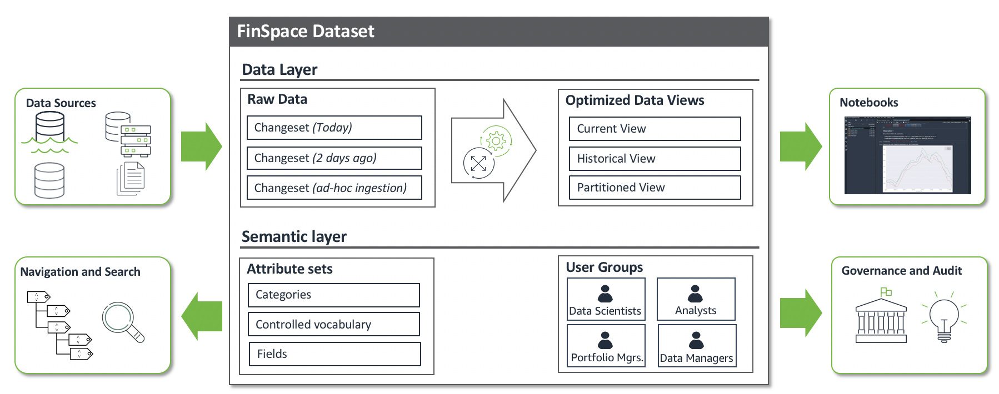
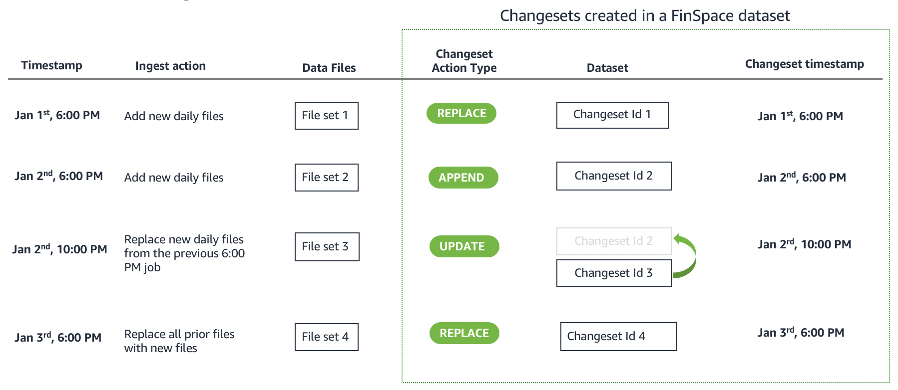
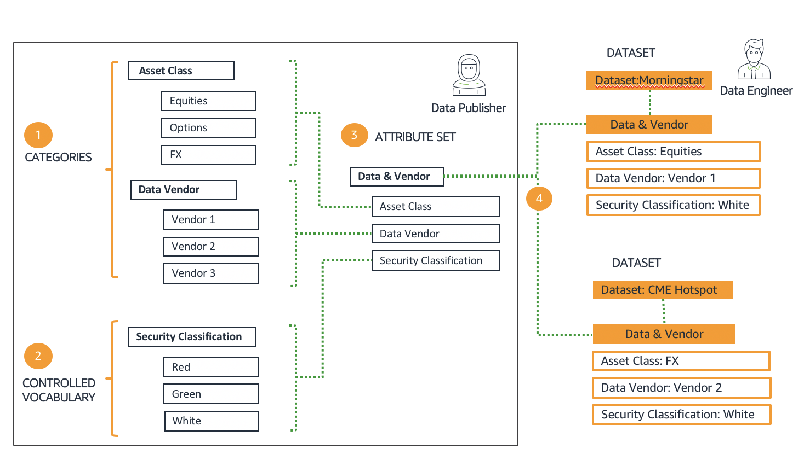

After careful consideration, we decided to end support for Amazon FinSpace, effective October 7, 2026. Amazon FinSpace will no longer accept new customers beginning October 7, 2025. As an existing customer with an Amazon FinSpace environment created before October 7, 2025, you can continue to use the service as normal. After October 7, 2026, you will no longer be able to use Amazon FinSpace. For more information, see
[Amazon FinSpace end of support](amazon-finspace-end-of-support.md "amazon-finspace-end-of-support.md").

# Core concepts and terms

###### Important

Amazon FinSpace Dataset Browser will be discontinued on `March 26,
 2025`. Starting `November 29, 2023`, FinSpace will no longer accept the creation of new Dataset Browser
environments. Customers using [Amazon FinSpace with Managed Kdb Insights](https://aws.amazon.com/finspace/features/managed-kdb-insights/ "https://aws.amazon.com/finspace/features/managed-kdb-insights/") will not be affected. For more information, review the [FAQ](https://aws.amazon.com/finspace/faqs/ "https://aws.amazon.com/finspace/faqs/") or contact [AWS Support](https://aws.amazon.com/contact-us/ "https://aws.amazon.com/contact-us/") to assist with your
transition.

This section covers the core concepts and essential terms related to FinSpace, including data
ingestion, organization, analysis, and security. From dataset management and changesets to
data views and integrated permission controls, this overview provides a solid foundation
for understanding how you can use FinSpace dataset browser to streamline financial data
workflows and enable sophisticated analytics at scale.

## Loading data

You can ingest data into Amazon FinSpace from your enterprise data lake or on-premises data stores. The data is ingested into Datasets.
FinSpace supports ingestion of structured data such as CSV, parquet, XML, and JSON or any unstructured data files. You can ingest data using
the FinSpace web application or the SDK. To learn more about loading data, see [Adding and managing data in Amazon FinSpace](finspace-add-data.md "finspace-add-data.md").

### Datasets

Dataset is a logical container of semantically identical data and schema. Data is ingested into a dataset as a changeset,
and every time a new set of data is added to a dataset, a changeset is created. Dataset tracks the versions of data that is ingested as changesets.
Data Views are generated from the changesets which can be analyzed within the FinSpace Notebook environments. A typical FinSpace environment may
contain hundreds or thousands of datasets. To learn more, see [Working with datasets](working-with-datasets.md "working-with-datasets.md").

### Changesets

A changeset is created when a new set of data files are ingested in a dataset in a single ingest operation. For example, if a data source sends files
at the end of the day everyday for a data product, you can create a new changeset by ingesting the files. A changeset is created with a unique id and a
timestamp for data versioning. You can create changesets to add new data, replace previously added data, and also make corrections to specific changesets.
To learn more, see [changesets](creating-changeset-in-a-dataset.md "creating-changeset-in-a-dataset.md").

## Data organization

Datasets can be described, organized, and made browsable and searchable in FinSpace. You can build a business data catalog with business terms and taxonomy specific to your organization.
The organizational concepts provided in Finspace are designed to provide centralized governance and control. The cataloging structure needs to be defined once with
definition of meta data fields. The permissions to define the catalog and metadata fields can be restricted to data governor or data stewards.
Once the cataloging structure is defined, the metadata fields can be associated to data to automatically organize it.

### Categories

Categories allow for cataloging of datasets by commonly used business terms. Categories are hierarchical in nature, allowing for each node of the hierarchy
to have a name and a description. The order of the nodes within a level are defined when you define categories. The categories are displayed in the data browser on the left side of the FinSpace web application home page. The FinSpace users will use the data browser to browse datasets.

### Controlled vocabularies

Controlled vocabularies are enumeration lists of attributes to describe datasets. A controlled vocabulary is used to ensure that standardized terms are used
to describe a dataset. For example, if your organization has a data security classification scheme with terms such as `Red`, `Green`,
`White` to describe the data, you can create a controlled vocabulary with the name Security Classification, with values `Red`, `Green`, `White`. The controlled
vocabulary, `Security Classification`, can then be used as an attribute field to describe a dataset where only one of three values (`Red`, `Green`, `White`)
can be applied.

### Attribute sets

Attribute sets are lists of attributes that can be applied to describe datasets. Attributes are metadata fields used to capture additional business
context for each dataset. Attribute sets help you ensure the consistent capture of metadata which increases metadata quality and provides better
search results for users. You can then browse and search attributes to find a dataset based on the values assigned to the attributes.

You can configure a business data catalog with above concepts in FinSpace in four steps.

1. Build categories – In the first step, you define the categories and sub-categories with business terms. The categories are displayed in the data Browser on the left side of the FinSpace web application home page. The data browser is one of the two ways for a user to search for data; the other way is the search bar.
2. Build controlled vocabularies – In this step, you define the controlled vocabularies to use in your organization. Example of a controlled vocabulary is data sensitivity classification.
3. Define attribute sets – In this step, you define the attribute sets. You can define an attribute type of a pre-defined category or controlled vocabulary.
4. Associate attribute set with a dataset – Once an attribute set is defined, it can be associated with a dataset. The dataset is then described by setting the values of the attributes.

A data governor or data steward can define categories, controlled vocabularies, and attribute sets, and data engineers can associate attribute sets with datasets.
Step 1, 2, 3 are one-time actions, the categories and controlled vocabularies can be reused in defining new attribute sets, and an attribute set can be associated with multiple datasets.
To learn more, install the capital markets [sample data bundle](sample-data-bundle.md "sample-data-bundle.md"), which creates a business data catalog with example categories, controlled vocabularies,
and attribute sets that are associated with the provided sample datasets.

## Data views

Data views provide access to the data stored in a dataset. A data view represents the full picture of a dataset at a given point of time. Data views create an optimized input data structure for
efficient querying of data. Multiple data views can be created from a dataset that cover different time periods. The data management engine in
FinSpace supports _bi-temporality_ that allows you to create a view of the data as-of a particular point in time,
factoring in or eliminating corrections to data. Bi-temporality enables you to reproduce the results as if they were calculated with a version of data on a past date. In addition,
the results of an analysis such as the output dataset and parameters can be stored in a separate FinSpace data set for future reproducibility.

## Data preparation and analysis

You can load data views in the FinSpace notebook environment to prepare and analyze data at petabytes scale.
To learn more, see [Prepare and analyze data in Amazon FinSpace](finspace-prepare-data.md "finspace-prepare-data.md").

### Jupyter lab notebook

The notebook environment in FinSpace supports Jupyter Lab notebooks for writing code to analyze the data. You can access the datasets created in FinSpace from the notebooks
using the APIs and load the data views and run analysis. To learn more, see [Working with notebooks](working-with-amazon-finSpace-notebooks.md "working-with-amazon-finSpace-notebooks.md").

### Managed Apache spark clusters

FinSpace supports managed Spark clusters that can be instantiated from the notebooks with API calls. The Spark clusters allow parallelization of data analysis and available in five sizes.
To learn more, see [Working with Spark clusters](working-with-Spark-clusters.md "working-with-Spark-clusters.md").

### Time series library

FinSpace provides a time series analytics library to prepare and analyze historical financial time series data using FinSpace managed Spark clusters. You can use the library to
analyze high-density data like US options historical OPRA (Options Price Reporting Authority) with billions of daily events or sparse time series data such as quotes for fixed income instruments.
To learn more, see [Spark time series analytics](finspace-time-series-library.md "finspace-time-series-library.md").

## Integrated permission management

FinSpace supports an integrated security and governance model. Users of FinSpace are registered in FinSpace and assigned permissions on an FinSpace application and dataset level. The same permissions are applied to results you see in the catalog and data you can access in the notebook and APIs.
To learn more, see [Managing user access in Amazon FinSpace](managing-user-access.md "managing-user-access.md").

### Superuser

A superuser has all the permissions in FinSpace. The first superuser for your FinSpace environment is created from the AWS console. The superuser can then create other superusers and application users from the FinSpace web application. We recommend that you only use the superuser for the initial setup, and use application users with assigned permissions for regular application access.

### Application user

An application user does not have any permissions when their account is created. They are assigned permissions by adding them to a permission group.

### Permission groups

Permission groups contain users. Permissions to perform any action in FinSpace are assigned to permission groups, not directly to the user. A user can be a member of multiple permission groups.
A permission group cannot be a member of another permission group.

### Permissions

Permissions are assigned to permission groups and not to users. The are two kinds of permissions in FinSpace - application permissions and dataset permissions.
Application permissions are assigned to a permission group when creating or editing it (for example, create datasets). Dataset permissions are assigned on a per
dataset basis when associating a permission group to a dataset (for example, read a view in a dataset).

## Audit report

From the FinSpace web application, you can generate audit reports to support your compliance processes. FinSpace tracks all activity within a FinSpace environment.
You can restrict access to audit reports.
