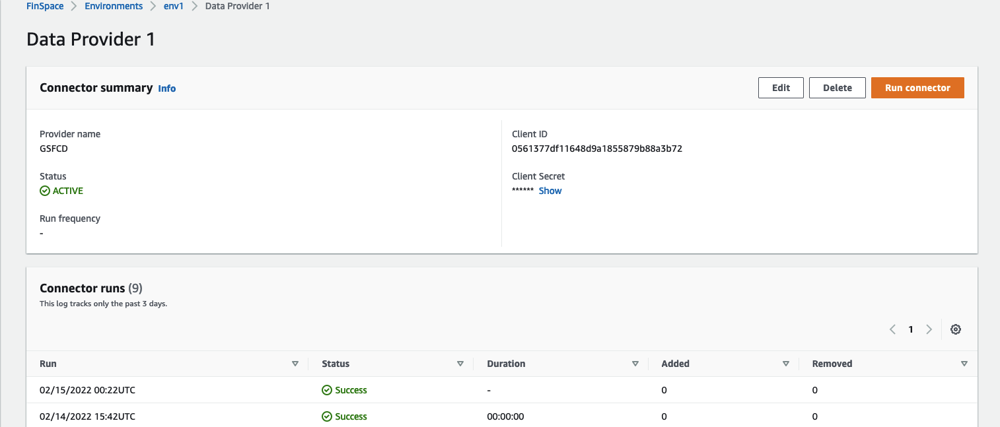
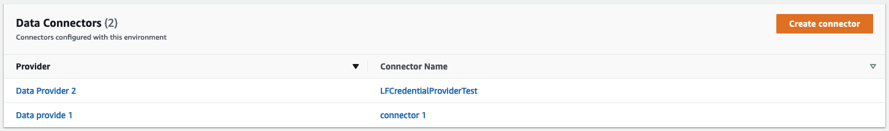
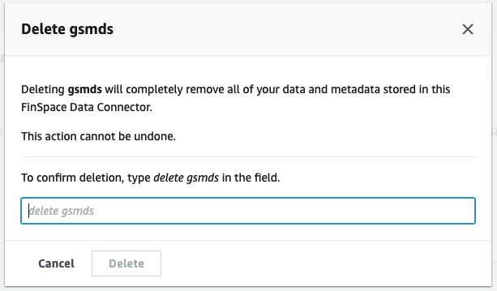

After careful consideration, we decided to end support for Amazon FinSpace, effective October 7, 2026. Amazon FinSpace will no longer accept new customers beginning October 7, 2025. As an existing customer with an Amazon FinSpace environment created before October 7, 2025, you can continue to use the service as normal. After October 7, 2026, you will no longer be able to use Amazon FinSpace. For more information, see
[Amazon FinSpace end of support](amazon-finspace-end-of-support.md "amazon-finspace-end-of-support.md").

# Connector details

###### Important

Amazon FinSpace Dataset Browser will be discontinued on `March 26,
 2025`. Starting `November 29, 2023`, FinSpace will no longer accept the creation of new Dataset Browser
environments. Customers using [Amazon FinSpace with Managed Kdb Insights](https://aws.amazon.com/finspace/features/managed-kdb-insights/ "https://aws.amazon.com/finspace/features/managed-kdb-insights/") will not be affected. For more information, review the [FAQ](https://aws.amazon.com/finspace/faqs/ "https://aws.amazon.com/finspace/faqs/") or contact [AWS Support](https://aws.amazon.com/contact-us/ "https://aws.amazon.com/contact-us/") to assist with your
transition.

The connector details page displays a summary of details for each data connector. It
consists of two sections:

- **Connector summary** – This section displays details of the connector
  that you created, such as the provider name, status of the connector, and run
  frequency. In this section, you can also [edit](#editing-data-connectors "#editing-data-connectors"), [delete](#deleting-data-connectors "#deleting-data-connectors"), or [run connectors](#running-data-connectors "#running-data-connectors").
- **Connector runs** – This section displays the date, status, and duration of each data connector run in a table. The table shows logs for only the past three days.

###### Note

- The connector summary displayed on this page might differ for each data provider.
- Superusers automatically have access to all datasets that a connector creates.

## Running a data connector

After you’ve created a data connector, you can run it from the connector details page. When a data connector runs, it retrieves all the datasets from the provider and populates them as datasets into the FinSpace web application, which can be accessed with the provided credentials. All datasets created by running a connector are placed in a FinSpace permission group with naming convention as `<Connector Name> Group (System Created)`. You can assign users to this permission group to grant them access.

###### Note

You can only use a data connector in the environment where you create it.

###### To run a data connector

1. Sign in to the AWS Management Console and open the Amazon FinSpace console at [https://console.aws.amazon.com/finspace](https://console.aws.amazon.com/finspace/landing "https://console.aws.amazon.com/finspace/landing").
2. In the left pane, choose **Environments**.
3. From the list of environments, choose the name of the environment where you
   created the data connector.
4. On the environment details page, scroll down to **Data
   Connectors** and choose the name of the data connector that you
   added.

 5. On the **Connector summary** page, choose **Run
connector**. The status is updated under the **Connector
runs** section.

###### Note

    * The run operation could take about three to five minutes to
     complete.
    * When a data connector run is still in progress, the
     **Edit**, **Delete**, and
     **Run connector** buttons are disabled.

After you get a confirmation message, the data connector connects to the data
provider and loads the available datasets into the FinSpace web application. For more
information about using datasets in the FinSpace web application, see [Using external datasets in Amazon FinSpace](dc-external-dataset.md "dc-external-dataset.md").

## Editing a data connector

###### To edit a data connector

1. Sign in to the AWS Management Console and open the Amazon FinSpace console at [https://console.aws.amazon.com/finspace](https://console.aws.amazon.com/finspace/landing "https://console.aws.amazon.com/finspace/landing").
2. In the left pane, choose **Environments**.
3. From the list of environments, choose the name of the environment where you created the data connector.
4. On the environment details page, scroll down to **Data Connectors** and choose the name of the data connector that you want to edit.
5. On the **Connector summary** page, choose
   **Edit**. The **Edit connector** page opens,
   and you can edit the details as required.

###### Note

- You can't edit the following fields:
  - **Environment**
  - **Data provider**
  - **Connector name**

- For Goldman Sachs Financial Cloud for Data connectors, if you change the **secret name**, you must modify the IAM role.

## Deleting a data connector

###### Note

This action is irreversible. Deleting will completely remove all of your datasets and associated metadata that the data connector creates in the FinSpace environment.

###### To delete a data connector

1. Sign in to the AWS Management Console and open the Amazon FinSpace console at [https://console.aws.amazon.com/finspace](https://console.aws.amazon.com/finspace/landing "https://console.aws.amazon.com/finspace/landing").
2. In the left pane, choose **Environments**.
3. From the list of environments, choose the name of the environment where you created the data connector.
4. On the environment details page, scroll down to **Data Connectors** and choose the name of the data connector that you want to delete.
5. On the **Connector summary** page, choose **Delete**.
6. On the confirmation dialog box, enter the name of the connector to delete it.

###### Note

The following entities that are automatically created by a data connector remain in your FinSpace
environment, even after you delete the data connector. You can later remove these
entities manually if you choose to.

- Permission groups.
- Categories – After deleting a data connector, the categories are still available under
  the **External Data** categories in the data
  browser and the **Categories** page.
- Attribute sets – After deleting a data connector, these attributes are still available
  under the **External Data Attribute Set** section in the
  **Attribute Sets** page.
