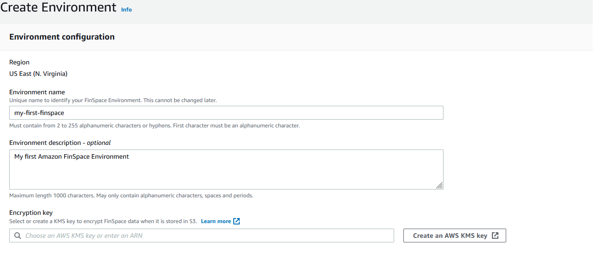
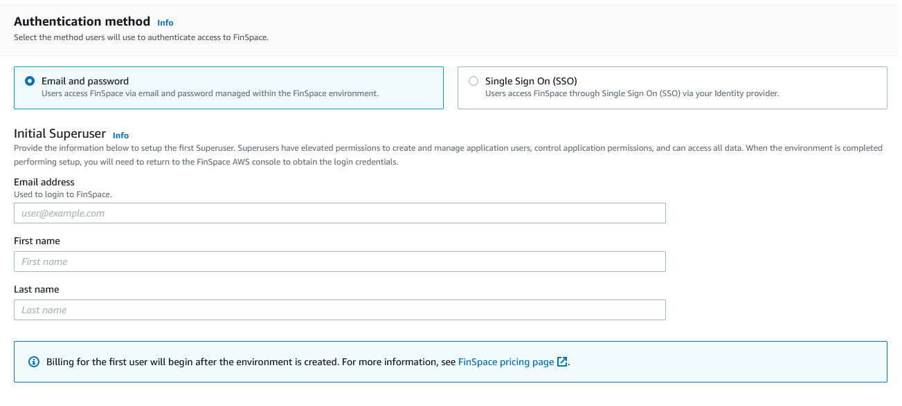
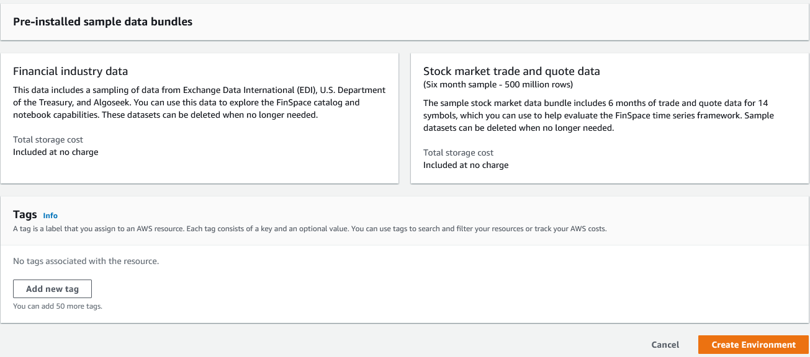

After careful consideration, we decided to end support for Amazon FinSpace, effective October 7, 2026. Amazon FinSpace will no longer accept new customers beginning October 7, 2025. As an existing customer with an Amazon FinSpace environment created before October 7, 2025, you can continue to use the service as normal. After October 7, 2026, you will no longer be able to use Amazon FinSpace. For more information, see
[Amazon FinSpace end of support](amazon-finspace-end-of-support.md "amazon-finspace-end-of-support.md").

# Create an Amazon FinSpace environment

###### Important

Amazon FinSpace Dataset Browser will be discontinued on `March 26,
 2025`. Starting `November 29, 2023`, FinSpace will no longer accept the creation of new Dataset Browser
environments. Customers using [Amazon FinSpace with Managed Kdb Insights](https://aws.amazon.com/finspace/features/managed-kdb-insights/ "https://aws.amazon.com/finspace/features/managed-kdb-insights/") will not be affected. For more information, review the [FAQ](https://aws.amazon.com/finspace/faqs/ "https://aws.amazon.com/finspace/faqs/") or contact [AWS Support](https://aws.amazon.com/contact-us/ "https://aws.amazon.com/contact-us/") to assist with your
transition.

An Amazon FinSpace environment is created from an AWS account. To create a FinSpace environment, the user performing the actions must have IAM permissions for `AdministratorAccess` or the FinSpace managed policy attached to their role.

**To create a FinSpace environment**

1. Sign in to your AWS account and open FinSpace from the AWS Management Console. It is located under Analytics, and you can find it by searching for _FinSpace_. Your AWS account number is displayed for verification purposes.
2. Choose **Create Environment**.

 3. Enter a name for your FinSpace environment under **Environment name**. 4. (Optional) Add **Environment description**. 5. Select a symmetric encryption KMS key to encrypt data in your FinSpace environment. If a KMS key is not available in the region where you want to create your FinSpace environment, create a new key.

For more information, see [Creating keys](../../../kms/latest/developerguide/create-keys.md "../../../kms/latest/developerguide/create-keys.md") in the _AWS Key Management Service Developer Guide_ 6. Select an authentication method for the environment from the following options:

###### Warning

Selected authentication method cannot be changed once an environment is created.

    1. **Email and password**: You must specify an initial superuser. A superuser has elevated permissions to create and manage application users, control application permissions and access all data. When the environment is completed performing setup, you will need to return to the FinSpace AWS
     console to obtain the sign in credentials from the environment details page. Enter the following information for the superuser:

    	1. Enter the **Email address**.
    	2. Enter **First name**.
    	3. Enter **Last Name**.
    2. **Single Sign On**:

    	1. Enter the name of your SAML 2.0 Identity Provider (IdP) which will be used for authentication.
    	2. You can choose to either upload SAML metadata document or enter the SAML metadata document URL issued by your IdP. Learn more about [SAML 2.0 based SSO](saml-sso.md "saml-sso.md") support in FinSpace.
    	3. Provide the attribute definition from your SAML 2.0 compliant identity provider (IdP) for the email field. Refer to the documentation of your IdP to determine the correct format for the attribute. An example for email attribute is `http://schemas.xmlsoap.org/ws/2005/05/identity/claims/emailaddress`.

7. Choose **Create Environment**. The environment creation process has now begun and it will take 50-60 minutes to finish in the background. You can return to other activities while the environment is being created.

After the environment is created, a domain URL will be generated which is the sign-in url for your FinSpace web application.

###### Note

Review [Inter-network traffic privacy in
Amazon FinSpace Dataset browser](inter-network-traffic-privacy.md "inter-network-traffic-privacy.md") to ensure that your FinSpace web application is accessible to users.

## Setup additional superusers

After your Amazon FinSpace environment is created, you can create additional superusers and configure permission groups from within the FinSpace web application. A superuser has all permissions to take all
actions in FinSpace. The first superuser is created when the environment is created in the AWS
console page. After the superuser is created, the superuser uses the credentials to login to the FinSpace web application for the first time.

**To create a superuser**

1. Sign in to your AWS account in which the FinSpace environment was created and open FinSpace from the AWS management console. It is located under Analytics, and you can find it by searching for FinSpace. Your AWS account number is displayed for verification purposes.
2. Select the FinSpace environment for which a superuser will be created.
3. In the section, superusers, choose **Add superuser.**
4. Enter the **Email address**.
5. Enter **First name**.
6. Enter **Last name**.
7. Choose **Next**.
8. Review the superuser details.
9. Choose **Create and view credentials**. Note that if you have created an environment with SSO, you will not receive a temporary password as you will be authenticated with your IdP.

The credentials of superusers, who have yet to sign in, are listed in a banner at the top of the environment details page.

Share the credentials with the person designated as the superuser. The credentials are necessary to sign in to your FinSpace web application. The **Domain** is the sign-in url for your FinSpace web application.

## AWS tags

You can optionally assign tags to an Amazon FinSpace environment. A tag is a label that you assign to an AWS
resource. Each tag consists of a key and an optional value, both of which you define. If you're using AWS
Identity and Access Management, you can control which users in your AWS
account have permission to create, edit, or delete tags.

**To add a new tag in your FinSpace environment**

1. Sign in to your AWS account and open FinSpace from the AWS Management Console. It is located under Analytics, and you can find it by searching for _FinSpace_. Your AWS account number is displayed for verification purposes.
2. Select the FinSpace environment to manage and add tags.
3. Under the **Tags** section, choose **Manage Tags**.
4. To add a new tag, choose **Add new tag**. Add tag details.
5. Choose **Save changes**.

**To delete an existing tag in your FinSpace environment**

1. Sign in to your AWS account and open FinSpace from the AWS
   Management Console. It is located under Analytics, and you can find it by searching for FinSpace. Your AWS
   account number is displayed for verification purposes.
2. Select the FinSpace environment to manage and add tags.
3. Under the **Tags** section, choose **Manage Tags**.
4. Choose **Remove** for the tag you want to remove.
5. Choose **Save changes**.
