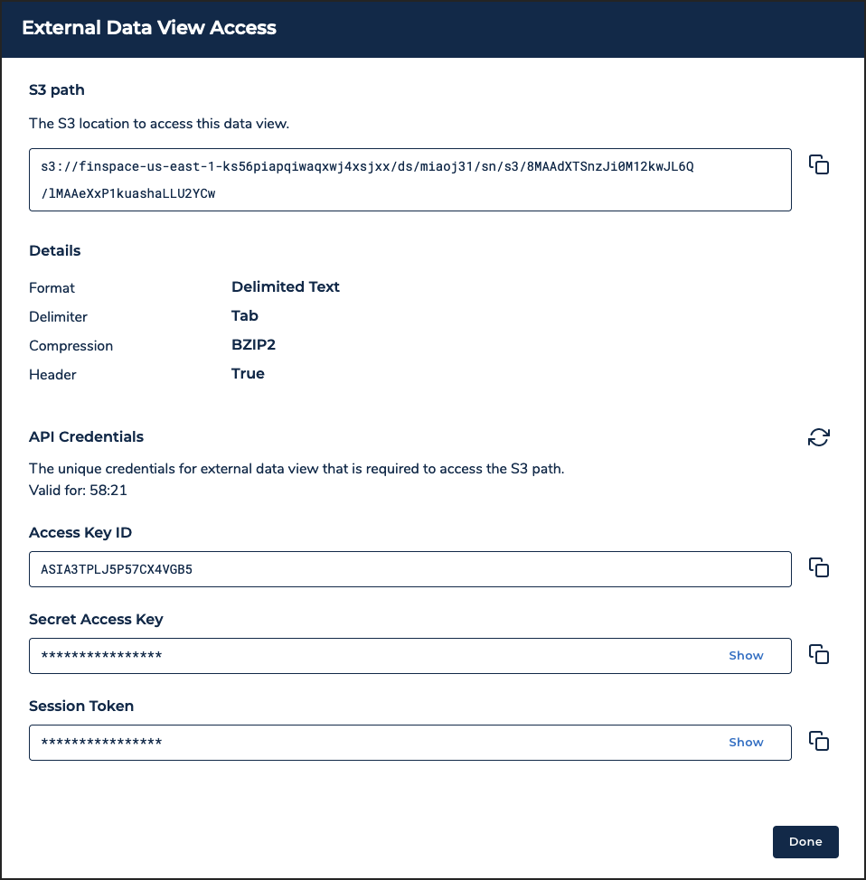

After careful consideration, we decided to end support for Amazon FinSpace, effective October 7, 2026. Amazon FinSpace will no longer accept new customers beginning October 7, 2025. As an existing customer with an Amazon FinSpace environment created before October 7, 2025, you can continue to use the service as normal. After October 7, 2026, you will no longer be able to use Amazon FinSpace. For more information, see
[Amazon FinSpace end of support](amazon-finspace-end-of-support.md "amazon-finspace-end-of-support.md").

# Create data view

###### Important

Amazon FinSpace Dataset Browser will be discontinued on `March 26,
 2025`. Starting `November 29, 2023`, FinSpace will no longer accept the creation of new Dataset Browser
environments. Customers using [Amazon FinSpace with Managed Kdb Insights](https://aws.amazon.com/finspace/features/managed-kdb-insights/ "https://aws.amazon.com/finspace/features/managed-kdb-insights/") will not be affected. For more information, review the [FAQ](https://aws.amazon.com/finspace/faqs/ "https://aws.amazon.com/finspace/faqs/") or contact [AWS Support](https://aws.amazon.com/contact-us/ "https://aws.amazon.com/contact-us/") to assist with your
transition.

###### Note

In order to create and manage data views, you must be a superuser or a member of a group with necessary permissions – **Create Datasets**.

**To create a data view**

1. From the homepage, search the dataset for which you want to create a view.
2. Choose the dataset name to view the dataset details page.
3. Choose the **All Data Views** tab.
4. Choose **Create Data View**.
5. On the **Create a New View** page, choose a
   **View Type**. To know more about the view types,
   see [Data view concepts](data-view-concepts.md "data-view-concepts.md").
6. For **Access Through**, choose one of the
   following options:
   - **FinSpace notebook using Spark** – For
     accessing the data view using the notebook.
   - **Externally using FinSpace API** – For
     accessing the data view using API. When you choose this, other fields to
     specify the input format are displayed.

7. Select partitioning for the data view under **Partition
   Data**.
   - If partitioning is not required, choose **No**.
   - If partitioning is required, choose **Yes**.
     - Select the columns to partition the view.
     - After you have selected the columns, **Order
       Partitions** list is populated on the right side of the
       menu with the selected fields. Drag the selected columns to control
       the partition order.

8. Select sorting for the view.
   - If sorting is not required, choose **No**.
   - If sorting is required, choose **Yes**.
     - Select the columns to sort the view.
     - After you have selected the columns, **Column
       Sort-By Order** list is populated on the right side of the
       menu with the selected fields. Drag the selected columns to control
       the sort order.

9. Choose **Create Data View** to start the view
   creation process.

The new view is listed in the **Data Views**
table. The details of the view are shown in the **Details** link under **View Last
Updated** column.

###### Note

For small files of up to 100 megabytes, data view creation takes approximately 2 minutes. For
larger files of around 1 gigabyte, expect data view creation to take
approximately 3-4 minutes. Views with partitioning and sorting schemes may take
longer. 10. If you chose to access the data view in a FinSpace notebook using Spark, the
**Analyze in Notebook** button appears on the right
side of the view. Choose this button to open the data view in a FinSpace notebook.

If you chose to access the data view using the FinSpace API, an **External API Access** button appears on the right side
of the view. Choose this button to open the **External Data
View Access** dialog box.

The dialog box displays the following information that you can copy to access the external data view:

    * **S3 path** – The location where
     the external data view is stored. This location is unique for every data
     view.
    * **Details** – Format options
     selected at the time of creating the data view.
    * **API Credentials** – The
     credentials required to access the external data view from the S3 location.
     These credentials are only valid for 60 minutes. After the credentials
     expire, you need to choose the refresh icon to generate new
     credentials.
