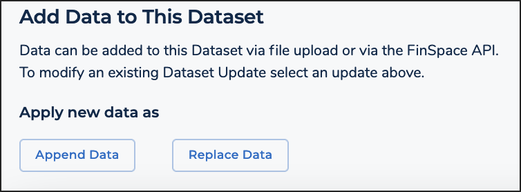

After careful consideration, we decided to end support for Amazon FinSpace, effective October 7, 2026. Amazon FinSpace will no longer accept new customers beginning October 7, 2025. As an existing customer with an Amazon FinSpace environment created before October 7, 2025, you can continue to use the service as normal. After October 7, 2026, you will no longer be able to use Amazon FinSpace. For more information, see
[Amazon FinSpace end of support](amazon-finspace-end-of-support.md "amazon-finspace-end-of-support.md").

# Creating changesets in a dataset

###### Important

Amazon FinSpace Dataset Browser will be discontinued on `March 26,
 2025`. Starting `November 29, 2023`, FinSpace will no longer accept the creation of new Dataset Browser
environments. Customers using [Amazon FinSpace with Managed Kdb Insights](https://aws.amazon.com/finspace/features/managed-kdb-insights/ "https://aws.amazon.com/finspace/features/managed-kdb-insights/") will not be affected. For more information, review the [FAQ](https://aws.amazon.com/finspace/faqs/ "https://aws.amazon.com/finspace/faqs/") or contact [AWS Support](https://aws.amazon.com/contact-us/ "https://aws.amazon.com/contact-us/") to assist with your
transition.

Data files are added to datasets and tracked as a changeset. A changeset is created in a dataset when one or more data files are
ingested in a single operation. All changesets in a dataset are preserved unless a dataset itself is deleted. A changeset is created with a unique identifier and a system timestamp is assigned
to it at the time of creation.

**A changeset is created as one of the following types**

- **Append** – New changeset is considered an addition to the end of the prior ingested changesets. For example, addition of a new daily file.
- **Replace** – New changeset is considered a replacement to all prior ingested changesets in a dataset. This does not mean that the prior ingested changesets are deleted but they will
  not be considered for the view creation.

## Replace data

**To create a changeset with type as Replace**

1. From the homepage search for a dataset where you want to replace data.
2. Choose the dataset name to view the dataset details page.
3. Choose the **All Data Views** tab.
4. Scroll down and choose **Replace Data**.
5. Choose **Select CSV File** to select and
   upload a file from your desktop.
6. Once the file is uploaded, choose the input format for the ingested data from the following options:
   - **Delimiter** – Specifies the delimiter character. The
     default value is _Comma_.
   - **Escape Character** – Specifies a character to use for
     escaping. The default value is _None_.
   - **Quotes** – Specifies the character to use for quoting.
     The default value is _Double Quotes_
     (").
   - **Multiline Records** – Specifies whether a single
     record can span multiple lines. By default this option is disabled. Enable
     this option if you want any record to span multiple lines.
   - **Treat First Line As Header** – Specifies whether to
     treat the first line as a header. By default this option is disabled.
   - **Skip First Data Line** – Specifies whether to skip the
     first data line. By default this option is disabled.

7. Choose **Replace Data**.
8. Once the file upload is complete, you should see a new entry for a changeset
   of type _Replace_ under the **Dataset Update History** table with a **Pending** status. Once the status is set to **Available**, a data view that includes the new
   changeset can be created.

## Append data

**To create a changeset with type as Append**

1. From the homepage, search for the dataset to which you want to append data.
2. Choose the dataset name to view the dataset details page.
3. Choose the **All Data Views** tab.
4. Scrolls down and choose **Append Data**.
5. Choose **Select CSV File** to select and
   upload a file from your desktop.
6. Once the file is uploaded, choose the input format for the ingested data from the following options:
   - **Delimiter** – Specifies the delimiter character. The
     default value is _Comma_.
   - **Escape Character** – Specifies a character to use for
     escaping. The default value is _None_.
   - **Quotes** – Specifies the character to use for quoting.
     The default value is _Double Quotes_
     (").
   - **Multiline Records** – Specifies whether a single
     record can span multiple lines. By default this option is disabled. Enable
     this option if you want any record to span multiple lines.
   - **Treat First Line As Header** – Specifies whether to
     treat the first line as a header. By default this option is disabled.
   - **Skip First Data Line** – Specifies whether to skip the
     first data line. By default this option is disabled.

7. Choose **Append Data**.
8. Once the file upload is complete, you should see a new entry for a changeset
   of type _Append_ under the **Dataset Update History** table with a **Pending** status. Once the status is set to **Available**, a data view that includes the new
   changeset can be created.
