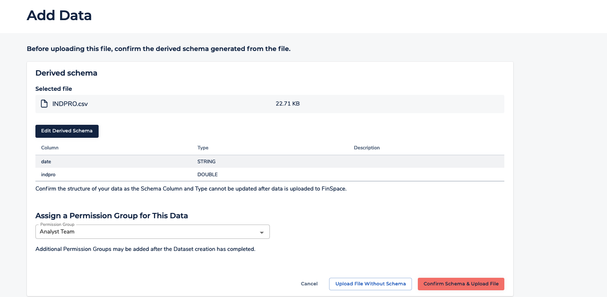

After careful consideration, we decided to end support for Amazon FinSpace, effective October 7, 2026. Amazon FinSpace will no longer accept new customers beginning October 7, 2025. As an existing customer with an Amazon FinSpace environment created before October 7, 2025, you can continue to use the service as normal. After October 7, 2026, you will no longer be able to use Amazon FinSpace. For more information, see
[Amazon FinSpace end of support](amazon-finspace-end-of-support.md "amazon-finspace-end-of-support.md").

# Creating a dataset

###### Important

Amazon FinSpace Dataset Browser will be discontinued on `March 26,
 2025`. Starting `November 29, 2023`, FinSpace will no longer accept the creation of new Dataset Browser
environments. Customers using [Amazon FinSpace with Managed Kdb Insights](https://aws.amazon.com/finspace/features/managed-kdb-insights/ "https://aws.amazon.com/finspace/features/managed-kdb-insights/") will not be affected. For more information, review the [FAQ](https://aws.amazon.com/finspace/faqs/ "https://aws.amazon.com/finspace/faqs/") or contact [AWS Support](https://aws.amazon.com/contact-us/ "https://aws.amazon.com/contact-us/") to assist with your
transition.

###### Note

In order to create and manage datasets, you must be a superuser or a member of a group with necessary permissions
– **Create Datasets**.

A dataset can be created by loading a file using the Amazon FinSpace web application.

**To create a dataset**

1. Sign in to the FinSpace web application. For more information, see [Signing in to the Amazon FinSpace web application](signing-into-amazon-finspace.md "signing-into-amazon-finspace.md").
2. On the left navigation bar of the home page, choose **Add Data**.
3. Drag and drop a .csv file or choose **Browse Files** to select a file. Once the file is detected by the web application, schema of the file will be displayed.
   The column names are read from the file and data types are inferred.

 4. Change the data types as required by choosing **Edit Derived Schema**. Take note of the data types and formats that are supported. 5. Choose **Save Schema**. 6. Choose **Confirm Schema & Upload File**. This action starts the following process:

    1. Create a dataset with name of the .csv file that was loaded and takes you to the [dataset details page](dataset-details-page.md "dataset-details-page.md").
    2. Once the upload of the sample data file is complete, a changeset is created with the content of the data file. Verify by checking the **Dataset Update History** table under **All Data Views** tab.
    3. Data view creation process is started. Once the upload of the sample data file is complete, a process is kicked off to create a data view that can be analyzed
    in a notebook.

    For small files of up to 100 megabytes, data view creation takes approximately 2 minutes. For larger files of around 1 gigabyte, expect data
    view creation to take approximately 3-4 minutes. Views with partitioning and sorting schemes may take longer.

    Once a dataset is created, you can start adding data to it. A new set of data added to a dataset creates a corresponding changeset.
