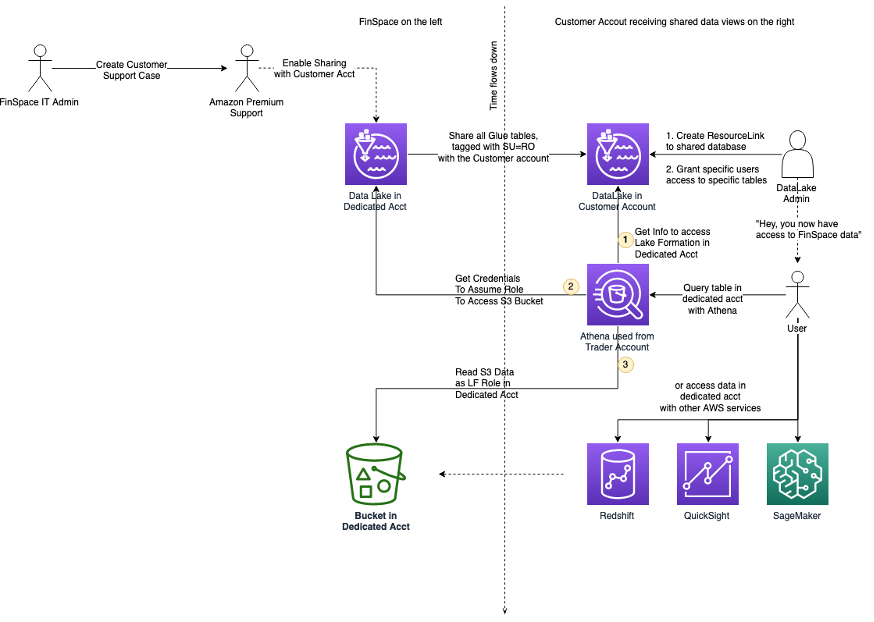

After careful consideration, we decided to end support for Amazon FinSpace, effective October 7, 2026. Amazon FinSpace will no longer accept new customers beginning October 7, 2025. As an existing customer with an Amazon FinSpace environment created before October 7, 2025, you can continue to use the service as normal. After October 7, 2026, you will no longer be able to use Amazon FinSpace. For more information, see
[Amazon FinSpace end of support](amazon-finspace-end-of-support.md "amazon-finspace-end-of-support.md").

# Sharing data views in Amazon FinSpace

###### Important

Amazon FinSpace Dataset Browser will be discontinued on `March 26,
 2025`. Starting `November 29, 2023`, FinSpace will no longer accept the creation of new Dataset Browser
environments. Customers using [Amazon FinSpace with Managed Kdb Insights](https://aws.amazon.com/finspace/features/managed-kdb-insights/ "https://aws.amazon.com/finspace/features/managed-kdb-insights/") will not be affected. For more information, review the [FAQ](https://aws.amazon.com/finspace/faqs/ "https://aws.amazon.com/finspace/faqs/") or contact [AWS Support](https://aws.amazon.com/contact-us/ "https://aws.amazon.com/contact-us/") to assist with your
transition.

Amazon FinSpace stores your data in an AWS account called the _FinSpace environment
infrastructure account_, which is a managed AWS account that's dedicated to
your FinSpace environment. This account is separate from the account that you create your FinSpace
environment in.

Data that you ingest into FinSpace is stored in the infrastructure account. You can access
this data through data views. Data views store a copy of your data, which is organized for
querying through an interface that is compatible with AWS Glue tables. You can query this
interface by using the managed Apache Spark clusters in FinSpace.

With FinSpace data view sharing, you can share these tables with a Lake Formation data lake. When you
do this, you can easily query the data with AWS analytics engines like Amazon Redshift, Athena, Quick Suite,
Amazon EMR, and SageMaker AI.

The following diagram illustrates how you can access FinSpace data views with AWS
integrated services.

- The diagram shows the first part of the process where a FinSpace IT admin creates a
  technical support case, to request enabling the FinSpace infrastructure account for
  sharing. The request consists of the identifier of the environment to be shared and
  the AWS Region.
- Next, the AWS support engineer enables the database and the data view tables to
  be shared in the designated FinSpace environment within the customer’s account.
- A Lake Formation administrator in the customer’s account creates a resource link to the
  shared database. Then, the administrator grants access to the resource link, the
  shared database, and the shared tables to other principals in the customer
  account.
- Finally, principals in the customer’s account are able to access the FinSpace data
  view tables with AWS integrated services such as Athena, Amazon Redshift, Quick Suite, and
  SageMaker AI.
