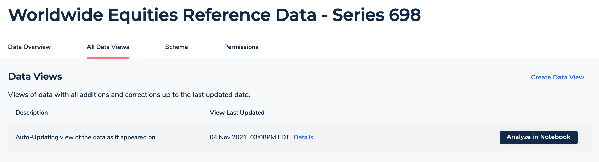

After careful consideration, we decided to end support for Amazon FinSpace, effective October 7, 2026. Amazon FinSpace will no longer accept new customers beginning October 7, 2025. As an existing customer with an Amazon FinSpace environment created before October 7, 2025, you can continue to use the service as normal. After October 7, 2026, you will no longer be able to use Amazon FinSpace. For more information, see
[Amazon FinSpace end of support](amazon-finspace-end-of-support.md "amazon-finspace-end-of-support.md").

# Data view concepts

###### Important

Amazon FinSpace Dataset Browser will be discontinued on `March 26,
 2025`. Starting `November 29, 2023`, FinSpace will no longer accept the creation of new Dataset Browser
environments. Customers using [Amazon FinSpace with Managed Kdb Insights](https://aws.amazon.com/finspace/features/managed-kdb-insights/ "https://aws.amazon.com/finspace/features/managed-kdb-insights/") will not be affected. For more information, review the [FAQ](https://aws.amazon.com/finspace/faqs/ "https://aws.amazon.com/finspace/faqs/") or contact [AWS Support](https://aws.amazon.com/contact-us/ "https://aws.amazon.com/contact-us/") to assist with your
transition.

**View Types**

Two types of views can be setup for a dataset:

- **Auto-Update view** – A data view
  with all additions (Append) and corrections (Replace, Replace Changesets)
  for a dataset. Future additions and corrections to this dataset are
  automatically applied to this view.
- **Static view** – A data view with
  all additions (Append) and corrections (Replace, Modify) up to a
  specified date and time for creation of view i.e. the view will be
  constructed from only those changesets that were created before the
  specified time and date. No future additions or corrections will be
  applied to this view.

A data view is constructed from changesets. Two factors are taken into account for the changesets to be considered in a view:

1. Specified date and time to create the view – All the changesets created
   prior to the specified date and time are considered for the view. In case of an
   auto-update view, the specified date and time is current day and timestamp.
2. The changeset types are interpreted for a creating a data view in the following
   ways:
   - **Changeset with Append type** –
     Changeset is interpreted as an addition to the end of all the prior created
     changesets. The changeset will be considered for view creation.
   - **Changeset with Replace type** –
     Changeset is interpreted as a replacement to all prior created changesets.
     No changesets created before a changeset of this type are considered for the
     view creation.
   - **Changeset created as a correction**
     – Changeset is interpreted as a replacement to a specific prior
     created changeset. The prior created changeset will be not considered for
     the view creation.

**View Last Updated**

The timestamp represents the point in date and time for which the view is
created. For static view, it will be the timestamp that you specified at the
creation of the view. For auto-update view, it will be the last time it was
updated when a new changeset was added.

**Data View ID**

The unique identifier for a data view.

**Dataset ID**

The unique identifier for a dataset.

**Data Access**

A view can be prepared to be accessed and used in:

- FinSpace notebook using integrated Spark clusters.
- Externally via the FinSpace API. The format of this view can be customized
  by specifying file format, delimiter, compression type.

**Partitioning**
Partitioning can be configured to optimize queries.

**Sorting**
The data in the data view can be sorted by one or more columns. Sorting data helps with query performance.
