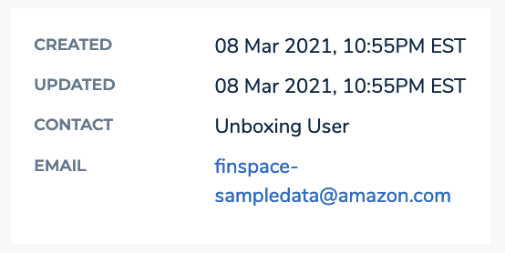
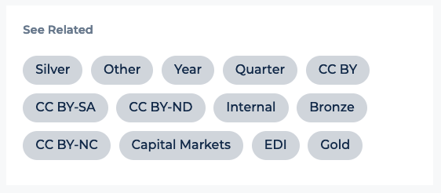
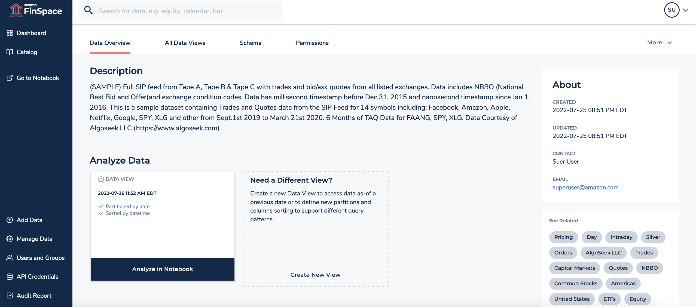
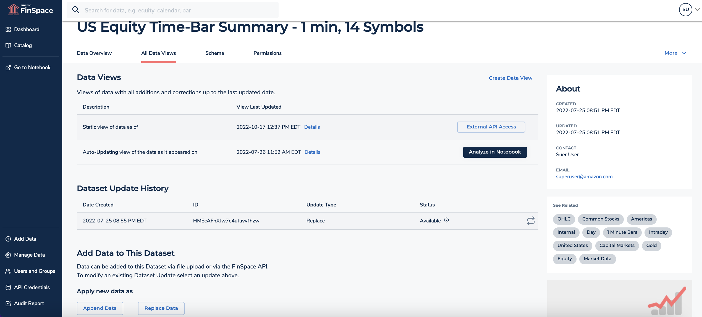
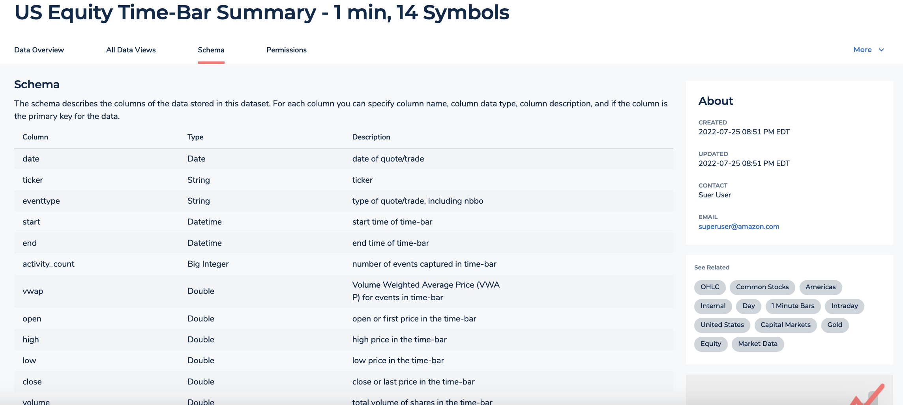
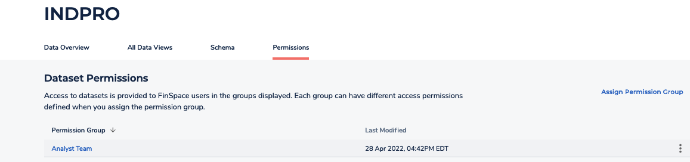

After careful consideration, we decided to end support for Amazon FinSpace, effective October 7, 2026. Amazon FinSpace will no longer accept new customers beginning October 7, 2025. As an existing customer with an Amazon FinSpace environment created before October 7, 2025, you can continue to use the service as normal. After October 7, 2026, you will no longer be able to use Amazon FinSpace. For more information, see
[Amazon FinSpace end of support](amazon-finspace-end-of-support.md "amazon-finspace-end-of-support.md").

# Dataset details page

###### Important

Amazon FinSpace Dataset Browser will be discontinued on `March 26,
 2025`. Starting `November 29, 2023`, FinSpace will no longer accept the creation of new Dataset Browser
environments. Customers using [Amazon FinSpace with Managed Kdb Insights](https://aws.amazon.com/finspace/features/managed-kdb-insights/ "https://aws.amazon.com/finspace/features/managed-kdb-insights/") will not be affected. For more information, review the [FAQ](https://aws.amazon.com/finspace/faqs/ "https://aws.amazon.com/finspace/faqs/") or contact [AWS Support](https://aws.amazon.com/contact-us/ "https://aws.amazon.com/contact-us/") to assist with your
transition.

The dataset details page contains detailed information about the dataset. This page contains overview of a dataset, all the data views created for the dataset, the schema and permissions related to a dataset under the following tabs.

- [Data Overview](#data-overview-tab "#data-overview-tab")
- [All Data Views](#all-data-views-tab "#all-data-views-tab")
- [Schema](#schema-tab "#schema-tab")
- [Permissions](#permissions-tab "#permissions-tab")
  From the right side of the page, you can edit the dataset description or remove the dataset by choosing the **More** menu.

You can also view the information related to when the dataset was created and the user who created this dataset.

From the **See Related** section, you can easily navigate to related datasets in the application. Each label in this
section corresponds to attribute values and category values associated to a dataset. The labels listed in this section match the
values of the attributes that you select at the bottom of the **Data Overview** tab. Selecting any labels will take you to the data browser where other datasets with the
same label will be shown in the results.

## Data Overview

This tab shows the description of the dataset, latest data views, and associated attribute sets that describe the dataset.

## All Data Views

This tab shows the details of all the data that is ingested into the dataset as changesets, and all the data views that have been created.

In this tab, you can do the following:

- View list of data views under the **Data Views** section. Choose **Details** to view detailed information about a specific data view.
- Load a data view for analysis. Choose the **Analyze in Notebook** button to open the data view in FinSpace notebook.
  Choose the **External API Access** button to access the data view externally using the FinSpace API.
- Create new data views by choosing the **Create Data View** button. For more information, see [Create data view](create-data-view.md "create-data-view.md").
- View dataset update history and make corrections to datasets.
- Load data to the dataset by uploading a file or through FinSpace API.
- Create changeset with `Append` and `Replace` type. For more information,
  see [Creating changesets in a dataset](creating-changeset-in-a-dataset.md "creating-changeset-in-a-dataset.md").

## Schema

This tab shows the schema of the dataset. The existing schema can only be edited if no data views have been created.

## Permissions

This tab shows the list of permission groups that are entitled to use the dataset. From this section, you can assign new permission groups to the dataset by choosing **Assign Permission Group**.

