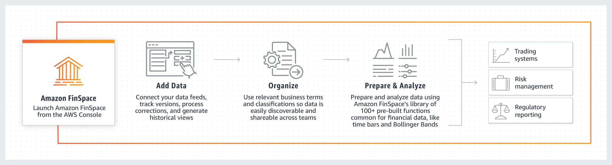

After careful consideration, we decided to end support for Amazon FinSpace, effective October 7, 2026. Amazon FinSpace will no longer accept new customers beginning October 7, 2025. As an existing customer with an Amazon FinSpace environment created before October 7, 2025, you can continue to use the service as normal. After October 7, 2026, you will no longer be able to use Amazon FinSpace. For more information, see
[Amazon FinSpace end of support](amazon-finspace-end-of-support.md "amazon-finspace-end-of-support.md").

# Dataset browser (deprecated)

###### Important

Amazon FinSpace Dataset Browser will be discontinued on `March 26,
 2025`. Starting `November 29, 2023`, FinSpace will no longer accept the creation of new Dataset Browser
environments. Customers using [Amazon FinSpace with Managed Kdb Insights](https://aws.amazon.com/finspace/features/managed-kdb-insights/ "https://aws.amazon.com/finspace/features/managed-kdb-insights/") will not be affected. For more information, review the [FAQ](https://aws.amazon.com/finspace/faqs/ "https://aws.amazon.com/finspace/faqs/") or contact [AWS Support](https://aws.amazon.com/contact-us/ "https://aws.amazon.com/contact-us/") to assist with your
transition.

Amazon FinSpace provides the Dataset browser that you can use to collect data and catalog it by relevant business concepts such as asset class, risk classification, or geographic region; which makes it easy to discover and share across your organization.

## How it works

###### To use FinSpace

1. Launch FinSpace from your Amazon Web Services (AWS) console, and configure how data will be organized in the catalog for easy searching.
2. Add data that will be needed for analytics.
3. Organize and describe the data so that it can be searched from the catalog.
4. Prepare data by creating historical or current data views partitioned to optimize performance.
5. Analyze data using integrated Jupyter notebooks, managed Spark clusters, or kdb Insights for data processing at scale.

## Benefits of dataset browser

With Amazon FinSpace Dataset browser, you can:

1. **Import data easily** – The SDKs allows you to load data files into FinSpace in bulk, daily, or ad-hoc fashion. Connect your daily historical data feeds from stock exchanges and data providers into FinSpace.
   For more information, see [Loading and analyzing data](tutorial-load-data-analyze-finspace.md "tutorial-load-data-analyze-finspace.md").
2. **Store and catalog data with business terms** – Create a business data catalog with your business taxonomy to organize data so that your business users can easily discover it. Organize data by asset classes, regions, data types, or industry.
   For more information, see [Configuring a business data catalog](tutorial-build-business-catalog.md "tutorial-build-business-catalog.md").
3. **Track versions of data** – Create bi-temporal views that let you analyze data the way it looked at a particular date and time. Reproduce historical financial models for audit and compliance purposes.
4. **Prepare and analyze data at scale** – Use FinSpace notebook with integrated managed Spark clusters to run analysis on petabytes of data. Scale compute with spark clusters on an as-needed basis.
   For more information, see [Prepare and analyze data](finspace-prepare-data.md "finspace-prepare-data.md").
5. **Share data managed in FinSpace** – Share data view tables with a Lake Formation data lake so that the data can be easily queried with AWS analytics engines like Amazon Redshift, Athena, Quick Suite,Amazon EMR, and SageMaker AI.
   For more information, see [Data views sharing](data-sharing-lake-formation.md "data-sharing-lake-formation.md").
6. **Financial time series analysis** – Run financial time series analysis on high density market data using integrated time series library with over 100 embedded functions including statistical and technical indicators such as Bollinger Bands.
   For more information, see [Time series library](finspace-time-series-library.md "finspace-time-series-library.md").
