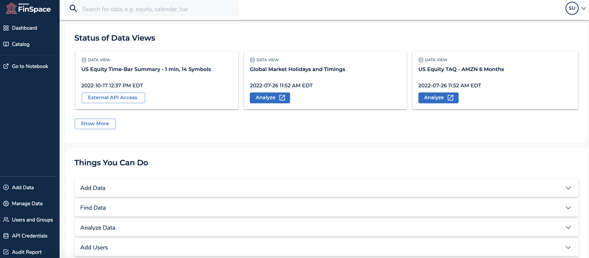
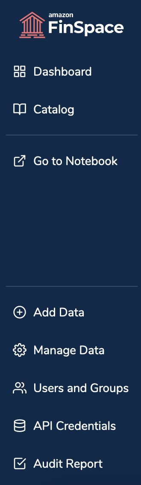
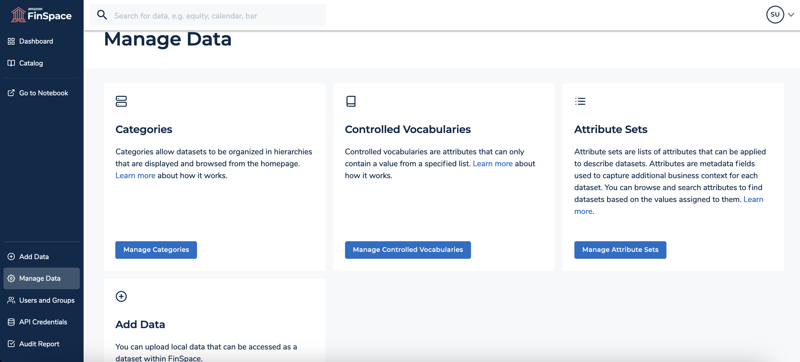
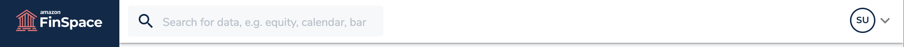
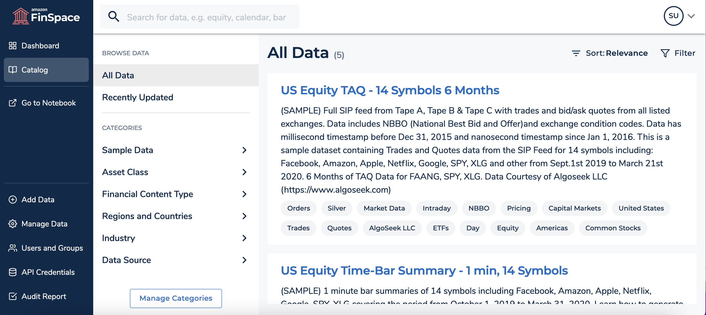
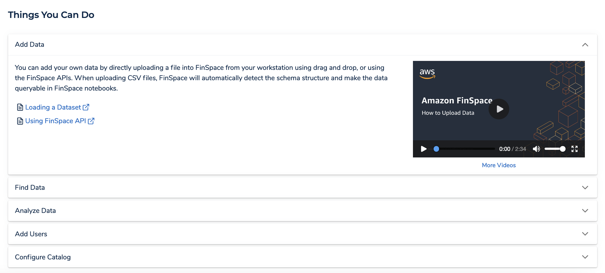
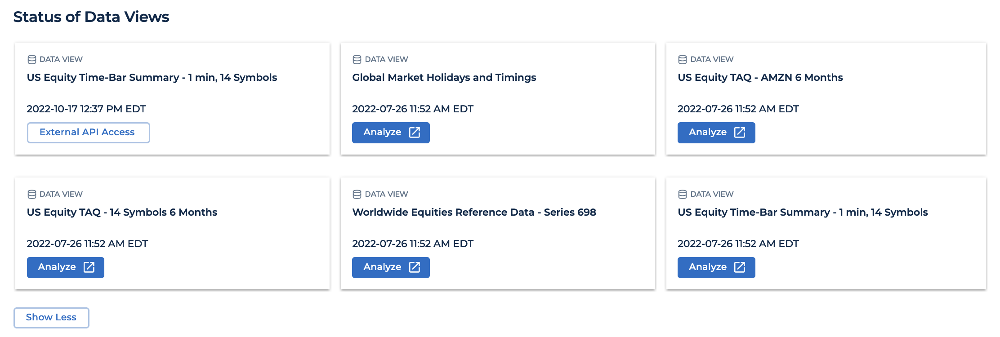

After careful consideration, we decided to end support for Amazon FinSpace, effective October 7, 2026. Amazon FinSpace will no longer accept new customers beginning October 7, 2025. As an existing customer with an Amazon FinSpace environment created before October 7, 2025, you can continue to use the service as normal. After October 7, 2026, you will no longer be able to use Amazon FinSpace. For more information, see
[Amazon FinSpace end of support](amazon-finspace-end-of-support.md "amazon-finspace-end-of-support.md").

# Using the Amazon FinSpace homepage

###### Important

Amazon FinSpace Dataset Browser will be discontinued on `March 26,
 2025`. Starting `November 29, 2023`, FinSpace will no longer accept the creation of new Dataset Browser
environments. Customers using [Amazon FinSpace with Managed Kdb Insights](https://aws.amazon.com/finspace/features/managed-kdb-insights/ "https://aws.amazon.com/finspace/features/managed-kdb-insights/") will not be affected. For more information, review the [FAQ](https://aws.amazon.com/finspace/faqs/ "https://aws.amazon.com/finspace/faqs/") or contact [AWS Support](https://aws.amazon.com/contact-us/ "https://aws.amazon.com/contact-us/") to assist with your
transition.

When you sign in to the Amazon FinSpace web application, you see the FinSpace homepage. For details on how to sign in, see [Signing in to the Amazon FinSpace web application](signing-into-amazon-finspace.md "signing-into-amazon-finspace.md").
This section walks you through the various parts of the homepage.
Note that most features are enabled by permissions and if your user is not a member of a permission group with permissions, such as **Access Notebooks**, you will not see the **Go to Notebook** button at the left side of the homepage.
For more information on permissions, see [Managing user permissions with permission
groups](managing-user-permissions.md "managing-user-permissions.md").

## Left navigation bar

The navigation bar on the left consists of the following controls:

- **Amazon FinSpace icon** – Is located in the top left corner and functions as a home link. Choosing this icon from anywhere in the application returns you to the homepage.
- **Dashboard** – Opens a dashboard view of the homepage.
- **Catalog** – Opens the data browser and the browse results page.
- **Go to Notebook** – Opens a FinSpace notebook in a new tab of your browser. This control is visible only if your user is a member of a permission group with necessary permissions.
- **Administrative controls** – The left navigation consists of the following controls that provide access to the administrative functions in FinSpace. Each menu item will take you to the function for that feature. These functions will be visible on the menu only if your user is a member of a permission group with necessary permissions.
  - **Add Data** – Opens the **Add Data** page, where you can quickly upload a data file and create a new dataset to store the data file. For more information, see [Adding and managing data in Amazon FinSpace](finspace-add-data.md "finspace-add-data.md").
  - **Manage Data** – Opens the **Manage Data** page, where you can configure a business data catalog for browsing datasets by using categories, controlled vocabularies, and attribute sets. You can also add data from this page.

  
  - **Users and Groups** – Opens the **Users and Permission Groups** page, where you can create permission groups and assign users. For more information, see [Managing user permissions with permission
    groups](managing-user-permissions.md "managing-user-permissions.md").
  - **API Credentials** – Opens the **API Credentials** page, from where you can get the credentials to access the FinSpace data API operations. These credentials are only valid for 60 minutes. After the credentials expire, you need to choose the
    refresh icon to generate new credentials.
  - **Audit Report** – Opens the **Generate Audit Report** page, from where you can generate audit reports to identify the type of user activity that has occurred within FinSpace for a period of time.

## Top navigation bar

The top navigation bar consists of the following controls:

- **Keyword search box** – This search box enables you to enter text to search for datasets in FinSpace.
- **User profile menu** – The user profile menu on the far right of the navigation bar that shows your user initials provides access to your user profile, links to the documentation, tutorial videos about using FinSpace, and the ability to log out of FinSpace.
  If you select your name you can see what permission groups you are a member of.

## Catalog

Choosing this button takes you to the browse results page that contains the data browser, where you can browse datasets with categories that you can configure yourself.
Selecting any of these nodes will take you to a results page that will find you all the datasets in FinSpace that are associated with that selected category.

## Action cards

In the bottom section of the homepage you will find action cards titled **Add Data**, **Find Data**, **Analyze Data**, **Add users**, and **Configure Catalog**.
Each card provides guidance to help you get started with FinSpace.

## Status of data views

This section shows your most recently created data views of datasets including the status of processing when you create a new view. You can also display views with partitions and sorting by choosing schema columns at the time of [creating a data view](create-data-view.md "create-data-view.md").
You can choose the dataset name to go to the dataset details page. The **Analyze** button at the bottom of the card allows you to access a notebook with a sample code to access the view.

If you select to access the data view externally using the FinSpace API while creating the data view, you will see the **External API Access** button at the bottom of the card. Choose this button to access the data view using your FinSpace API credentials.
