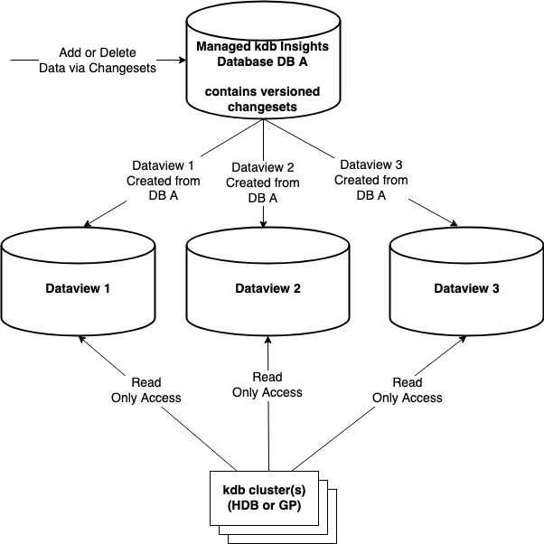

After careful consideration, we decided to end support for Amazon FinSpace, effective October 7, 2026. Amazon FinSpace will no longer accept new customers beginning October 7, 2025. As an existing customer with an Amazon FinSpace environment created before October 7, 2025, you can continue to use the service as normal. After October 7, 2026, you will no longer be able to use Amazon FinSpace. For more information, see
[Amazon FinSpace end of support](amazon-finspace-end-of-support.md "amazon-finspace-end-of-support.md").

# Dataviews for querying data

Dataviews allow you to place portions of your Managed kdb Insights object store database
onto disk for faster read-only access from your kdb clusters. To your kdb process, the dataview
looks like a kdb segmented database, with data placed across one or more disk mounts (volumes)
and the object store. This lets you place frequently-queried data on a fast-access disk for more
performant access while keeping the rest of the data in the object store layer for less frequent
access. With dataviews, the golden copy of your database’s data still remains in the object
store format. The data stored on disk for faster access is a copy.


Dataviews can be accessed from HDB and General purpose (GP) type clusters for read only
access. The data within a dataview is accessible from the cluster as a kdb [segmented database](https://code.kx.com/q/database/segment/ "https://code.kx.com/q/database/segment/") that is automatically
configured when you associate the dataview with the cluster.

A segment is a mount point that can contain a portion of a database. Different segments
could contain different data partitions, tables, or even columns. A kdb _par.txt_ file that FinSpace automatically creates when you mount a database defines the
segments.

The segments of this segmented database can reside on different kdb Insights disk volumes. A
segment of your database can be any portion of it. For example, consider a database with
contents as the following date-partitioned layout.

```
/sym
/2023.10.01/trades/price
/2023.10.01/trades/time
/2023.10.01/trades/quality
/2023.10.01/trades/price
/2023.10.02/trades/time
/2023.10.02/trades/quality
/2023.10.02/trades/price
/2023.10.03/trades/time
/2023.10.03/trades/quality
/2023.10.03/trades/price
/2023.10.04/trades/time
/2023.10.04/trades/quality
/2023.10.05/trades/price
/2023.10.05/trades/time
/2023.10.05/trades/quality
/2023.10.05/trades/price
/2023.10.01/trades/.d
/2023.10.02/trades/.d
/2023.10.03/trades/.d
/2023.10.04/trades/.d
/2023.10.05/trades/.d
```

In this example, `trades` is a table and `time`,
`quantity`, and `price` are columns. You can store the most recent day of
data on a high throughput volume, two days prior to that on 250 MB/s/TiB volume, with the rest
accessible as a segment from the object store layer. The following table shows the data and
segments.

| Database contents                                                                                                                                                      | Segments                                                                                                                     |
| ---------------------------------------------------------------------------------------------------------------------------------------------------------------------- | ---------------------------------------------------------------------------------------------------------------------------- |
| /2023.10.05/trades/time<br>/2023.10.05/trades/quality<br>/2023.10.05/trades/price                                                                                      | **Segment**: **Dataview Segment<br>1**<br>**Stored On**: Managed kdb Insights Volume 1<br>[High throughput – 1000 MB/s/TiB]  |
| /2023.10.04/trades/time<br>/2023.10.04/trades/quality<br>/2023.10.04/trades/price<br>/2023.10.03/trades/time<br>/2023.10.03/trades/quality<br>/2023.10.03/trades/price | **Segment**: **Dataview Segment<br>2**<br>**Stored On**: Managed kdb Insights Volume 2<br>[Medium Throughput – 250 MB/s/TiB] |
| /2023.10.02/trades/time<br>/2023.10.02/trades/quality<br>/2023.10.02/trades/price<br>/2023.10.01/trades/time<br>/2023.10.01/trades/quality<br>/2023.10.01/trades/price | **Segment**: **Dataview Default<br>Segment**<br>**Stored On**: Object store                                                  |

This gives you control to place copies of portions of your database on the appropriate type
of disk for access, if you require higher performance access than what is available with the
default object store storage.

In addition, having the ability to explicitly place data on different volumes when creating
a dataview, the contents directly under the root (/) path of the database, such as
`/sym` in this example, are always copied to the cluster’s local storage for fast
access.

## Auto-updating vs static dataviews

When you create a dataview, you can specify from one of the following types of
dataview.

- **Auto-updating** –An auto-update dataview contains the most recent version of the data in
  the database. Its contents are automatically updated as new data is added to the
  database.
- **Static** – For a static dataview, the data within the view
  is not updated automatically as new data is added to the database. When creating a static
  dataview, you specify a database version identifier that is the changeset ID. The dataview
  will contain contents of the database as of that changeset ID. To refresh the contents of
  a static dataview, you need to update it. If you do not provide a changeset ID when
  updating a dataview, system picks the latest one by default.

## Dataview versions

When you create a dataview, it is assigned an initial version. Each update, whether automatic or
manual, creates a new version of a dataview. A dataview version becomes active when it is
mountable. A dataview version is released when it is not attached to any clusters and when
it's no longer the latest active version.

## Data placement

For each volume, you specify a list of paths for the data that you want to place on the
volume. This can be done by using the db paths. Your paths can include the wildcard characters
— asterisk (\*) and question mark (?). Here are a few examples of how you can use db
paths for segment configuration.

- To specify a particular partition – `/2020.01.02/*` or
  `/2020.01.02*`
- To specify all partitions for Jan 2020– `/2020.01.*` or
  `/2020.01*`
- To specify all partitions for 1st of each month in 2020 –
  `/2020.??.01` or `/2020.*.01`
- To specify all partitions – `/*` or `*`

## Data cardinality

You can create multiple dataviews for a single database. For example, you may wish to
create one dataview based on an older version of the database for historical analysis, at the
same time you may want an auto updating dataview for applications to query more recent data in
your database. You can also use multiple dataviews with the same data in each, as a way to
spread query load from a large number of clusters querying the data. You can create two
different dataviews on the same changeset version.

## Consideration

- Dataviews are only available for clusters running on a scaling group. They are not
  supported on dedicated clusters.
- The paths placed on different volumes cannot overlap. For example, you could not place a path
  of `/2023.10.31/*` on one volume of a dataview and `/2023.10*` on
  another volume of the same dataview because the paths overlap. This constraint is because
  each volume is a different segment in the `par.txt` file on the database and
  contents of a segment can’t overlap.
