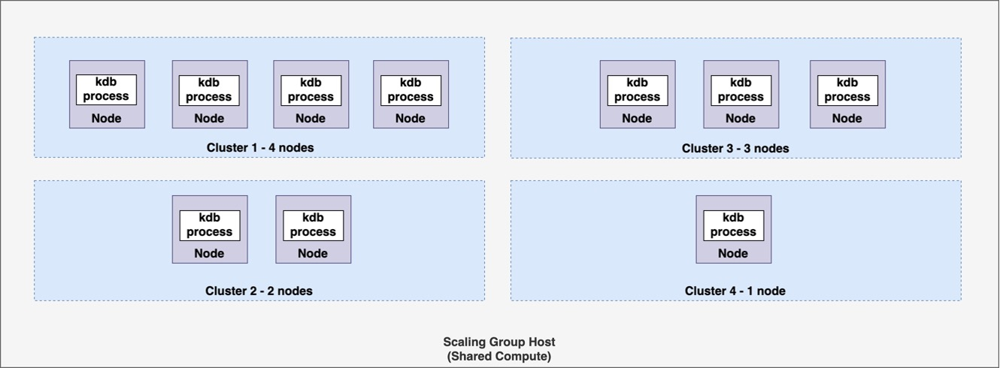
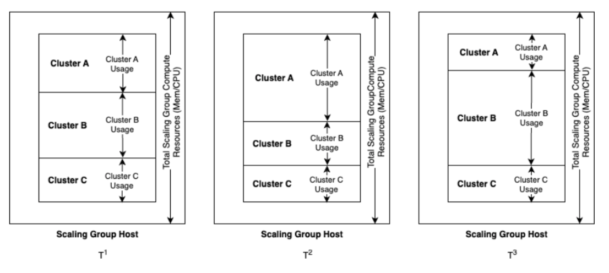

After careful consideration, we decided to end support for Amazon FinSpace, effective October 7, 2026. Amazon FinSpace will no longer accept new customers beginning October 7, 2025. As an existing customer with an Amazon FinSpace environment created before October 7, 2025, you can continue to use the service as normal. After October 7, 2026, you will no longer be able to use Amazon FinSpace. For more information, see
[Amazon FinSpace end of support](amazon-finspace-end-of-support.md "amazon-finspace-end-of-support.md").

# Managed kdb scaling groups

Many kdb customers today use a deployment architecture consisting of multiple kdb
processes running on a single compute host. When workloads are such that the
resource of demands of the different processes don’t conflict, this approach can
maximize use of computing resources (CPU, RAM, I/O) to achieve more efficient use of
computing resources. Scaling groups allows you to take this same approach with
Managed kdb Insights.

Scaling group terminology

- Scaling group – Shared compute you can run your kdb workloads (clusters) on.
- Scaling group host – A single unit of compute in a scaling group. Scaling groups
  currently can only have a single host.
- Cluster – A set of one or more identically configured kdb process (nodes).
- Cluster node – A single kdb process, running within a cluster.
  With scaling groups, you can run multiple kdb workloads or clusters on shared compute
  (a host) that you provision. This allows you to maximize utilization of compute in your
  FinSpace Managed kdb Insights environment. You can run multiple clusters on a single
  scaling group host. Each cluster can have one or more nodes, each with a kdb process.

The previous diagram is an example of four clusters running on a scaling group host.
Cluster 1 has four nodes, Cluster 2 has two nodes, cluster 3 has three nodes and cluster 4
has one node. As memory requirements for an individual cluster vary throughout the day, each may
consume different amounts of memory. By placing workloads that have memory needs
that peak at different times throughout the day, you can place more workloads
or clusters in a fixed set of compute than it is possible if you used FinSpace [dedicated](kdb-clusters-running-clusters-comparison.md "kdb-clusters-running-clusters-comparison.md") cluster
option.

For example, you may have multiple HDB workloads where memory requirement of any individual HDB will vary at different times of the day, but in total they
will all remain within a certain known memory footprint. You can place all of these workloads onto a scaling group to share resources like CPU and memory as shown in the following diagram.

## High level workflow for running clusters on a

scaling group

Before running a cluster on a scaling group, you need to create the scaling group itself. Once you
create the scaling group, you can launch one or more clusters on it. You can display clusters
running on a scaling group by using the `ListKxClusters` API or from the
**Clusters** tab in Amazon FinSpace console. When you delete a cluster running in
a scaling group, the host and any other running clusters on the scaling group remain available. If there
are no clusters running on a scaling group, you may delete it.

## Resource management with scaling groups

When launching a cluster to run on a scaling group,the total available
amount of memory on the scaling group host is limited. The following table describes the limits of each host.

| Compute type    | vCPUs | Memory available for kdb (GiB) |
| --------------- | ----- | ------------------------------ | ---------------------------------------------------------------------------------------------------------------------------------------------------------------------------------------------------------------------------------------------------------------------------------------------------------------------------------------------------------------------------------------------------------------------------------------------------------------------------------------------------------------------------------------------------------------------------------------------------------------------------------------------------------------------------------------------------------------------------------------------------------------------------------------------------------------------------------------------------------------------------------------------------------------------------------------------------------------------------------------------------------------------------------------------------------------------------------------------------------------------------------------------------------------------------------------------------------------------------------------------------------------------------------------------------------------------------------------------------------------------------------------------------------------------------------------------------------------------------------------------------------------------------------------------------------------------------------------------------------------------------------- |
| kx.sg.large     | 2     | 16                             |
| kx.sg.xlarge    | 4     | 32                             |
| kx.sg.2xlarge   | 8     | 64                             |
| kx.sg.4xlarge   | 16    | 108                            |
| kx.sg.8xlarge   | 32    | 216                            |
| kx.sg.16xlarge  | 64    | 432                            |
| kx.sg.32xlarge  | 128   | 864                            |
| kx.sg1.16xlarge | 64    | 1949                           |
| kx.sg1.24xlarge | 96    | 2948                           | When launching a kdb cluster to run on a scaling group, you specify the minimum memory required for each kdb process in the cluster (node) as well as expected amount of memory. If there is insufficient memory on the scaling group host to meet this required value, the cluster will not start. You can also specify an expected value for the amount of memory the cluster will require. The scheduler will use this to avoid launching the cluster if the memory value is not sufficient. For clusters with more than one node or kdb processes, the amount of memory used is the sum of the kdb process memory that each node consumes. ## Considerations  • Currently, a scaling group consists of a single scaling group host and clusters can only run on one scaling group at a time. If you need to run more clusters in your environment than can fit on a single scaling group host, you may run multiple and put different clusters from your set on to different scaling groups.  • You cannot delete a scaling group until you delete all the clusters running on it.  • [Savedown storage](kdb-cluster-types.md#kdb-cluster-savedown-storage "kdb-cluster-types.md#kdb-cluster-savedown-storage") does not work with General purpose (GP) and RDB clusters running on scaling groups. Instead, you should use volumes for the temporary storage of your savedown data.  • HDB and GP clusters, when they are run as a part of a scaling group, don't support high performance HDB disk cache. You may instead use dataviews if you need to place portions of your database on high performance disk. |
