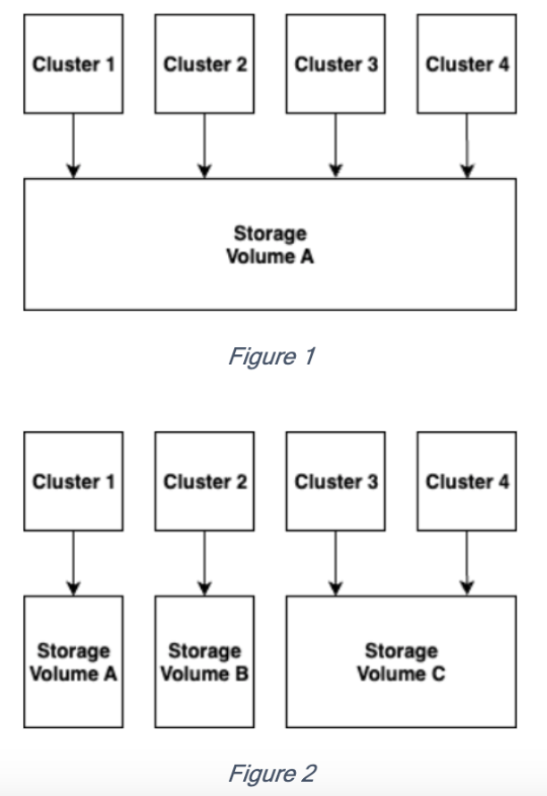

After careful consideration, we decided to end support for Amazon FinSpace, effective October 7, 2026. Amazon FinSpace will no longer accept new customers beginning October 7, 2025. As an existing customer with an Amazon FinSpace environment created before October 7, 2025, you can continue to use the service as normal. After October 7, 2026, you will no longer be able to use Amazon FinSpace. For more information, see
[Amazon FinSpace end of support](amazon-finspace-end-of-support.md "amazon-finspace-end-of-support.md").

# Managed kdb volumes

Volumes are managed storage that resides in your Managed kdb Insights environment
and can be associated with clusters for storage of data such as TickerPlant (TP) logs, Real-time Database (RDB) savedown
files, and temporary storage on General purpose (GP) type clusters. Volumes can also be used by
dataview to store copies of your database of disk for fast access when reading data from
a database. You can also use volumes to share data between RDB and Intra-day DB (IDB).

## Volumes for temporary data storage

You can use a Managed kdb volume data storage for your cluster. When creating a TP cluster, you must specify a volume that will hold the TP logs. For an RDB or GP cluster running on a scaling group, you can specify a volume to hold savedown or temporary files.

Multiple clusters can share a single volume for simplicity as shown in Figure 1, or you can configure
multiple volumes and associate them with specific clusters for workload isolation as shown in Figure 2.

## Volumes with dataviews

You can use Managed kdb volumes when you create dataviews. Dataviews store a copy of the
data in your database on one or more volumes for fast access. When creating a dataview you can
specify one or more volumes to store a portion of your database for faster data access
compared to querying the data from the default object store format of the data in the
database. For more information about using volumes as part of a dataview, see [Creating a kdb dataview](managing-kdb-dataviews.md#create-kdb-dataview "managing-kdb-dataviews.md#create-kdb-dataview").

## Volume types

Volumes are available in different price or performance characteristics based on your
need. Currently FinSpace offers the following three types of volume with three throughput characteristics.

- 1000 MB/s/TiB –
- 250 MB/s/TiB
- 12 MB/s/TiB

## Considerations

- When you delete a cluster, the data remains on the volume. If you don’t want this
  delete data before deleting the cluster.
- You can access data mounted on a volume from within a cluster from the path `/opt/kx/app/shared/$VOLUME_NAME/$CLUSTER_NAME`.
